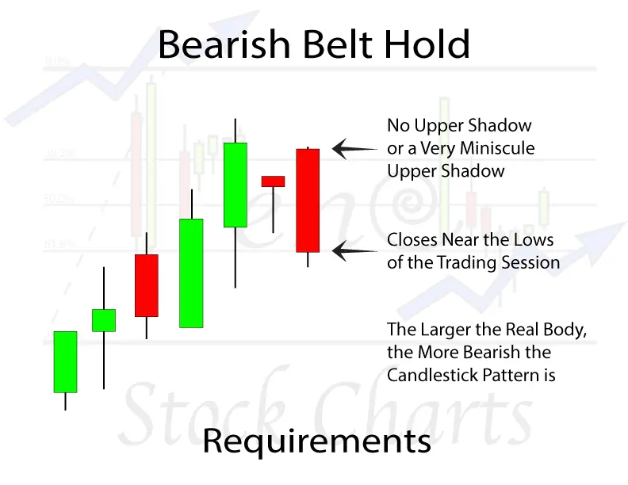
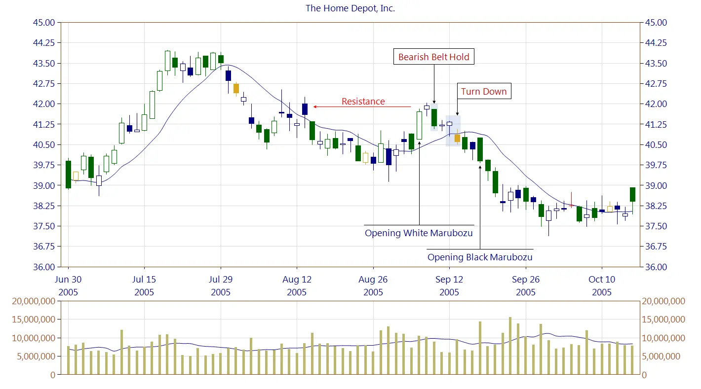
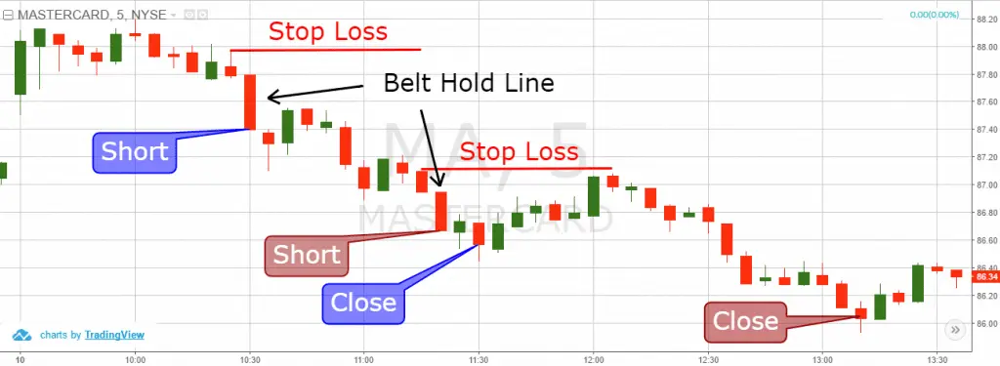

# Belt Hold Line Candlestick Pattern

Belt Hold is candlestick pattern is considered as a modest reversal pattern that can suggest a bearish or bullish trend reversal depending on the pattern and direction of the trend it appears. Belt Hold Candlestick pattern is called yorikiri in Japanese..

The model is one single pattern, nearly the same as Marubozu's, because the pattern showed the force of bearish and bullish activity. It has a large, real body with small or no shadows. The single bar in an upward trend is a possible top-turn pattern and the pattern is a bare ribbon holding pattern.

Bearish Belt  hold consists of a black candle, opening at or near the top and closing on or around the bottom, leaving very little bottom or top shadows. A bullish hold pattern, on the other hand, appears downstream and is a possible reverse pattern of the bottom. The candle opens at or close to the high and ends at or near the low. It consists of a rising candle.

The height of these bars indicates a potential change in sentiment; thus, the pattern becomes increasingly crucial as the candles grow in size.

Both the bullish and bearish belt hold patterns are more dependable when they appear at the market's extremes, as indicated by support, trend lines and moving averages,pivot points , and resistance levels. 
They become much more important when combined with other patterns, such as the [engulfing pattern](https://anothertechs.com/crypto/the-engulfing-pattern/) or the [dark cloud cover](https://anothertechs.com/crypto/dark-cloud-cover/)  pattern.

The belt hold is a particular candlestick pattern that provides one of the most specific clues of the current market's direction. 
However, simply understanding how to spot this pattern is insufficient.

## Types of Belt Hold Candlestick Pattern

### Bullish Belt Hold Candlestick Pattern

The Bullish Belt Hold Pattern is a single bar Japanese candlestick pattern that indicates a potential reversal of a current decline. 
A trading day begins at its lowest level in this candlestick pattern, but as the day goes, the stock starts to move up, eventually closing around a high. 
That being stated, it is not required for the trading day to end at its peak.

The Bullish Belt Hold candle resembles a white opening Marubozu candle. 
The candle pattern is such that it opens at the low of the period and then rallies to close around the high, leaving only a tiny upper shadow and no lower shadow. 

This pattern reappears in decline after a string of bearish candlesticks. 
Furthermore, the opening price of canldle is significantly lower than the price of the candle previous day. 
The pattern is known as a "belt hold" because it closes well within the previous candle's body, preventing the price from falling further.

#### Identifying a Bullish Belt Hold Line
**Belt Holding Requirements**
- The candlestick never trades below its opening price.
- The bar must be upbeat.
- The preceding bar had to be bearish.

**Optional conditions**
- The candle must be extinguished within the body of the previous candlestick.
- The candlestick should close close to the high point.
- The candlestick must open lower than the previous candlestick's low.

### Bearish Belt Hold line Candlestick Pattern

A bearish belt hold is a pattern that typically indicates a shift in investor sentiment from bullish to bearish. 
On the other hand, the bearish belt hold is not considered highly dependable because it occurs frequently and is frequently erroneous in anticipating future share prices. 
When establishing trend predictions, as with any other candlestick charting method, more than two days of trade should be considered.

Bearish belt holds are relatively easy to identify, but they must be validated by looking at durations that stretch beyond the day period. 
The previous day's candlesticks should be in a clear uptrend, indicating that mood has shifted. 
To help confirm the authenticity of the signal, the candlestick should belong, and the next session's candlestick should likewise be bearish.

### Identifying a Bearish Belt Hold

**Bearish Belt Holding Requirements**
- The candlestick does not trade over its opening price.
- The candlestick must be negative.
- The previous candle must have been bullish.

**Optional conditions**
- The belt hold bar must be able to close within the body of the first candlestick.
- The candlestick must shut near the bottom point.
- The candlestick must open higher than the previous candlestick's high.

## Psychology behind Belt Hold Candlestick Pattern

When a bullish belt hold candlestick appears, it implies that purchasers controlled the share price for the whole trading session because the share price never fell below its initial share price.

The share price has only risen since the trading session began, which is why a bullish belt hold has no lower shadow. 
The buyers have been in command throughout the trading session.

The bearish belt hold suggests a short-term shift in attitude from bullish to bearish. 
The top of the bearish belt hold is converted into a resistance line. 
If the belt holds resistance line aligns with an already formed one, it receives more weight.

## How to Trade Belt Hold Line Pattern

### Entery 

After spotting the belt, hold a candlestick, open a position in the direction of the candle and go long immediately after it closes.

### Stop Loss

Always use a stop-loss order to safeguard your belt hold transactions, just like you would any other trade. 
The stop-loss should be placed precisely beneath the entry candle's low. 
However, because the marubozu candle appears during periods of extreme volatility, the price action will frequently reach the stop if it is positioned correctly on the other side of the candle.

As a result, it is recommended that you set your stop-loss one candle away from the marabozu. 
If you are buying a stock on the low belt signal, set your stop-loss below the candle's low that follows the closing marubozu candle. 
If you are selling on a belt hold signal, your stop-loss order should be placed above the candle that precedes the marubozu.

### Profit

Set an initial aim when using a belt hold line trade. 
The first option is to exit your position when the stock reaches a size that is at least twice or three times the size of the marubozu pattern.

The other way for profit taking is to employ price action rules to determine when to exit your trades; this, of course, requires more skill and, most importantly, discipline.

### References

- https://www.investopedia.com/terms/b/bearishbelthold.asp
- https://www.angelbroking.com/knowledge-center/share-market/bullish-belt-hold
- https://www.candlescanner.com/candlestick-patterns/bearish-belt-hold/
- https://stephenbigalow.com/