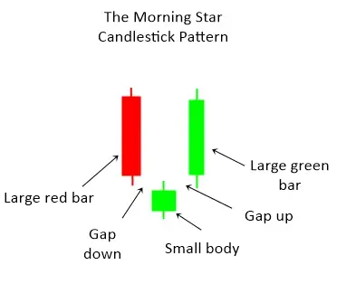

# Best candlestick patterns that every trader should know

Candlestick charts are one of the most popular ways to visualize price data in the financial markets. They are easy to read and can provide valuable information about market trends and price movements. 

Candlesticks are formed by plotting the price data of an asset over a specific period of time. Each candlestick represents the price action over a certain period of time, with the candlestick body representing the difference between the open and close price and the candlestick wicks representing the high and low price.

There are dozens of different candlestick patterns, but not all of them are useful for traders. In this article, we will take a look at the five most important candlestick patterns that every trader should know about.

## Morning and Evening Star

The morning and evening star candlestick patterns are made up of three candlesticks. The first candlestick is a long-bodied candlestick in the direction of the trend. The second candlestick is a small-bodied candlestick that goes against the trend and the third candlestick is a long-bodied candlestick that goes in the direction of the trend.

The morning star candlestick pattern is a bullish Candlestick pattern, while the evening star is a bearish one. The morning and evening star patterns can often be found at the bottom of market trends.

**To know more about Morning Star Candlestick Pattern click [here](https://anothertechs.com/crypto/morning-star/)**

The evening star pattern is made up of three candlesticks. The first candlestick is a long-bodied candlestick that goes against the trend. The second candlestick is a small-bodied candlestick that goes in the direction of the trend and the third candlestick is a long-bodied candlestick that goes against the trend.

The evening star is a bearish candlestick pattern that can often be found at the top of market trends.

**To know more about Evening Star Candlestick Pattern click [here](https://anothertechs.com/crypto/evening-star/)**

## Doji Star

The Doji star is a candlestick pattern that is often seen as a sign of reversal in the markets. This pattern is created when the open and close prices are equal (or very close to equal), and it has a small body with long upper and lower shadows.

The Doji star is considered a bearish reversal pattern when it forms after an uptrend. This is because it shows that the bulls were unable to maintain control of the market and that the bears are now in control.

If you see a Doji star pattern forming after a downtrend, it is considered a bullish reversal pattern as it shows that the bears are losing control of the market and the bulls are now in control.

While the Doji star is often seen as a reversal pattern, it is important to remember that it is just a single candlestick

The doji is probably the most well-known candlestick pattern. It is characterized by a small body with long upper and lower shadows. The doji pattern can be found at the top and bottom of market trends and it can also be used to signal a reversal in the market.

When the doji is found at the top of an uptrend, it is called a bearish doji reversal pattern. This pattern can be used to signal that the market is about to reverse and start moving lower.

On the other hand, when the doji is found at the bottom of a downtrend, it is called a bullish doji reversal pattern. This pattern can be used to signal that the market is about to start moving higher.

**To know more about Doji Star Candlstick Pattern Click [here](https://anothertechs.com/crypto/everything-you-need-to-know-about-doji-star/)**

## Engulfing Candlestick Pattern

The engulfing candlestick pattern is made up of two candlesticks. The first candlestick is a small-bodied candlestick that is engulfed by the second candlestick, which is a large-bodied candlestick.

This pattern can be found at the top and bottom of market trends and it can also be used to signal a reversal in the market.

Just like the doji and the hammer, the engulfing pattern can be found at the top and bottom of trends. Here is a daily chart of the USD/JPY showing the engulfing pattern.

The first candlestick is a small-bodied candlestick that has formed at the end of a market trend. The second candlestick is a much larger candlestick that has engulfed the first candlestick. This is a bullish signal that the market is going to continue moving higher.

The first candlestick is a small-bodied candlestick that has formed at the top of a market trend. The second candlestick is a much larger candlestick that has engulfed the first candlestick. This is a bearish signal that the market is going to continue moving lower.

**To know more about Engulfing Candlstick Pattern Click [here](https://anothertechs.com/crypto/the-engulfing-pattern/)**

## Hammer and Hanging Man

The hammer and hanging man are two very similar candlestick patterns. The main difference between them is that the hammer occurs at the bottom of a downtrend while the hanging man occurs at the top of an uptrend.

The hammer and hanging man both have small bodies with long lower shadows. This indicates that there was significant selling pressure during the period, but that the bulls were able to push prices back up towards the end of the period.

The hammer has a long upper shadow, which indicates that there was some buying pressure during the period, but that the bears were able to push prices back down towards the end of the period.

The hanging man has a small upper shadow, which indicates that there was very little buying pressure during the period.

The hammer is considered a bullish reversal pattern and the hanging man is considered a bearish reversal pattern.

Here is an example of the hammer candlestick pattern:

**To know more about Hammer Candlstick Pattern Click [here](https://anothertechs.com/crypto/hammer-signal/)**

Here is an example of the hanging man candlestick pattern:

**To know more about Hanging Man Pattern Click [here](https://anothertechs.com/crypto/hanging-man-pattern/)**

Both the hammer and the hanging man are bullish reversal patterns. This means that the market is likely to start moving higher after the formation of these patterns.

## Conclusion

Candlestick patterns are a useful tool to have in your trading arsenal. They can be used to signal a reversal in the market or they can be used to signal the continuation of a trend.

