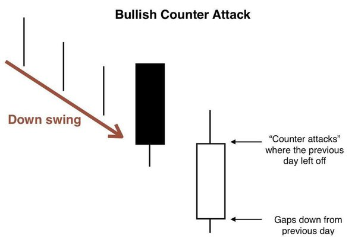
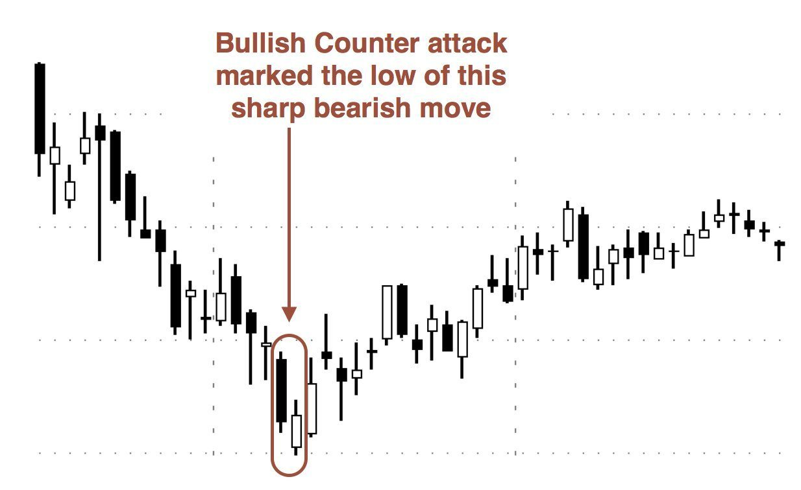
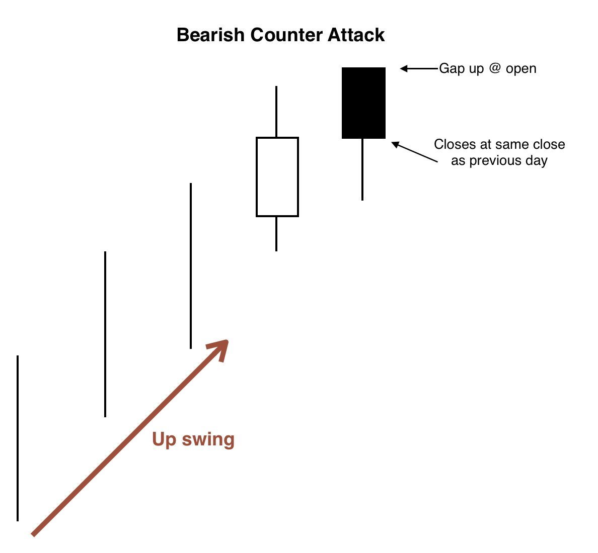
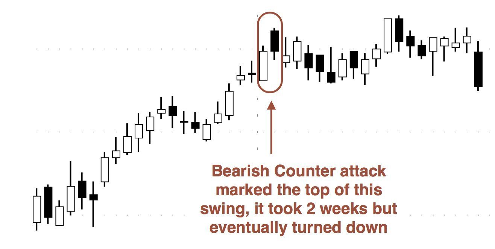

# Candlestick Pattern - Understanding Counterattack candlestick pattern

There is no shortage of reversal indicators in technical analysis and candlestick patterns. The counterattack candlestick pattern is one such trend reversal indicator that many traders use to enter a positional trade.
Here's everything you need to know about this one-of-a-kind technical indicator.

This indicator, also known as the **counterattack lines candlestick pattern**, consists of two candlesticks that move in opposite directions. It can occur during an uptrend or a downtrend and is useful for identifying trend reversals. The indicator is known as a bullish counterattack pattern when it occurs during a downtrend. When it happens during an uptrend, the indicator is called a bearish counterattack pattern.

**Notes**

- Bullish counterattack lines indicate a possible trend reversal from a downtrend to an uptrend.

- Bearish counterattack lines indicate a possible trend reversal from an uptrend to a downtrend.

- The pattern is made up of two candles with opposing color/direction. It is recommended to use a third and/or fourth candle to confirm the next price direction following the pattern.

## Understanding Counterattack Line

## Bullish Counterattack Line Candlestick Pattern

The bullish counterattack line, also known as the bullish meeting line, is a two-candlestick pattern that appears after a downtrend and is regarded as a bottom reversal signal. The bullish counterattack line is a weaker bottom reversal signal than the nearly identical piercing pattern. The first candlestick indicates a bearish trend. The second candlestick opens far below the close of the first day's bearish candlestick, but then rallies to close at roughly the same price as the first day's candlestick. As a result, the second day candlestick is an extremely bullish candlestick. The large gap down on the second day gives bears confidence that the downward trend will continue; however, to bears' surprise, prices reverse and fill the gap, closing at the same price level as the previous day's close. That day, the bears made no progress.

**The bullish counterattack lines candlestick pattern consists of the following characteristics:**

- The market is in a downward spiral.

- The first candle has a long real body and is black (down).

- The second candle gaps down on the open, is white, has a real body similar to the first candle's real body, and closes near the first candle's close.

### Psychology Behind Bullish Counterattack Lines

Assume the market is in a strong downtrend. The first candle continues to fall, with the close falling well below the open, resulting in a long real body. This boosts bear confidence while putting bulls on the back foot. Their apprehension is justified by the opening of the second candle, which gaps down from the close of the previous session. The opening, on the other hand, depletes the supply of selling pressure, allowing bulls to lift the security in a reversal session that concludes near the close of the first candle. This price action indicates a possible bullish reversal, which will be confirmed on the third or fourth candle.

### Identifying Bullish Counterattack Lines Candlestick Pattern

The bullish counterattack candlestick pattern is a two-bar pattern that appears in the market during a downtrend. To be considered a bullish counterattack pattern, a pattern must meet the following criteria.

- The market must be in a strong downtrend for the bullish counterattack pattern to form.

- The first candle should be a long black candle with a solid body.

- The second candle must also be long (ideally, the same size as the first), but it must be white and have a real body.
  The second candle must close near the first candle's close.

## Bearish Counterattack Line Candlestick Pattern

The bearish counterattack line, also known as the bearish meeting line, is a two-candlestick pattern that appears after an uptrend and is considered a top reversal signal. The bearish counterattack line is a weaker top reversal signal than the associated dark cloud cover pattern. The first candlestick indicates a bullish trend. The second candlestick opens far above the close of the first day's bullish candlestick, but then falls back to close at roughly the same price as the first day's candlestick.As a result, the second day candlestick is a big bearish candlestick. The large gap up on the second day gives bulls confidence that the upward trend will continue; however, to bulls' surprise, prices reverse downward and fill the gap, closing at the same price level as the previous day's close. That day, the bull made no progress.

**The bearish counterattack lines candlestick pattern is distinguished by the following characteristics:**

- The market is on the rise.

- The first candle is white (up) and has a long genuine body.

- The second candle gaps higher on the open, is black, has a real body similar to the first candle's real body, and a close similar to the first candle's close.

### Psychology Behind Bearish Counterattack Lines

Assume the market is in an active uptrend. The first candle continues the upward trend, with the close well above the open, resulting in a long real body. This boosts bull confidence while putting bears on the back foot. Their apprehension is justified by the opening of the second candle, which opens with a gap up from the previous session's close. However, the opening reduces buyer demand, allowing bears to drop the security in a reversal session that concludes near the close of the first candle. This price action indicates a possible bearish reversal, which will be confirmed on the third or fourth candle.

### Identifying Bearish Counterattack Lines Candlestick Pattern

The bearish counterattack candlestick pattern is a two-bar pattern with the characteristics listed below.

- The market must be on an upward trend.

- The first candle must be long and white, with a solid body.

The second candle must be black and of equal or similar size to the first.

## How to use the Counterattack Candlestick Pattern

It's one thing to notice the pattern. Entering a trade using the identified pattern is a completely different story. As a result, here are some key considerations to bear in mind before engaging in a trade based on the counterattack lines candlestick pattern.

– First, keep an eye out for a strong trend. It can be either a bullish or a bearish trend.

– Once you've identified the trend, look for a candle that opens with either a 'gap up' or a 'gap down.' The openings should correspond to the current trend.

– Pay attention to the movement of this candle. The candle should move in the opposite direction of the current trend.

– Once that condition is met, ensure that the candle moving in the opposite direction closes close to the previous day's close.

– A pattern can be called a counterattack lines candlestick if it meets all of the above criteria.

– Once the pattern has been correctly identified, it is best to wait for a confirmation candle before entering a position. In the case of a bullish counterattack pattern, for example, you should consider entering a trade only if the candle that appears after the pattern is bullish. The bullish reversal is said to have failed otherwise.

## Limitations of Counterattack Lines

- Counterattack lines may be untrustworthy on their own. They are typically used in conjunction with other confirming technical analysis and require confirmation candles.

- Candlestick patterns do not provide profit targets, so there is no indication of the magnitude of the reversal. The pattern may initiate a long-term reversal, or the reversal may be brief.

- Although the pattern does occur, it is uncommon. There will be few opportunities to use this candlestick pattern.
