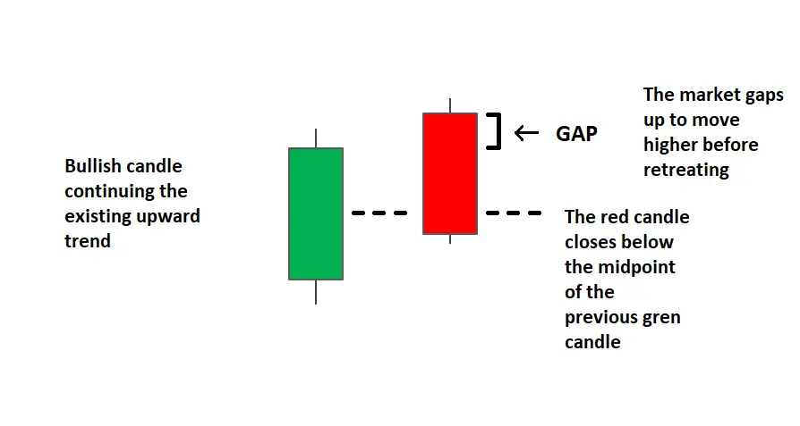
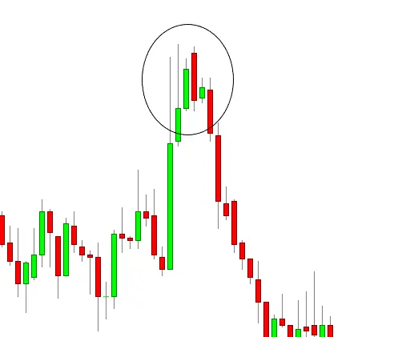
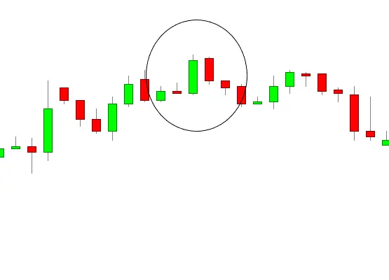

# Dark Cloud Cover Candlestick Pattern 

## What it is?

A dark cloud cover is a **bearish reversal** candlestick pattern in which a falling candle (usually black or red) has an opening price higher than the closing price of the previous rising candle (usually white or green), and then the closing price is lower than the middle of the rising candle. point.

This pattern is important because it shows the **momentum change from up to down**. The pattern is created by an upward candle and a downward candle. Traders analysis that the price will continue to fall on the next (third) candle.

## What Does it means?

Each candle has its own meaning and tells a unique story about the dynamics of the market.

The uptrend market is driven by positive sentiment. The bulls are under control and continue to drive the market higher.

With the formation of the first bullish candle of the dark cloud cover pattern, we notice that the buying pressure is high and buyers continue to support the uptrend.

As the market opens higher, this sentiment will continue until the next day's open. Buying pressure continues to drive the market higher.

However, it will soon be discovered that the positive gap has exhausted the final market share of purchasing power. Shorts control and push prices to make up for the gap.

At that stage, as more and more investors began to worry that the market was not as strong as they thought, selling pressure increased. More and more people began to sell their positions, and the market closed below the midpoint of the previous candle.

Most traders believe that only dark cloud cover patterns that appear after an uptrend or general price increase are useful. As prices rise, this pattern becomes more important in marking possible downtrends. If the price movement fluctuates, the pattern is not important, because the price can remain volatile after the pattern.

### Criteria for dark cloud cover candlestick pattern

1. Existing bullish uptrend.
2. The up (bullish) candle in this uptrend.
3. Gaps in the next time period.
4. The gap from the top becomes a bearish candle.
5. The bearish candle closed below the midpoint of the previous bullish candle.

The dark cloud cover pattern is further characterized by black(red) and white(green) chandeliers with longer bodies and relatively short or shadowless shadows. These attributes show that, in terms of price movements, the drop is very decisive and significant. Traders can also follow this pattern to look for confirmations in the form of bearish candles. **The price is expected to drop after the dark clouds are covered, so if it doesn't, it indicates that the model may fail.**

The close of the bearish(red) candle can be used to get out of a long position. Alternatively, if the price continues decreasing, the merchant can leave the next day (the ASA has been confirmed). If you approach near the close of bearish candle, you can increase the stop-loss in the next period. **There is no profit goal for the pattern of the dark cloud cover**. The merchant uses other candy patterns to determine whether to finish short trade depending on the dark cover of the cloud.

## Example Chart for dark cloud cover

