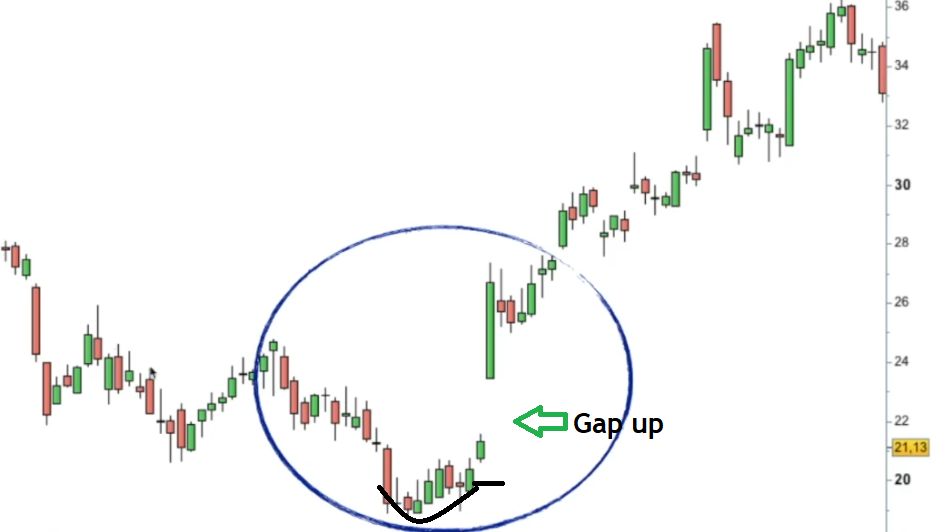

# Candlestick Pattern - Dumpling Tops and Frypan Bottoms

Dumpling top and frypan bottoms. Someone must have been hungry when they thought of these names !!

## Dumpling Top Candlestick Pattern

Several [Japanese candlesticks](https://en.wikipedia.org/wiki/Candlestick_pattern) form the top structure of a dumpling. With a small body, the first candlesticks are bullish or bearish. This candlestick arrangement should form a rounded top. Following that, a final candlestick is formed with a bearish gap opening.

When small real body candlesticks slowly rise and then move in a neutral to downward direction, a dumpling top occurs. When a bearish candlestick gaps down from the other candlesticks, the dumpling top pattern is complete.

As the market forms a [convex](https://en.wikipedia.org/wiki/Convex) pattern, the dumpling top usually has small real bodies. A dumpling top is confirmed when the market gaps down. This is the same pattern as the Western rounded bottom top. As proof of a top, the dumpling top should have a bottom window.

**Notes:**

– Normally, this would indicate a Bearish reversal of the current Trend.

– It occurs during an uptrend, and the candles that follow the Pattern must confirm it.

– The Pattern begins during an Uptrend, then becomes a "Sideways" Trend (representing market indecision); at the end of the Pattern, the Trend reverses direction and becomes a Downtrend.

– This Pattern is quite rare; it is important that there is a Gap Down after the "Sideways" Trend and just before the Downtrend begins (To obtain a further confirmation of the reversal of the Trend, as the Pattern suggests).

### Dumpling Top Chart Example

The chart above depicts a dumpling top. Take note of how the top of the chart above has many small-bodied candlesticks that are mostly neutral. This demonstrates that neither the bulls nor the bears have complete control of this consolidation area. The dumpling top pattern is confirmed when a strong bearish candlestick gaps down away from the area of consolidation, and prices are expected to fall further.

## Frypan Bottom Candlestick Pattern

The fry pan bottom pattern is the inverse of the dumpling top pattern. When small real body candlesticks move slowly downward and then in a neutral to upward direction, the fry pan bottom occurs. When a bullish candlestick gaps up from the rest of the candlesticks, the fry pan bottom pattern is complete.

When a bullish candlestick gaps up from the rest of the candlesticks, the frypan bottom pattern is complete.

The bottom of the fry pan represents a market that is bottoming and whose price action forms a [concave](https://en.wikipedia.org/wiki/Concave) design before opening a window to the upside.
It looks like a Western rounded bottom, but the Japanese fry pan bottom should have a window in an upmove to confirm the bottom.

**Notes:**

– Normally, this would indicate a Bullish reversal of the current Trend.

– It occurs during a downtrend, and the candles that follow the Pattern must confirm it.

– The Pattern begins during a Downtrend, then becomes a "Sideways" Trend (representing market indecision); at the end of the Pattern, the Trend reverses direction and becomes an Uptrend.

– This Pattern is quite uncommon; it is critical that there is a Gap Up after the "Sideways" Trend and just before the start of the Uptrend (To obtain a further confirmation of the reversal of the Trend, as the Pattern suggests).

### Frypan Bottom Chart Example

The diagram above depicts the bottom of a fry pan. Take note of all the small bodied candlesticks in the consolidation area after prices fell. A large bullish candlestick gapped up and away from the area of consolidation, confirming a fry pan bottom.
