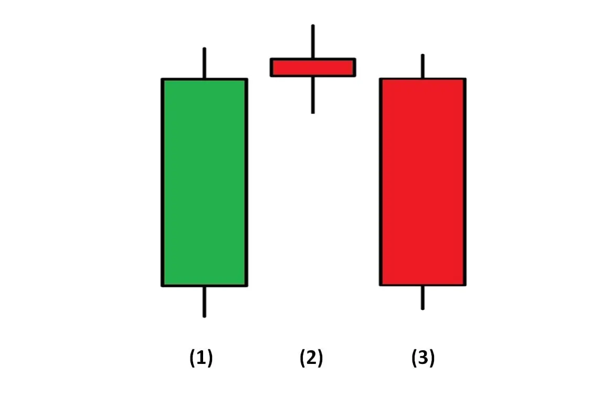
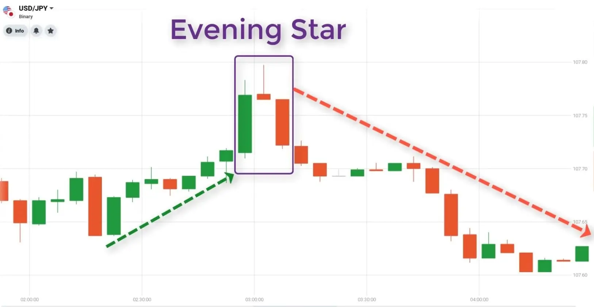
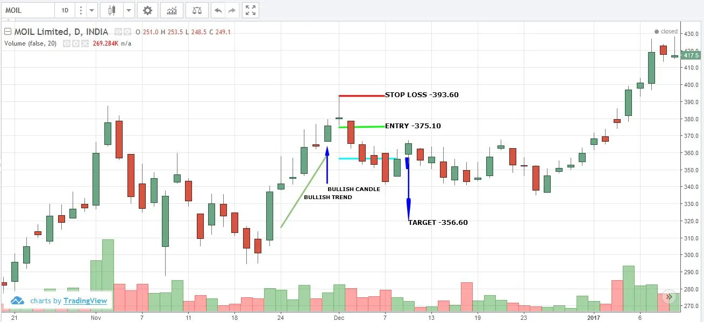
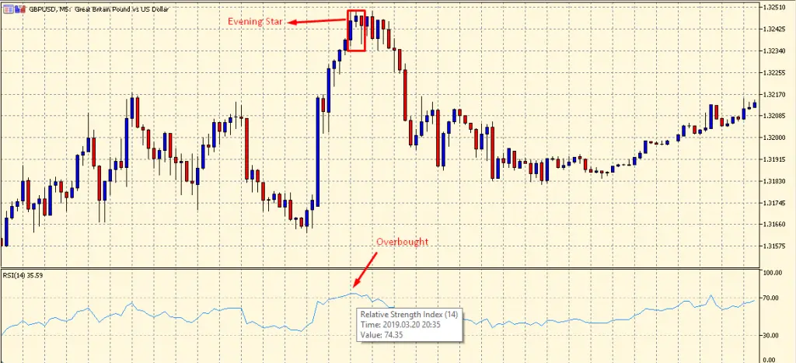

# Evening Star Pattern

The evening star candlestick pattern is the bearish counterpart of the [morning star](https://anothertechs.com/crypto/morning-star/) pattern in technical analysis. Because the evening star pattern is a top reversal, it should be acted upon if it occurs after an uptrend.

## What does Evening Star Pattern means?

The Evening Star composes of three candles. The first candle of the evening star pattern should be light-colored and have a relatively large body. The second candle is a star. It is a candle with a shorter body and does not touch the body of the previous candle. The gap between the two real bodies of the candlestick makes it a Doji star.

The evening star shows the first visualization of weakness, since the buyer could not raise the price until it is much higher than the closing of the previous period. This weakness is confirmed by the following the stars. These candles should be a dark and must close well with the previous candle.

**An evening star candlestick pattern should have a gap separating the first and second real bodies and then another gap separating the second and third real bodies.**

## How to identify Evening Star Candlestick Pattern?

Identifying the evening star candlestick pattern on the forex/stock/crypto chart is more than just identifying the three main candles. What is needed is to understand past price behavior and where the pattern appears in existing trends.

1. Establish an existing uptrend-the market should show higher highs and lows.

2. **Big bullish candle** -Big bullish candle is the final product of heavy buying pressure and the continuation of an existing uptrend. At this point, traders should only look for long trades, because there is no evidence of reversal.

3. **Big bearish candle** - This candle shows the first sign of new selling pressure. In the non-forex market, this candle opens downwards from the closing price of the previous candle, marking the beginning of a new downward trend.

4. **Follow-up price action** - After a successful reversal, traders will notice lower highs and lows, but the risk of failed moves should always be managed by using well-positioned stop losses.

In the market, traders will always look for signs of indecision when buying pressure subsides and the market is flat. This is the ideal place to see the [Doji](https://en.wikipedia.org/wiki/Doji) candles.

## What does the evening star pattern show?

An evening star pattern is a useful tool for technical analysis because it can predict changes in investor sentiment and price momentum.

As mentioned above, the evening star pattern consists of three candles, one per period. Bullish candles are long on the first day and asset prices have strong bullish momentum. Following the sharp rise in prices reflected by the bull gap, momentum began to weaken the day after the star appeared.

However, the second day was still a wavering day between bullish and bearish sentiment. If there is a gap down when the market opens on the third day, it indicates that momentum will reverse and traders have made a short decision. When the price closed much lower at the end of the third day, the evening star pattern is confirmed.

## How do technical analysts trade when they see the evening star pattern?

Once the evening star candlestick pattern appears, traders may wish to use it as a signal to place a sell order. This may be particularly useful before major news releases, as the star indicates that the market will lack the belief that the upward trend will continue. However, traders who want to reduce their risk may wish to wait and use the star as a signal, planning to enter the market by selling in a subsequent downtrend. This is because the breakout can follow the initial reversal to a lower trading range.

The following is an example of one way to trade the evening star pattern:

- **Setting a correct time frame for the chart** - This depends on many trading strategies and will give traders a more comprehensive understanding of price movements.

- **Understand the opening, high, low and closing prices** - viewing a chart with a 1-day candlestick chart gives traders a good idea. Traders will see the daily opening and closing prices, as well as the highest and lowest prices.

- Wait for the daily RSI to exceed 70-most traders see [RSI](https://en.wikipedia.org/wiki/Relative_strength_index) over 70 as a clear overbought signal. This is a common method used by forex/stock/crypto exchange traders.

- **Degradation Time Frame** - After confirming that the RSI is above 70 (overbought state) on the long-term chart, it's time to zoom in.

## Difference between Evening Star Pattern and Morning Star Pattern

Contrary to the [evening star](https://anothertechs.com/crypto/evening-star/)  pattern, the [morning star](https://anothertechs.com/crypto/morning-star/) pattern sets the trend from bearish to bullish. The first candle of the morning star pattern is a long bearish candle, indicating bearish price momentum. "Morning Star" is a short-body candle (bullish or bearish) or doji.

The third candle is bullish, confirming the reversal and offsetting most of the loss from the first candle. Ideally, there is a space between the first candle and the [morning star](https://anothertechs.com/crypto/morning-star/) and a space between the [morning star](https://anothertechs.com/crypto/morning-star/) and the confirmation candle.

In addition to the evening and morning stars, there are other star patterns. All other star patterns are reversal patterns, which can help traders make buy or sell decisions. Although there has been controversy over whether technical analysis can be a profitable investment tool, the evening star pattern is considered a reliable tool for predicting bearish momentum.

### Example chart for evening star candlestick pattern

