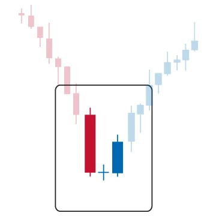

# Candlestick Pattern - Everything you need to know about Doji Star

Consider the market conditions when the buying trend is strong, but some traders also expect the current trend to reverse; this is why they sell. What happens in this situation? If all traders go out and sell, the market will fall. But when it is not strong enough, the market will reflect indecision. Traders pay close attention to these moments to predict when market trends may change. But how do you know when it will happen by looking at the graph? Well, technical traders will look for Doji candlestick patterns that appear on the trading chart.

Doji candles belong to the Japanese candlestick chart family. It is named for its unique training. We will try to understand what a Doji candlestick is and what its support level should be when you see it.

## Meaning of Doji Star candlestick pattern

The Doji candlestick pattern is a three-column pattern. **It is considered to be a sign that the current market trend may be about to reverse**. It is a versatile candlestick pattern with two variants, bullish and bearish. Its variants depend on your existing trends.

To understand the Doji candlestick pattern, it is important to understand a simple Doji candlestick pattern. When the opening price and the closing price are at the same or almost the same level, a Doji candlestick pattern is formed. The pattern looks like a plus or a cross.

**Key Points:**

- The Doji pattern is a 3 column inverted candlestick pattern.
- Start with a long candle, open it to draw a Doji, and then reverse it with a larger candle in the opposite direction.

### Type of Doji Star candlestick pattern

- **Doji Star** – Looks like a star with the same opening and closing value and the same length of the top and bottom wicks. This happens when neither a bullish or bearish trend is enough to affect market sentiment.

- **Long-legged Doji** – A star-shaped Doji with extended upper and lower wicks. It also represents an undecided mood with high volatility.

- **Dragonfly Doji** – You can find it at the bottom of the downtrend, indicating the rejection of lower prices. Unlike the Doji Star and Long-legged Doji, Dragonfly does not portray the indecision of the market. Rather, it portends a possible uptrend reversal. You can recognize the dragonfly by its unique appearance, lack of real body, and long lower wick.

- **Price Doji** – It is represented by a single horizontal line, which represents the final hesitation of the market. This pattern appears at the opening and closing, both high and low are the same.

- **Gravestone Doji** – Gravestone Doji is located on the other side of Dragonfly Doji. Appears in an uptrend, indicating that the market refuses to accept higher prices. It is a Doji candle with no real body and extended upper shadow.

## Psychology behind Doji Star Pattern

Technical analysts believe that all known information about the stock is reflected in the price, which means that the price is valid. However, the evolution of prices in the past has nothing to do with the evolution of prices in the future, and the real price of a share may have nothing to do with its true or intrinsic price. Therefore, technical analysts use tools to help filter noise to find the most likely trades.

One tool that was formed by a Japanese rice trader named Honma from the town of Sakata in the 18th century, and it was introduced to the West in the 1990s by Steve Nison.

Each candlestick pattern has four data sets to help define its shape. Based on this form, analysts can make assumptions about price behavior. Each candle is based on the opening price, the highest price, the lowest price, and the closing price. The time duration or tick interval used does not matter. The complete or hollow bars created by the candlestick pattern are called the real bodies. The lines that extend to the outside of the body are called shadows. Stocks whose closing price is higher than their opening price will have a hollow candle. If the stock price closes lower, the body will have a full candle. One of the most important candle patterns is called a Doji.

When the opening price and the closing price of a stock are almost the same, a Doji is created, which refers to both the singular and the plural forms. Doji often looks like a cross or a plus sign, and the body is small or non-existent. From an auction theory perspective, Doji represents the indecision of buyers and sellers. We are all the same, so prices have nowhere to go; buyers and sellers are at a standstill.

Some analysts interpret this as a sign of retracement. However, this may also be the time when buyers or sellers gain momentum for continued trends. Dojis usually appear during the integration period and can help analysts identify potential price breakouts.

## Bullish Doji Star candlestick pattern

The bullish doji pattern is a three-column pattern formed in a downtrend. The first column has a long red(or black) body, and the second column opens lower. It is closed like a doji pattern, and the trading range is small. The third bar closed above the midpoint.

Technical analysts use bullish doji candles to determine the reversal of the current long-term market downtrend. Experts see the bullish doji pattern as a signal to buy. They also use it to check the weather and avoid selling assets. It mainly appears at the bottom of the chart. This is a bell that indicates that the bulls are coming after a long-term bearish phase.

### Identifing bullish Doji Star candlestick?

Look for a normal red candle at the bottom of the chart on the first day. If it confirms the current downtrend and shows that the price closed below the opening price.

Next, look for the little doji on the next day, which shows that there is almost no difference between the opening price and the closing price.
Now look for the third candle that shows an upward gap.

### Trading in the bullish Doji Star pattern?

If the price starts to move in the opposite direction, you should consider taking a long trade while holding your stop loss to ensure safety. You can also try checking the 5 minute and 15 minute time frames to analyze this pattern and take appropriate precautions. Once the bullish doji pattern forms, the price starts to rise. Therefore, if you start trading after confirming this mode, you will likely make a profit.

## Bearish Doji Star candlestick pattern

A bearish doji candle is a bearish reversal pattern that appears in an uptrend. It is represented by two lines. The body of the first candle is very long because it is rising in an uptrend. Then, especially the doji that opened and closed above the first candle formed.

### How to identify a bearish Doji Star candlestick?

You should look for a candlestick with a long green(or white) line and a doji above the first candle. You should also remember that the shadow of the doji will not be too long and the shadow of the line will not overlap. Therefore, these tips can easily identify a bearish doji candlestick pattern.

### Trading in bearish Doji Star pattern?

A bearish doji is a signal that shows the end of an uptrend and the beginning of a bearish reversal that caused the price to fall. Therefore, it is wise to sell the stocks/crypto-coins whenever there is a bearish doji pattern.

## Limitations of a Doji

In isolation, the Doji candle is a neutral indicator that provides little information. Also, dojis are not common. Therefore, it is not a reliable tool for detecting events such as price reversals. When it happens, it is not always reliable. There is no guarantee that the price will continue to develop in the expected direction after the candle is confirmed.

The size of the tail or wick of the doji plus the size of the confirmation candle can sometimes mean that the entry point of the trade is far from the stop loss position. This means that traders need to find another stop loss position, or they may need to abandon the trade, because too large a stop loss may not justify the potential return from the trade.

Calculating the potential gains of doji trading can also be difficult, because candlestick patterns usually do not provide price targets. Other techniques, such as other candlestick patterns, indicators, or strategies are needed to exit the trade in a profitable situation.

## Example Charts

