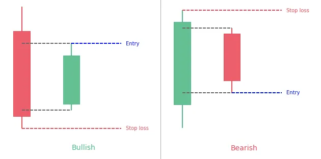
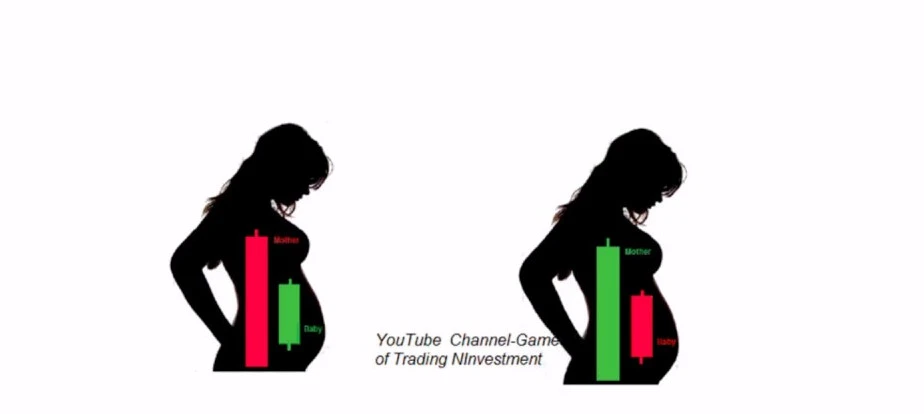
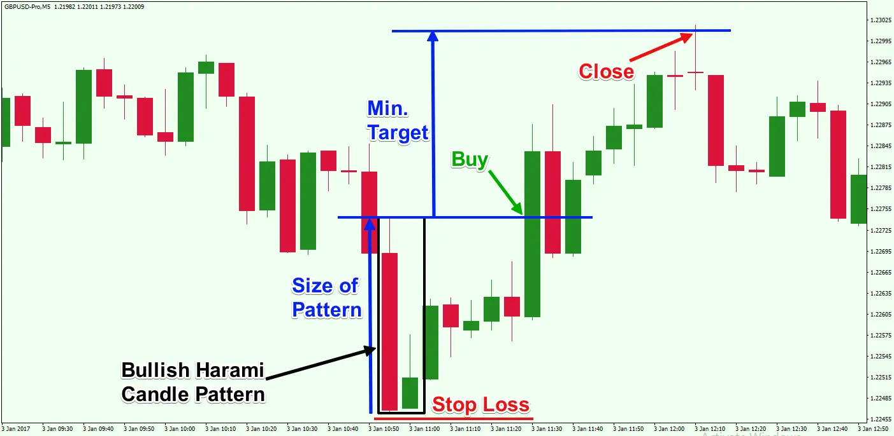
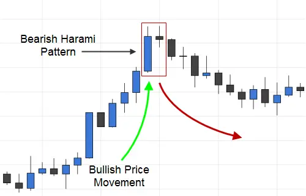

# Harami Candlestick Pattern

Before you start wondering, the name ‘Harami' does not refer to the Hindi word harami 😜.
It's thought to be an old Japanese word for "pregnancy." When you see the [candlestick](https://www.investopedia.com/terms/c/candlestick.asp) formation, you'll appreciate how intuitive this word is.

## What does harami candlestick pattern means?

The harami [candlestick](https://www.investopedia.com/terms/c/candlestick.asp) is a Japanese candlestick pattern that consists of two candles and signals whether the market is likely to reverse or continue. As shown below, the harami candlestick pattern can signal both bullish and bearish signals:

The first candle (pregnant candle) is a large candle that continues the current trend, and the trailing candle is a small candle that protrudes like a pregnant woman, as shown in the photographs above. It's worth noting that the second candle will technically gap inside the first. Gapping on forex/stock/crypto charts, on the other hand, is uncommon due to the 24-hour nature of currency trading. As a result, the theoretically perfect harami candlestick pattern is uncommon in the FX market, as gaps are narrow and the second candle frequently forms a small inside bar of the first.

The confirming candle is used to advise traders whether the smaller following candle initiates a reversal or continues the trend established by the starting candle.
The harami pattern's and other [candlestick](https://www.investopedia.com/terms/c/candlestick.asp) patterns' popularity stems from their ability to catch a reversal at the most opportune time with minimal risk.
Traders will be able to achieve exceptionally favorable risk-reward ratios as a result of this.

## Psychology behind harami candlestick pattern

The stock market is constantly a battleground between bulls (buying) and bears (sellers).
It's all about supply and demand.

_Consider the following scenario:_

For the past few days, a stock has been declining.
A large red candle appears one day, indicating that the sellers have complete control.

The stock opens the gap higher the next day.
Those who are short on the stock begin to fear that it will rise in price as a result of the price increase.

They cover their short bets, causing the price to rise even more.

The grip of the sellers is diminishing as the price rises. The purchasers are gaining the upper hand.

If the stock opens higher on the third day (after the Bullish Harami formation), it's a sign that the trend may be changing and the stock price may be rising.

## Bullish harami candlestick pattern

A bullish harami is a [candlestick](https://www.investopedia.com/terms/c/candlestick.asp) chart signal that indicates the end of a bearish trend. A bullish harami may be described by some investors as a signal to place a long position on an asset.

Investors studying for harami candlestick patterns should start by looking at periodic market performance in [candlestick](https://www.investopedia.com/terms/c/candlestick.asp) charts. A bullish harami relies on initial candles to indicate that a downward price trend is continuing and that a bearish market appears to be pushing the price lower. Harami patterns appear over two or more days of trading, and a bullish harami relies on initial candles to indicate that a downward price trend is continuing and that a bearish market appears to be pushing the price lower.

The bullish harami pattern indication is represented on the chart by a lengthy [candlestick](https://www.investopedia.com/terms/c/candlestick.asp) followed by a smaller body, known as a [Doji](https://anothertechs.com/crypto/everything-you-need-to-know-about-doji-star/), that is totally contained within the vertical range of the previous body.
A line drawn around this pattern is said to resemble a pregnant woman by some.

A smaller body on the following [Doji](https://anothertechs.com/crypto/everything-you-need-to-know-about-doji-star/) must close higher within the body of the previous day's candle to form a bullish harami, indicating a larger possibility of a reversal.

**Notes**:

- A bullish harami is a [candlestick](https://www.investopedia.com/terms/c/candlestick.asp) chart signal that indicates a price reversal in a bear market.

- It's usually signaled by a minor price increase (shown by a white candle) that can be contained within the given equity's recent downward price movement (represented by black candles).

## Bearish harami candlestick pattern

A bearish harami is a two-bar Japanese [candlestick](https://www.investopedia.com/terms/c/candlestick.asp) pattern that indicates a price reversal is imminent. A tall white candle is followed by a little black candle in this arrangement. The second candle's opening and closing prices must be contained within the first candle's body. The formation of a bearish harami is preceded by an uptrend.

The potency of the pattern is determined by the size of the second candle; the smaller it is, the more likely a reversal will occur. A bullish harami, which is preceded by a downtrend and predicts that prices may reverse to the upside, is the polar opposite of a bearish harami.

To make a bearish harami pattern more useful as a trading signal, traders usually combine it with other technical indicators. For example, when a bearish harami emerges during a retracement, a trader may use a 200-day moving average to confirm the market is in a long-term decline and enter a short position.

**Notes**:

- A bearish harami is a [candlestick](https://www.investopedia.com/terms/c/candlestick.asp) chart signal that indicates a price reversal in a bullish trend.

- A slight price decline (shown by a black candle) that can be contained within the given equity's upward price trend (represented by white candles) from the previous day or two is usually indicative.

- To boost the chances of a successful transaction, traders might employ technical indicators like the relative strength index (RSI) and the stochastic oscillator with a bearish harami.

## Advantages and disadvantages of harami candlestick pattern

### Advantages

- Simple to recognize

- Chance to profit from significant fluctuations with high risk-to-reward ratios

- In forex/stock/crypto trading, it is often employed.

### Disadvantages

- Prior to execution, confirmation is required.

## How to trade harami candlestick pattern

### 1. Harami candlestick trading with indicators

The harami candlestick pattern will be combined with Bollinger bands in this trading method.

Only trade the harami [candlestick](https://www.investopedia.com/terms/c/candlestick.asp) pattern, which appear when the price reaches a Bollinger band level on the upper or lower side.

For example, you can enter a short position after the price touches the upper Bollinger band at the same moment a harami is formed, as seen below.
trading with indicators

One should hold their position and close it until the price touches the lower Bollinger band.

### 2. Harami candlestick trading with price action

The price action strategy option should always be included in our analysis because the harami candle is a price action component.

When we trade on price movement, we are completely reliant on the chart's price action.

This implies no indicators, oscillators, or moving averages, among other things.

Chart patterns, candle patterns, support and resistance levels, and other indicators should be used.
