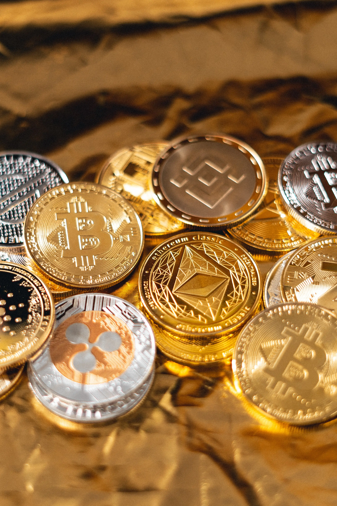
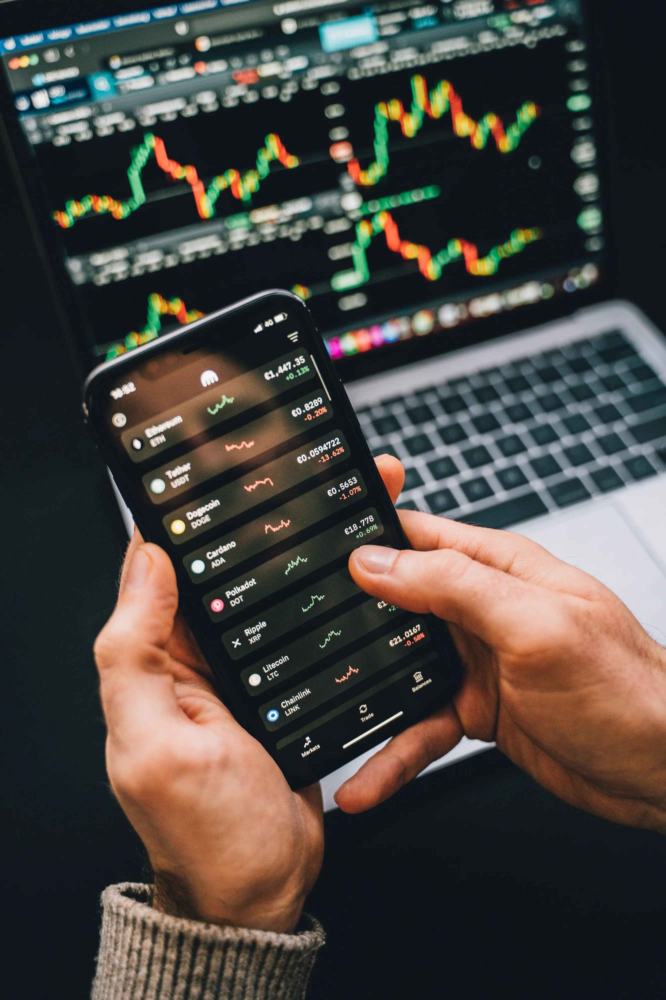

# How to Buy Cryptocurrency in India

Cryptocurrency has a tale of distrust and strict regulation in India. The Reserve Bank of India (RBI) and the Ministry of Finance have listed the potential use of volatility for investors' dangerous and illegal activities as their concerns. After the Bitcoin crash in 2017, the Ministry of Finance warned investors to stay away from Bitcoin and other cryptocurrencies. The Ministry of Finance has compared virtual currencies with Ponzi schemes and warned that they will not be regulated or protected by the Indian government.

After trying to ban banks from dealing with Indian cryptocurrency exchanges, a Supreme Court ruling, and an attempt to ban cryptocurrencies forever, Indians can still buy cryptocurrencies. Investors who want to buy cryptocurrencies can still buy through Indian exchanges such as WazirX or international exchanges such as Binance. Take a look at some of the exchange options that India offers.

India is a country with strict regulations on cryptocurrency and plans to ban any virtual currency that does not come from the government. Therefore, investors may need to be cautious and be prepared to liquidate their cryptocurrency holdings. This guide will explain how to continue buying cryptocurrency and other things to keep in mind.

## How does Cryptocurrency Investment Works?

Cryptocurrencies came into life in 2009 with the work of the first cryptocurrency – Bitcoin.

Bitcoins do not have a physical appearance like the US dollar or Indian Rupee note. You can only see the bitcoin address.

Bitcoin codes are created during the bitcoin mining process. The mining process needs large powerful computers and a continuous electricity supply. It’s not sufficient to mine bitcoins in India due to the high price of power in India.

Most of the bitcoins are mined in China and countries like Norway where computer infrastructure and power are cheap.

People like you and me can purchase bitcoins directly from the crypto exchange. I will go through the bitcoin exchange process later in the article.

I should also inform you that It’s a good practice to have the cryptocurrencies safe in a wallet rather than storing them in the exchange for security reasons.

## How to Buy Cryptocurrency in India?

**Buying crypto in India is still a legitimate process that investors can quickly take part in by opening an account with a crypto exchange**. Citizens can trade various currencies, hold virtual currency in wallets, and more once they have registered for an account.

### What You Need To Buy Crypto In India?

Before setting up an account online with a crypto exchange, you will need to confirm your identity with some documents. Various exchanges will have various rules when it comes to account setup, but the following things are good to have on hand to make the process faster:

1. You may need to upload photos of your Aadhaar card or other acceptable ID
2. A private and secure internet connection (public WiFi poses security issues)
3. A cell phone you can use for two-factor authentication
4. An account with an exchange that operates in India
5. A bank account you can withdraw from to deposit rupees to your exchange
6. A secure method of cryptocurrency storage. Most brokerages will have a good built-in wallet or protected vault system that you can use.

## Choose a platform to buy cryptocurrencies

Cryptocurrency Exchange Screen
A cryptocurrency platform is an exchange or website that helps connect buyers and sellers of cryptocurrencies. The platform helps to trade and exchange various cryptocurrencies.

Without a platform, it is difficult to invest in cryptocurrencies unless you meet the cryptocurrency seller in person.

It is also important to choose the correct platform, it is secure and compatible with your cryptocurrency transactions.

Find a cryptocurrency exchange with INR pairs so that you can directly invest in cryptocurrencies without having to convert Indian currencies to Bitcoin or USDT.

### Security

The security of cryptocurrency exchanges and cryptocurrencies is an important factor, because if the exchange is not secure, your cryptocurrency and funds may be stolen.

You should choose an encrypted exchange that uses encrypted transactions, stores encrypted currencies in cold locations (not connected to the Internet), and ensures the security of the trading platform.

### Ease of use

The exchange must provide a simple and fast trading platform that can be used on the internet and smartphones. So you can trade anytime, anywhere.

The platform should allow you to deposit/withdraw in local currency without any problems.

### Exchange rate

Transaction fees are typically less than 1% of each transaction, and if you do a large number of transactions, the fee may be less.

In addition to the transaction fees, you also have to pay the withdrawal fees. You should compare all the fees the exchange charges for its services.

You should choose a platform that provides all facilities at a reasonable cost, because transaction fees represent a large investment cost.

## Best Cryptocurrency Exchange Platform 2021

### 1. [WazirX](https://wazirx.com/exchange) - Best Cryptocurrency Exchange in India

** WazirX ** is the most popular cryptocurrency exchange in India, starting trading with
on March 8, aiming to become the most trusted
cryptocurrency exchange operating in India. It plans to launch a fully functional
cryptocurrency exchange that will support different cryptocurrency pairs. WazirX
also launched its own WRX Coin token. You can earn 100
WRX for free by joining the exchange. Lately, WazirX was taken by Binance, the world's largest
exchange. Provides a large number of
supported tokens.

### 2. [CoinSwitch](https://coinswitch.co/)

Coin switch is an instant cryptocurrency exchange that can help users make
transactions between more than 400 cryptocurrencies. It has a very simple and easy-to-use interface. Users can also use credit cards to buy cryptocurrencies on Coinswitch.

### 3. [Coindcx](https://coindcx.com/)

CoinDCX is another great cryptocurrency exchange in India. CoinDCX provides instant fiat-to-crypto currency conversion free of charge, so users can access various financial products and services supported by industry-leading security procedures and insurance protection. CoinDCX provides users with an integrated combination of products, including its P2P store to buy 100+ cryptocurrencies immediately at INR

### 4. [ Cashaa ](https://cashaa.com/)

Cashaa is a UK-based cryptocurrency banking solution, launched in India in 2019. Cashaa is a cryptocurrency exchange that allows users to buy 7 Bitcoins (BTC), Ethereum (ETH, USDT and CAS, and INR. The list is and the list is constantly growing. Cashaa (CAS) crypto coin is the native cryptocurrency of the platform. Cashaa follows strict KYC and all accounts are verified on the same day at . Cashaa India is located in Mumbai. As mentioned on the Cashaa website, will provide users with an access card with a key so they can withdraw their funds.

### 5. [ Zebpay ](https://zebpay.com/)

Zebpay is India’s oldest and largest cryptocurrency exchange. Due to the ban imposed by the Reserve Bank of India, Zebpay moved to Malta, also has an office in Singapore, and currently supports more than 150 countries. Zebpay charges a transaction fee of 0.15% of the manufacturer's fee and 0.25% of the taker's fee. They also charge different withdrawal fees for different cryptocurrencies, and the Zebpay app is also available for Android and iOS phones.

### 6. [ Colodax ](https://colodax.com/)

Colodax was founded by the CrypDates team in 2017. It is a B2P (broker to Peer) exchange that allows Indian traders to easily deposit and withdraw Indian rupees. The broker is a high-frequency trader affiliated with our exchange, and users need to complete KYC to trade on our platform. Now refer a friend to get up to 10,000 NPXS tokens. You can trade all major cryptocurrencies on Colodax, such as Bitcoin (BTC), Ripple (XRP), Ethereum (ETH), Litecoin (LTC), etc.

### 7. [ BuyUcoin ](https://www.buyucoin.com/)

Launched in 2016, BuyUCoin is the oldest cryptocurrency exchange still operating in India after the Reserve Bank of India ban. It is another Indian market leader in the cryptocurrency market. It provides a simple and reliable platform to buy, exchange, store and accept many cryptocurrencies, such as Bitcoin, Ethereum, Ethereum Classic, List, NEM, Civic, Litecoin, Bitcoin Cash, and so on.

BuyUcoin has more than 250,000 users exchanging assets in more than 30 cryptocurrencies on the platform. Users can use credit cards to buy cryptocurrencies directly on the exchange. Buy you coin also added a repeat buy function to so that users can invest as SIP for encryption. BuyUcoin developed and proposed a "sandbox" framework to monitor cryptocurrencies in India to avoid the possibility of a total ban on cryptocurrencies in India
