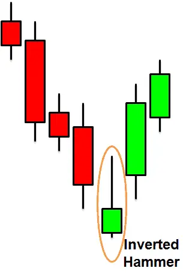
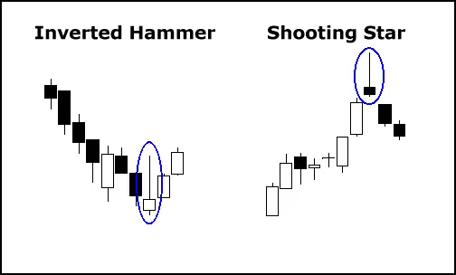
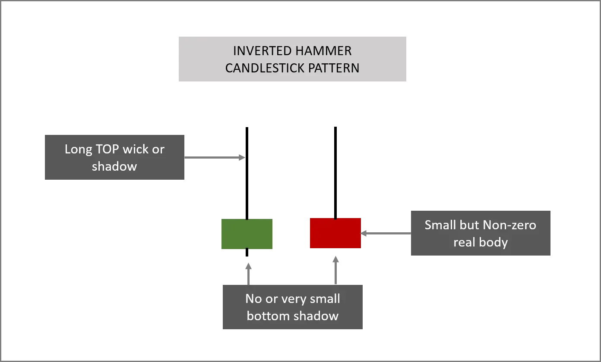
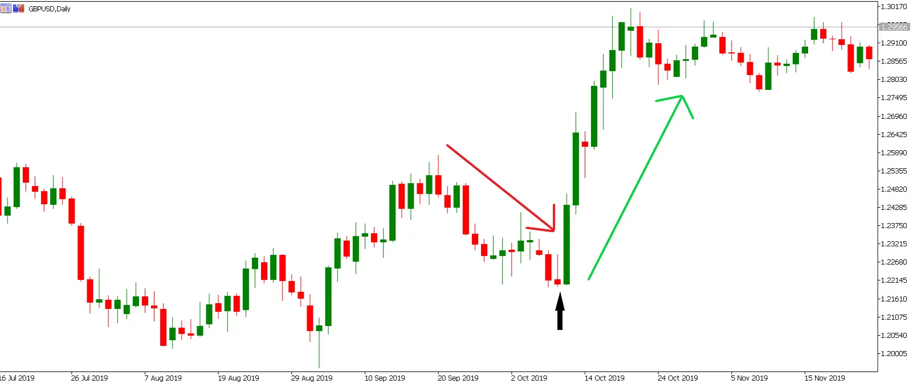
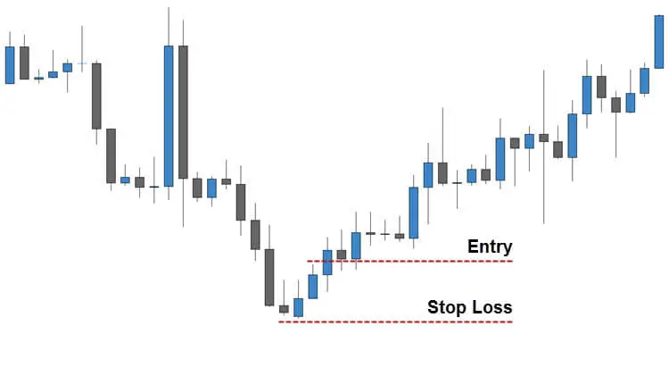

# Inverted Hammer Candlestick Pattern

When it comes to trading, knowing how to recognize potential reversals will help you maximize your profits. One such signal that can assist you in identifying new trends is the **inverted hammer candlestick pattern**.

This tutorial will tell you everything you need to know about the inverted hammer.

## What does the inverted hammer candlestick pattern means ?

The real body of an inverted hammer candle is small, with an extended upper wick and little or no lower wick. It appears near the bottom of a downtrend and indicates the possibility of a bullish reversal. The longer upper wick indicates that the bulls are attempting to push the price higher. The validity of this move will be confirmed or rejected by price action in the future.

The [shooting star](https://anothertechs.com/crypto/shooting-star/) should not be confused with the inverted hammer.
Both candles have similar appearances, yet their meanings are vastly different. At the top of an uptrend, the shooting star is a bearish indicator, while at the bottom of a downtrend, the inverted hammer is a bullish signal.

## How Inverted Hammer Candlestick is formed?

When bullish traders acquire confidence, an inverted hammer candlestick appears. Bulls attempt to drive the price as high as they can, while bears (or short-sellers) attempt to fight the higher price.
The positive tendency, however, is too powerful, and the market ends up at a higher price.

## Identifying Inverted Hammer Candlestick Pattern

As a little body, the inverted hammer design. There is also an enlarged upper wick, but there isn't much in the way of a lower wick. This will be apparent at the bottom of a downtrend and could signal a possible bullish reversal.

Furthermore, the longer upper wick may be signaling to investors that the bulls intend to push prices higher. Following price action, which may reject or confirm the coming adjustments, a more accurate picture will emerge.

## Green Inverted Hammer vs Red Inverted Hammer

A bullish, green Inverted Hammer candlestick is formed when the low and open are the same, and it is regarded as a stronger bullish sign than when the low and close are the same (a red Inverted Hammer).

## Psychology behind inverted hammer candlestick pattern

An inverted hammer candlestick pattern indicates that buyers are exerting market pressure.
It warns that after a bearish trend, there may be a price turnaround.
It's vital to remember that the inverted hammer candlestick shouldn't be used as a stand-alone indication; always double-check any potential signals with other forms or technical indicators.

Finally, before acting on the inverted hammer, examine your trading plan.

## Advantages and disadvantages of the inverted hammer candlestick pattern

### Advantages

- If the inverted hammer candle initiates a new uptrend right away, traders can enter the market at the start of the trend and profit from the entire upward movement.

- On a chart, the Inverted Hammer Candlestick is easy to spot.

### Disadvantages

- Price action is represented by the Inverted Hammer, which is a single candle. Without evaluating further supporting evidence/indicators, relying just on a single candle to overturn market momentum might lead to sub-optimal results.

- The inverted hammer candle may indicate a brief uptick in positive price activity, but not a longer-term trend reversal. This can occur if purchasers are unable to maintain buying pressure in the face of a strong downward trend.

## Here's how to trade an inverted hammer candlestick pattern if you come across one.

When deciding whether or not to trade when the inverted hammer candlestick pattern appears, it's vital to keep an eye out for other important signals that could indicate a possible reversal. However, if you are convinced that a change will occur, you can use spread bets or CFDs to trade. Both of these are ancillary products that allow investors to trade on both decreasing and rising prices.

There are numerous possibilities, such as trading, going along, or buying, but there is also the option to sell or go short if the signal is not promising enough and the downward trend appears to be likely to continue.
