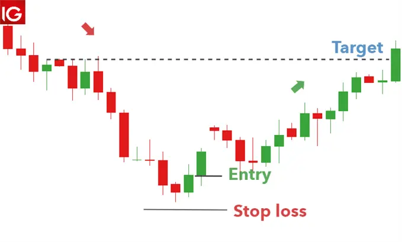

# Candlestick Pattern - Morning star

For a long time, investors have been carefully studying the candlestick patterns that appear in the price trajectory. This is to predict the future. These areconsidered price signals in technical analysis.A fascinating set of **reversal** pattern analysis are those that indicate stars. A star is composed of a small real body (green/red or white/black), which separates the large real body before it. In other words, the actual body of the star may be within the upper shadow line of the previous trading day; all that is required is that the candles do not overlap.

## What is Morning star pattern?

Morning star candlstick is a visual pattern composed of three candles, and technical analysts interpret it as a **bullish signal**. Morning star pattern formed after a downtrend, indicating that it started to climb upwards. This is a sign of a reversal of the previous price trend. Traders observe the formation of Morning Star and then use other indicators to find confirmation that a reversal has indeed occurred.

## Formation of Morning star candlestick pattern

1. The first candle is a strong bearish candle (red).

2. The second candle is a special candle called the Spinning Top.

3. Lastly,third is a bullish candle (green) whose length is at least equal to half of the first candle.

## Difference between Morning Star and Doji Morning star pattern

There is a slight variance in the morning star pattern. A doji is formed when the middle candlestick's price action is essentially flat. This is a little candlestick, like the plus symbol, with no discernible wicks. Compared to a morning star with a thicker middle candle, the doji morning star more clearly displays the market's uncertainty.

Because more traders can easily spot a morning star-forming, the arrival of a doji after a black candle typically results in a more aggressive volume increase and a proportionately longer white candle.

## What does morning star candlstick pattern tells us?

The morning star pattern's small real body represent a stalement between the bulls and bear. The bear are obviously in charge in a brisky descending market(crypto,stock,foreing exchange). With the emergence of a morning star in such an environment,it is a signal of a shift from the **seller being in control to a deadlock between the selling and buying forces**.This dealock may have occured either because of a diminution in the selling forces or an increase in the buying pressure. Either way, the morning star pattern tells us the rally's prior power has slightly dissipated. This means the market will move upwards.

## Using Morning Star Candlestick Pattern in Forex Trading

Morning star pattern is a powerful price signal with high precision. The morning star candlestick pattern is very popular with price action traders. The best combination is to use analytical indicators to identify forex trends. Then use morning star pattern to determine the entry point.

There are many way you can trade in forex using morning star pattern few of them are:

### 1. Combining with Support

In this combination, the support area is considered to be retained. If there is a morning star pattern, the price is likely to rebound. You can enable a high security UP option.

**Conditions**: a 5-minute candlestick price chart, a support zone, and an expiration time of 15 minutes or more.

#### Openning a trade

When the price falls into the support zone and forms a morning star candlestick pattern, turn on the UP option.

### 2. Combining with RSI indicator

RSI technical indicator is always a powerful indicator for price trend analysis. When combined with the morning star sail pattern, they will provide you with a good point for bottom fishing.

**Conditions**: 5-minute candlestick price chart, RSI indicator (14), expiry time of 15 minutes or more.

#### Openning a trade

When the RSI indicator appears in the oversold zone (30) and Morning star mode, turn on an UP option.

### Notes

- Don't use morning star candlestick pattern just to find a forex trade. Combine it with at least one indicator or other price signal to get a higher probability of winning.
- Restrict the use of morning star pattern  when the market deviates. Because the accuracy of this candlestick pattern in the side market is not high.

## Limitation of Morning Star Pattern

Limitation of Morning star pattern is that since this is a three-candle pattern, you must wait until the end of the third trading candle to complete the pattern. Normally, if this third candle is a tall white or green candle, we will get a good signal after the market has rallied sharply. In other words, the termination of morning star pattern may not provide attractive risk / reward trading opportunities. One option is to wait for the morning star support area correction and start eating the bulls.

Although the ideal morning star and [evening star](https://anothertechs.com/crypto/evening-star/) should not allow any of their three entities to touch, but in a market where the opening and closing prices are the same or the closing price is the same, the definition of the morning star (and the [evening star](https://anothertechs.com/crypto/evening-star/)) is more flexible.
