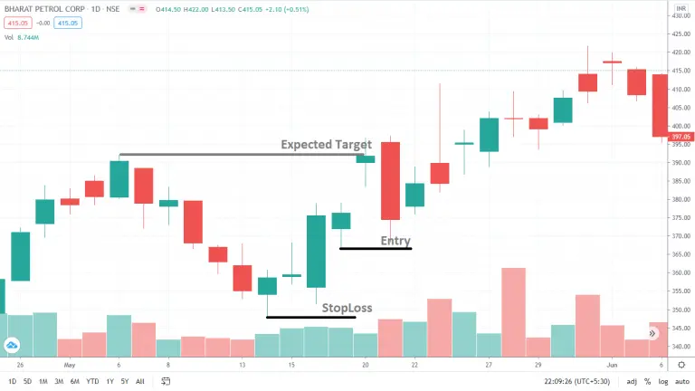

# Piercing line pattern

For each bearish pattern, there is also a bullish pattern. So previously we have seen a bearish pattern - [The Dark Cloud Cover](https://anothertechs.com/crypto/dark-cloud-cover/).
Now its counterpart is the bullish [piercing line pattern](https://anothertechs.com/crypto/piercing-pattern/).

## What is the Bullish Piercing line Pattern

The piercing line pattern is considered a bullish reversal candlestick pattern that is at the bottom of a downtrend. When bulls enter the stock/crypto market and prices rise, it usually indicates a change in trend.

This piercing line pattern consists of two downtrend candles(red and green). The first candle is a red (or black) body and the second candle is a green (or white) body. This green (or white) candle has a lower open price, preferably below the low of the red (or black) prior candle. This is the support for buyers to push the price higher to reach more than 50% from the last bearish candle.

The piercing line candlestick pattern is similar to the bullish [engulfing](https://anothertechs.com/crypto/the-engulfing-pattern/) pattern. In the bullish [engulfing](https://anothertechs.com/crypto/the-engulfing-pattern/) pattern, the green(or white) candle engulfed the entire previous red(or black) candle. In the [piercing](https://anothertechs.com/crypto/piercing-pattern/) pattern, the green(or white) candle pierced, but does not envelop the previous entity. In the form of perforation, the higher the degree of penetration, the more likely it is to become a fund investment.

### How to identify piercing line pattern

1. The body of the first candle should be black or red and the body of the second candle should be white or green.

2. The downward trend has been obvious for a long time, and a long negative line appears at the end of the trend.

3. The opening price of the next time period is lower than the price of the previous time period.

4. The white or green candles close to more than half of the black or red candles.

## What does piercing line pattern tell Us

After the strong downtrend took effect, the sentiment was bearish. The fear became more prominent and the price gap narrowed. The bears may even drive prices down even further, but before the end of the time period, the bulls intervene and reverse the prices drastically. The price closed near the high of the time period, a move that almost offset the price drop the time period before. Now, this worries the bears. More purchases in the next time period confirmed this move.

## Example chart for piercing line pattern

