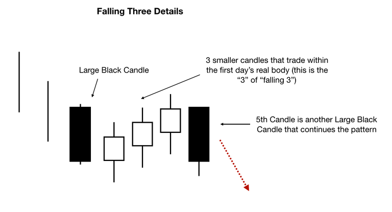

# Candlestick Pattern - Rising Window and Falling Window

All of the candle signals we have seen so far have been reversal. In fact, most candle signals are trend reversal. There are, however, a group of candle patterns that are continuation indicators. **A continuation pattern is one in which the market should continue the same trend as theat in force before the continuation pattern**. For instance, a continuation pattern following a rally means that the trend remains up and we should expect the rally to remain in force.

## Rising Window Candlestick Pattern

A gap-up is another name for a Rising Window candlestick pattern.The support and resistance zones of window candlestick patterns are particularly rigid.

**During an uptrend, the Rising Window is a two-candle bullish continuation pattern. With the exception of the Four-Price Doji, both candles in the pattern can be of any type. The most crucial feature of the pattern is a price gap between the high and low of the first and second candles. The space (window) between two bars denotes resistance to selling pressure.**

A bullish signal is issued when a Rising Window candlestick pattern appears, indicating that more shares are being acquired above the gap-up area than are being sold.
When this occurs, market makers react quickly by raising the stock's share price to a point where buying and selling demand are more evenly balanced.

This significant rise in the stock price frequently occurs outside of normal trading hours, such as following the release of positive news or a strong results announcement.

### What Does Rising Window Candlestick Pattern Tells Us ?

Now that you've mastered the difficult lesson of how to build a Rising Window, let's talk about what this pattern is trying to tell investors. The space between the candles represents the distance between the high of the previous candle and the low of the current candle.

This trend indicates that the bulls are in good shape, and we can expect them to keep pushing the price higher. Examine the size of the gap to acquire a better understanding of the pattern's message. A high gap denotes a significant price increase, whereas a small gap denotes a modest (and unimportant) price change.

An Upside Gap Tasuki has created if the two candles that follow a Rising Window do not close the window or fill the gap (including their shadows). The two candles must be of opposing colours (the first white, the second black), with the black candle opening inside the white candle's body and closing below it. This pattern indicates that there is a pause following the upswing as the bears attempt to force the price down. They are, however, unable to succeed. The gap has not been bridged, thus we can expect the rally to continue.

### Requirements for Rising Window Pattern

The requirements for a Rising Window candlestick pattern are listed below.

- It's a continuation candlestick pattern that's bullish.

- A Rising Window candlestick pattern is made up of two candles.

- Between the two candlesticks in the pattern, there must be an empty gap where the intra-day prices do not overlap.

- The first of the two candlestick patterns could have a red coloured true body, but the most likely possibility is that the pattern is made up of two green coloured candlesticks.

### Identifying Rising Window Pattern

Follow the steps below to locate a genuine rising window candlestick pattern on the price chart.

1. A gap between two bullish candlesticks is a good sign.

2. It's the distance between a newly formed candlestick's low and the prior candlestick's high.

3. The two bullish candlesticks should have a substantial body, indicating strong buyer momentum.

4. During a bullish price trend, it should form.

During an uptrend, the rising window candlestick is most effective. Because it is a signal for the continuation of a trend. If, on the other hand, the rising window pattern appears below the resistance zone, a reversal is possible. As a result, trading rising window candlestick patterns immediately below the resistance zone should be avoided.

A rising window pattern will work if it occurs after the resistance zone has been broken, and it is a positive trend continuation signal.

## Falling Window Candlestick Pattern

A bearish continuation candlestick pattern is a Falling Window candlestick pattern.
A gap-down candlestick pattern is also known as a Falling Window candlestick pattern.

**The falling window is a candlestick pattern made up of two bearish candlesticks separated by a downward gap.** The down gap is the distance between the recent candlestick's high and the prior candlestick's low. It arises as a result of the market's excessive amount of selling orders.

It's a Bearish trend continuation candlestick pattern that shows how strong the market's sellers are. When a falling window forms on the price chart, the price of an asset/security will continue to fall.

### What does Falling Window Tells Us?

So, what is the message being conveyed by this pattern?
The signal, in this case, displays a gap between the low of the previous candle and the high of the current candle. This price drop reflects the bears' current strength and signals that the downturn will continue.

Although a Falling Window is merely a gap down, why not capitalise on its dramatic formal name? It's also known as a Western Gap. Most of the time, this signal functions as a bearish continuation pattern, but it's always advisable to wait for confirmation. Examine the signal's size to gain a better understanding of it. As you could expect, a wide gap indicates a significant price drop. A minor difference isn't as meaningful as a large one.

When the two candles appear after the Falling Window, examine them. A Downside Tasuki Gap pattern may have arisen if they do not close the window or fill the gap (this includes their shadows). The first and second candles must be bearish, but the third must be bullish, in order to qualify. This suggests that after a significant downturn (as evidenced by the gap down), the bulls attempted to force the price back up. However, they were unsuccessful, and the decline is projected to continue.

### Identifying Falling Window Pattern ?

To identify a perfect falling window pattern on the price chart, follow the steps below.

- Look for two bearish candlesticks, as well as a gap between the high of the most recent bearish candlestick and the low of the most recent bearish candlestick.
- Keep in mind that the Gap should not be very wide.

- Bearish candlesticks should have large bodies since this indicates strong seller momentum.

- It should appear during a downward price trend.

### Requirements for Falling Window Pattern

The specifications for a Falling Window candlestick pattern are listed below.

1. It's a continuation candlestick pattern that's bearish.

2. A Falling Window candlestick pattern is made up of two candles.

3. Between the two candlesticks in the pattern, there must be an empty gap where the intra-day prices do not overlap.

4. One or both candlesticks could have green coloured genuine bodies, but two candlesticks with red coloured true bodies are the most likely option.

## How to Trade Falling Window Pattern ?

The price will be held back by the down gap in the falling window, which will operate as a resistance zone. Because a big number of selling orders are placed in this zone, the price will remain low until all of the selling orders are filled.

Following the falling window pattern, price will either continue to fall or give a minor pullback towards the gap zone to fill some selling orders.

Trading falling window patterns can be done in two ways. You can either place sell orders right after this candlestick formation or wait until the price does not pull back into the gap zone. Later, I'll show you how to make a high-risk, high-reward deal.
