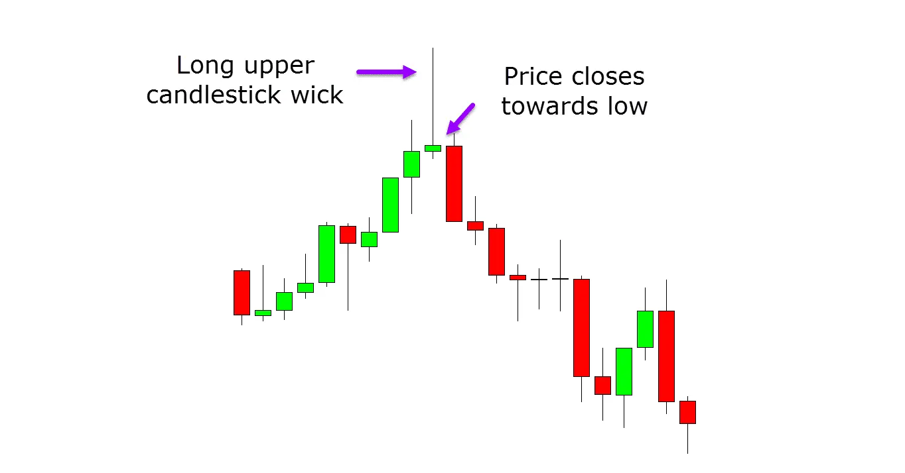
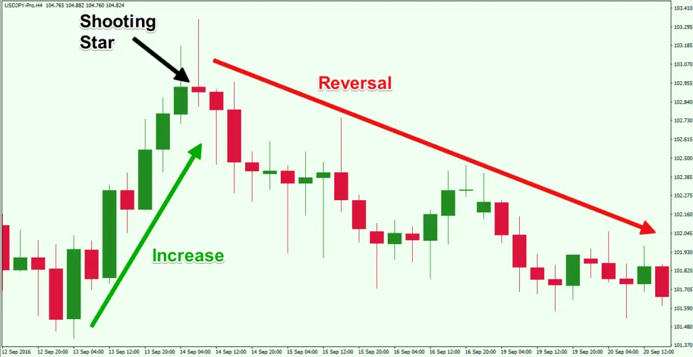
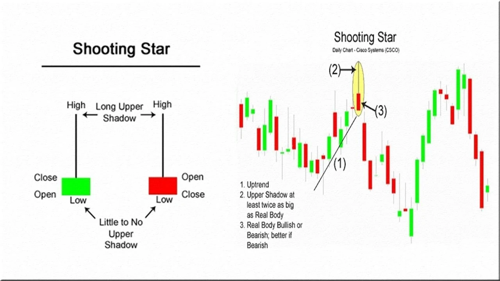

# Understanding the Shooting Star Candlestick Pattern

When the term "Shooting Star" is mentioned, many envision a celestial object descending towards the earth's surface. In the realm of Technical Analysis, however, a shooting star takes on a different meaning—it represents a bearish candlestick pattern characterized by a long upper shadow and the absence of a lower shadow.

## What Exactly is the Shooting Star Candlestick Pattern?

The shooting star candlestick pattern is identified by a bearish candlestick with a significant upper shadow, minimal or no lower shadow, and a small real body near the period's low. This pattern typically emerges after a period of upward movement in prices. Specifically, it occurs when a security opens, experiences substantial upward momentum, but ultimately closes near its opening price.

To be classified as a shooting star, this pattern must manifest during a price advance, and the distance between the highest price of the period and the opening price should be more than twice the size of the shooting star's body. Additionally, there should be little to no shadow below the real body of the candlestick.

**Notes**:

1. After an advance, a shooting star pattern appears, indicating that the price may begin to plummet.

2. The formation is [bearish](https://en.wikipedia.org/wiki/Candlestick_pattern) since the price attempted a substantial climb during the day, but sellers took control and pulled the price back down toward the open.

3. After a shooting star, traders usually wait to observe what the next candle (period) does.
   They may sell or short if the price falls during the next term.

4. If the price rises following a shooting star, the formation could have been a false indication, or the candle could be indicating a potential resistance area in the candle's price range.

## Key Psychological Insights into the Shooting Star Candlestick Pattern

The shooting star pattern signifies a potential price top and an impending reversal. It is particularly effective when it appears after a series of 2-3 consecutive rising candles with higher highs, indicating a strong upward trend. This pattern reflects the battle between buyers and sellers during the trading session.

At the start of the period, buyers push the price significantly higher, demonstrating continued buying pressure. However, as the period progresses, sellers step in and drive the price back down towards the open, erasing the gains made earlier in the day. This shift indicates that buyers have lost control by the session's close, and sellers are gaining dominance.

The extended upper shadow of the shooting star represents buyers who initially entered the market during the period but are now facing losses as the price retraces back to the opening level. Confirmation of the shooting star pattern comes from the subsequent candlestick, which should open lower or near the previous close and then move lower with increased volume. This confirmation suggests a high probability of a price reversal and potential further decline.

## Trading Strategies and Best Practices

**Key Takeaways**:

Before trading with the shooting star, keep the following considerations in mind:

- **Trade Entry**: Confirm that the prior trend is an active bullish trend before entering a shooting star trade.

- **Stop Loss**: When trading the shooting star candlestick pattern, you should always strive to place a stop-loss order.

- **Profit**: For this trade, the price goal should be equivalent to the size of the shooting star pattern.

### Entry and Confirmation:

Before executing a trade based on the shooting star pattern, it's crucial to confirm the prevailing trend. Ensure that there is an active bullish trend before considering a short position triggered by the shooting star pattern.

### Risk Management:

Implementing a stop-loss order is essential when trading the shooting star candlestick pattern. This risk management strategy helps limit potential losses in case the trade doesn't unfold as expected.

### Profit Target:

The price target for a trade initiated by the shooting star pattern should ideally match the size of the pattern itself. This approach helps set realistic profit-taking levels based on the pattern's structure.

## Benefits and Limitations of the Shooting Star Pattern

### Benefits:

- **Simplicity:** The shooting star pattern is straightforward and easy to identify, making it a valuable tool for new technical traders.

- **Confirmation:** When combined with other technical indicators or analysis, the shooting star pattern can provide strong confirmation of a potential price reversal.

### Limitations:

- **Single Candle Significance:** In a robust uptrend, a single candlestick pattern like the shooting star may not carry significant weight on its own. It's crucial to consider broader market trends and confirmatory signals.

- **Risk Management:** Relying solely on the shooting star pattern without proper risk management strategies, such as stop-loss orders, can expose traders to unnecessary risks.

## Conclusion

The shooting star candlestick pattern serves as a valuable tool for traders seeking to identify potential bearish reversals in price trends. By understanding its formation, psychological implications, and best practices for trading, traders can leverage this pattern effectively in their decision-making processes. However, it's essential to complement the shooting star pattern with comprehensive risk management strategies and additional technical analysis for optimal trading outcomes.

