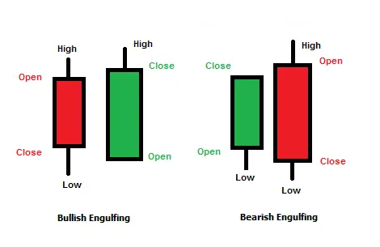
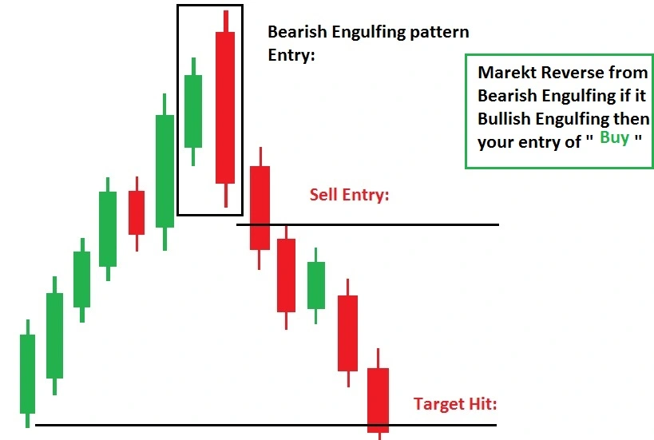
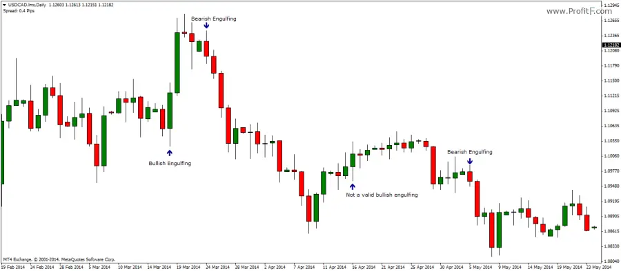
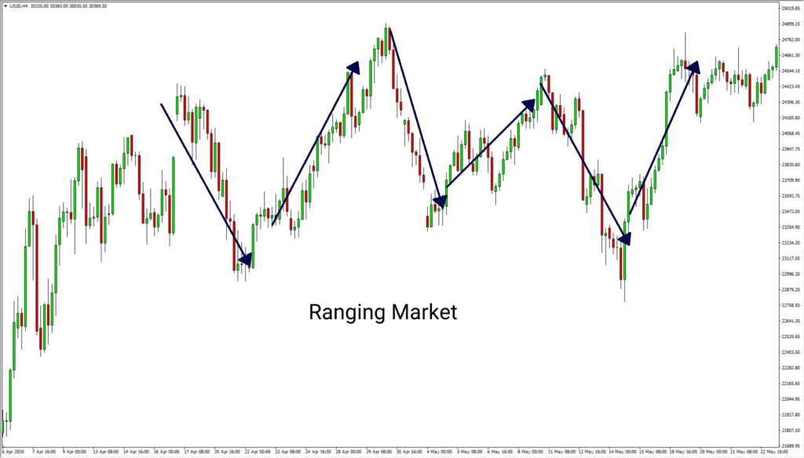

# Engulfing Candlestick Pattern for Stock/Crypto Trading

Before entering Engulfing pattern, you should know the following ...

The main goal of trading is to determine who "can" control the price and then trade in that direction. I say "probably" because we can never be sure whether aggressive buyers/sellers of the past will keep the momentum going into the future.

For example, when the price reaches a support zone, traders may think that buyers are more likely to control the market, thus pushing the price up to resistance. Then the merchant will enter a long transaction (purchase).

Trend traders can do similar things after a certain pullback. You will then buy a currency pair, believing that buyers who were in control in the past will actively withdraw from the market.

# What in does Engulfing Pattern means?

Traders use the engulfing candlestick pattern to enter the market, waiting for a possible trend reversal. **This candlestick pattern marks the reversal of the current trend**. These are two candlesticks, one of which completely "wraps" the body of the other candle. To get an effective engulfing pattern, **the first candle must fit the body of the next**. The
engulfing candle can be either bearish or bullish, depending on its position in the current trend. The opposite is also possible. Since it consists of two candles, it is classified as a double candle mode.

A candle shows the opening and closing prices of each trading cycle. Your time range can vary from one second to one day or more, depending on your chart settings. Seeing two side-by-side histograms can make a good comparison of the market direction from one moment to the next. The color of the candle indicates whether the price direction is ascending (green or white) or descending (red or black).

### Criteria:

1. The market should be an indefinable trend (uptrend or downtrend).
2. The second real body must engulf the previous real body.
3. Second real body must be of the opposite color.

## Bearish Engulfing Pattern

The bearish engulfing chart pattern is a technical pattern that indicates that the price is about to go lower. It consists of a tall candle (green) and a large downward candle (red), which surrounds the smaller upward candle. This model is necessary because it shows that sellers are performing better than buyers. These sellers are actively reducing prices, more than buyers can increase prices.

This pattern is the complete opposite of the bullish pattern. It provides the best signal when you see an uptrend and show an increase in selling pressure. Candles primarily lead to a trend reversal, as more and more sellers enter the market to further lower prices. This pattern consists of two candles, the second candle completely enveloping the previous green candle.

**How to identify**: When a bearish pattern appears, the price movement should show a clear uptrend. The huge bearish candle indicates that sellers are actively entering the market, providing an initial bias for further bearish momentum. The trader will then confirm that the trend is reversing by using indicators, support and resistance levels, and the subsequent price action that occurs after this pattern.

## Bullish Engulfing Pattern

The bullish engulfing pattern is the complete opposite of the bearish pattern. When it appears at the down of an downtrend, it provides the strongest signal and indicates an increase in buying pressure. As more buyers enter the market and increase prices further, a bullish engulfing candle usually triggers a reversal of an existing trend. This pattern includes two candles, the second candle fully covering the "body" of the prior green candle.

**How to Identify**: When there is a bullish pattern, the price trend should show a clear downtrend. The huge bullish candle indicates that buyers are actively entering the market, providing an initial bias for further bullish momentum. The trader will then confirm that the trend is reversing by using indicators, key support and resistance levels, and subsequent price action after the engulfing pattern.

## Example Charts

