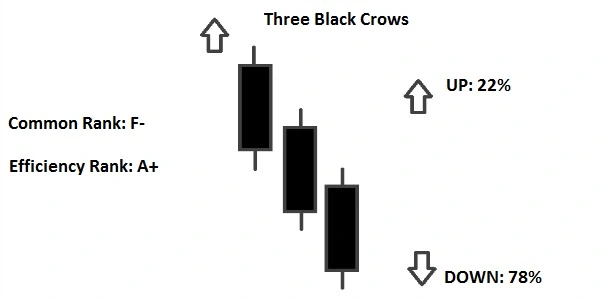
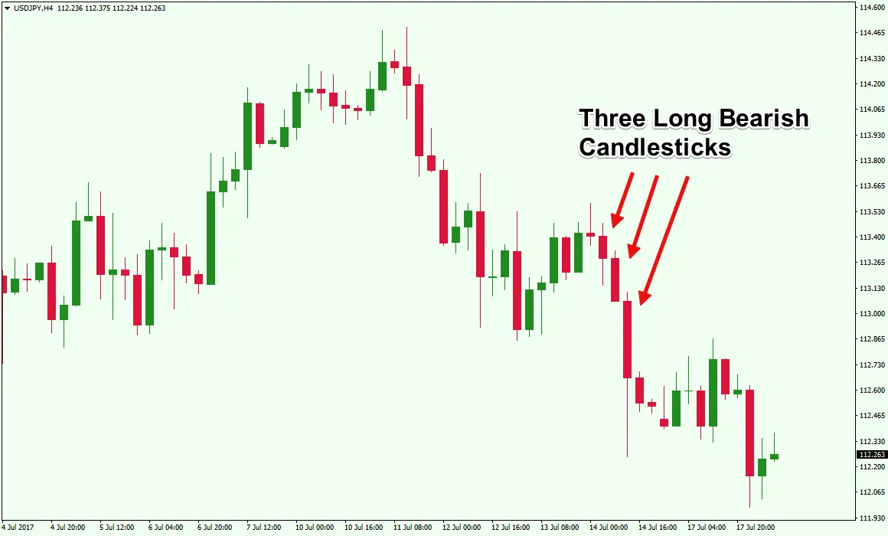
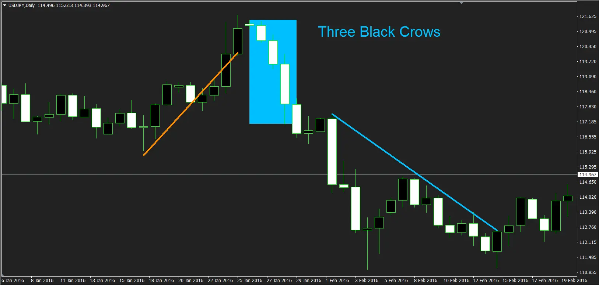
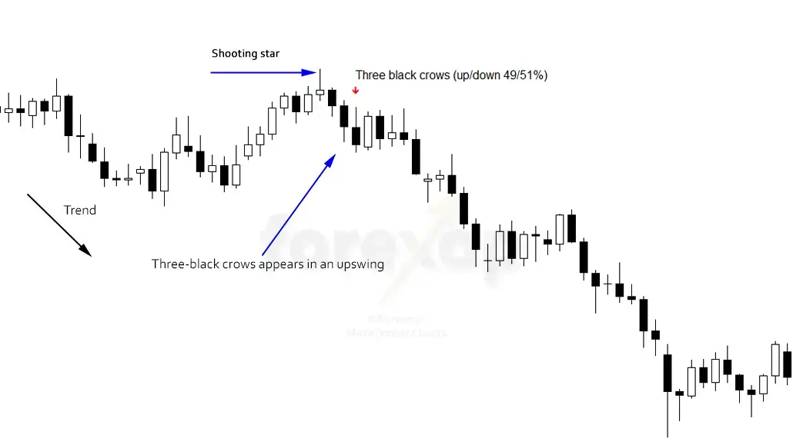

# Three Black Crows Candlestick Pattern

The term "three black crows" refers to a bearish candlestick pattern that may indicate an uptrend's reversal. Candlestick charts depict a security's opening, high, low, and closing prices for the day. The candlestick for stocks moving higher is white or green. They become dark or red as they descend.

Three consecutive long-bodied candlesticks that opened within the real body of the preceding candle and closed lower than the previous candle make up the black crow pattern. Traders frequently combine this signal with other technical indicators or chart patterns to confirm a reversal.

Three black crows constitute a visual pattern, thus there are no computations to be concerned with while determining this indicator. During three consecutive trading sessions, bears overtake bulls, forming the three black crows pattern. Three bearish long-bodied candlesticks with short or no shadows or wicks appear on the pricing charts.

The bulls will start the session marginally higher than the previous close, which is characteristic of three black crows, but the price will be pushed lower throughout the day. Under bearish pressure, the price will eventually close near the session low.

The shadow cast by this trading action will be very short or nonexistent. Traders frequently view this three-session downward pressure as the commencement of a bearish downturn.

## Formation of Three Black Crow Candlestick Pattern

### Candle 1

This pattern's first candlestick should be a long-bodied bearish candlestick that forms as a continuation of the current upswing.

The closing price of a bearish candle should be lower than the opening price, indicating that the bears are attempting to drive prices lower.

### Candle 2

A bearish candlestick should be used as the second candlestick. It can have either a long or short body.

The opening price of this candlestick should be between the midpoint and closing price of the first candlestick, i.e. between the midpoint and closing price of the first candle.

### Candle 3

A bearish candlestick should be used as the third candlestick. A long or short-bodied candle can be used.

This candlestick's opening price should be inside the genuine body of the second candlestick, i.e. the midpoint or closing price of the second candle.

The height of the second candlestick should not be broken by the third candle.

These three candlesticks have the potential to be Bearish [Marubozu](https://anothertechs.com/crypto/belt-hold-line/).

A long-bodied bearish candlestick pattern in which the closing price is the low price and the opening price is the high price for that day is known as a Bearish [Marubozu](https://anothertechs.com/crypto/belt-hold-line/).

In the Bearish [Marubozu](https://anothertechs.com/crypto/belt-hold-line/), there are no shadows.

## What Does Three Black Crows Tell Us ?

During an uptrend, the three black crows pattern appears, frequently foreshadowing the end of a bull market. It forms when the bears outnumber the bulls for three trading sessions in a row. In other words, it's a clear sign of a bearish trend reversal.

After a period of great market performance, it is natural for the bulls to relax their hold and let the bears to have some fun, causing prices to fall. This pattern alerts traders to the onset of a negative trend, with prices projected to fall in the next sessions.

It is not necessary for each candle to open within the body of the previous one. The first candle appears during an uptrend, whereas the next two appear during a decline.

It can also appear near a [Doji](https://anothertechs.com/crypto/everything-you-need-to-know-about-doji-star/), which is an uncertain candlestick formation that depicts market hesitancy before to a trend reversal. It's also worth noting that the pattern can appear in both negative and positive market conditions.

The three black crows will frequently occur in bearish rallies or short upswings in a bearish trend.

## Notes

- Three bearish long-bodied candlesticks form the Three Crows pattern, which is a bearish reversal pattern.

- Because the Three Black Crows is a bearish reversal pattern, it should only be studied after an ascent.

- It's worth noting that these three candlesticks have the potential to be Bearish. Marubozu

- To validate the creation of this candlestick pattern, traders might use volume and technical indicators.

## Trading in Three Black Crows

As previously said, the three black crows pattern signals the start of a negative trend in the market. You should pay attention to the length of the candlesticks once you've identified what appears to be a three black crows pattern.

To confirm that the bears have complete dominance, the second and third candles should be roughly similar in size. **If the third candle is noticeably smaller than the rest, the pattern is weak and useless.**

Once an uptrend has run its course, the pattern begins to emerge. This signifies the start of a significant downturn, and you should take a short position.

On a mini pullback, you should enter after the pattern has developed. The Three Black Crows pattern appears in the chart above, followed by two candles of consolidation before going lower.

Stops should be placed above the pattern's start, with the goal of catching a break beneath the chart pattern. A pullback to a moving average or another level of support could be the case.

### Bottom Line

Crows are thought to bring ill luck. The three black crows pattern acquired its name because its appearance indicates the end of an uptrend.

It is part of the Japanese candlestick chart family, which is increasingly commonly utilised by day traders to forecast trend changes and plan market entry and exit positions.

After a run, this pattern signals that the uptrend is weakening and the bears are gaining control. It can assist you in catching reversals and entering trades before the true momentum kicks in.

It signifies a negative reversal and likely profit-taking in a particular stock or the market in the following sessions when it occurs at the top of any trend.

The three black crows design, like other candle formations, has its limitations.

To confirm reversals, traders should utilise it in conjunction with other technical indicators and chart patterns.

## Limitation of Three Black Crows

Because the three crows pattern causes prices to decline, traders should be aware of oversold conditions, which could lead to consolidation before a further drop in prices.

Traders should look at additional chart patterns or technical indicators in addition to the three black crows pattern to confirm the reversal.

### Refrences

- http://forexop.com/candlesticks/three-black-crows/
- https://trading.funituresited.com/three-black-crows-pattern-explained-for-beginners/
- https://www.feedroll.com/candlestick-patterns/1265-three-black-crows-pattern/
- https://forextraininggroup.com/
