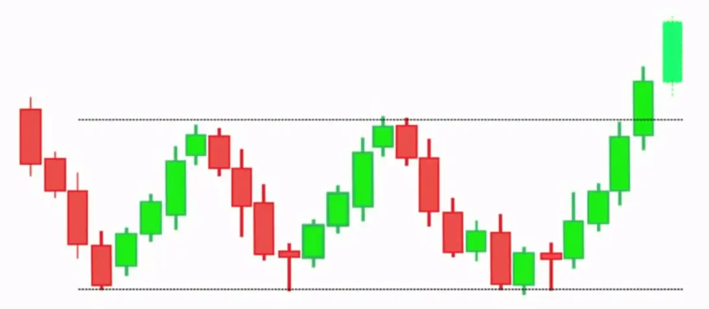
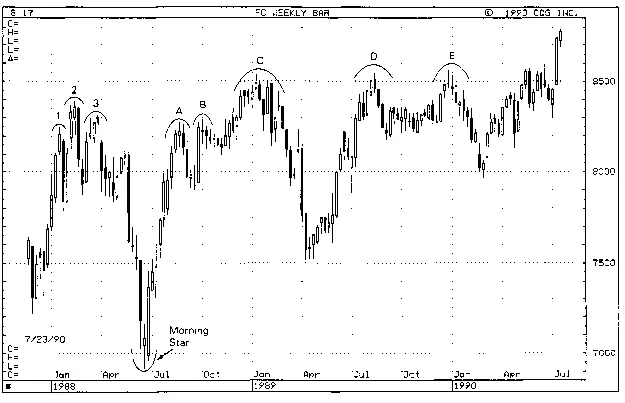

# The Three Mountain Top Candlestick Pattern

The three mountain top/Buddha Top is a technical analysis chart pattern that predicts a price reversal in an asset. A three mountain top, signals that the asset is no longer rallying and that lower prices are approaching. This pattern can exist on any time period, but they must follow an upswing to be classified as such.

**A reversal of three mountain top, on the other hand, indicates that the price of the asset is no longer falling and may be rising.**

**Notes**:

- Three mountain top is formed when three peaks move into the same place, with pullbacks in between.

- Three mountain top is formed when the price falls below pattern support, indicating that the price will continue to fall.

- A trader exits long holdings and enters short positions after three mountain top pattern completes.

- If trading the pattern, a stop loss could be put above resistance (peaks).

- The expected downward aim for the pattern is equal to the pattern's height minus the breakout point.

## How does three mountain top works ?

- The price rises to a new high, then falls, showing that buyers are in charge.

- The first sign of selling pressure appears when the price fails to break out of the prior high. At this time, the market is pulling down and forming a consolidation.

- The market tries and fails once more to break out higher. The three "spikes" are visible after three futile attempts to escape.

- The Three Mountain Top Chart Pattern is completed when the price breaks below the consolidation lows.

## Importance of Three Mountain Top Candlestick Pattern

A three mountain top pattern shows that the price is difficult to penetrate the area of the peaks from a technical standpoint. In real-life terms, this signifies that the asset has been unable to find many purchasers in that price range despite many attempts.

Traders who bought at the beginning of the pattern are under pressure to sell as the price falls. Investing in a price that is unable to move over resistance has limited profit potential. As past buyers quit losing long positions and new traders establish short positions, selling may become more aggressive when the price falls below the pattern's swing lows. This is the psychology of the pattern, and it's what drives the selloff after it's completed.

There isn't such a thing as a flawless pattern. A three mountain top creation and completion can lead traders to believe that the asset will continue to fall. However, the price may recover and break through the barrier.

For further safety, a trader could place a stop loss on short bets above the most recent peak or above a previous swing high inside the pattern.

If the price does not fall but instead rises, the risk of the deal is reduced.

## How to Trade using Three Mountain Top Pattern

Once the price of the asset falls below pattern support, some traders will establish a short position or quit a long position. The most recent swing low following the second peak serves as the pattern's support level, or a trader might use a trendline to connect the swing lows between the peaks. When the price falls below the trendline, the pattern is considered complete, and the price is predicted to fall further.

Traders will look for significant volume when the price falls through support to add confirmation to the pattern. Volume should increase, indicating a strong desire to sell. The pattern is more likely to fail if the volume does not rise (price rallying or not falling as expected).

The pattern specifies a downside goal equal to the pattern's height minus the breakout point. This goal is only a guess. The price may drop significantly lower than the aim, or it may not reach the target at all.

In addition to the triple top, other technical indicators and chart patterns can be used. To help confirm the price drop, a trader can look for a bearish MACD crossover after the third peak, or the RSI to drop out of overbought area.

## Mistakes to Avoid while trading Three Mountain Top Pattern

### 1. It's too late to enter once the pattern is obvious:

It's too late to short the markets when the Three Mountain Top pattern appears on the charts.

Why?

Because you'll most likely be shorting into an area of Support, where purchasing pressure could push the price higher.

This indicates you're selling just as buyers are getting ready to enter the market, which isn't a good idea.

### 2. Don't Chase Breakdown

Okay, so you're thinking:

“Well, I'll hold off on shorting the markets until Support breaks.” That sounds fantastic in theory.

But…

By the time Support is broken, the market has already moved lower and is set to make a higher decline.

If you try to follow the markets lower, you'll almost certainly get stopped out on a pullback.

### References

- https://www.cryptostationchannel.com/2020/01/3-mountain-3-buddha-top-3-river.html

- http://www.dothefinancial.info/white-candlestick/three-mountains-and-three-rivers.html
