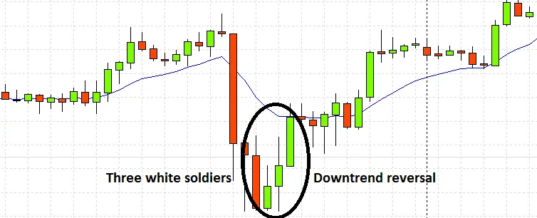
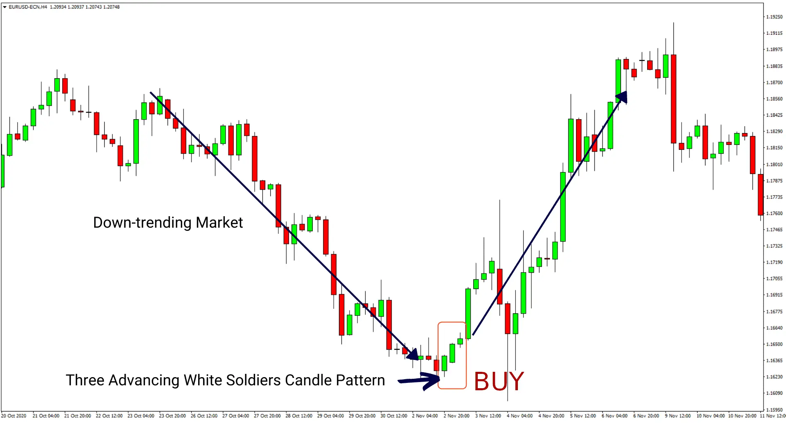
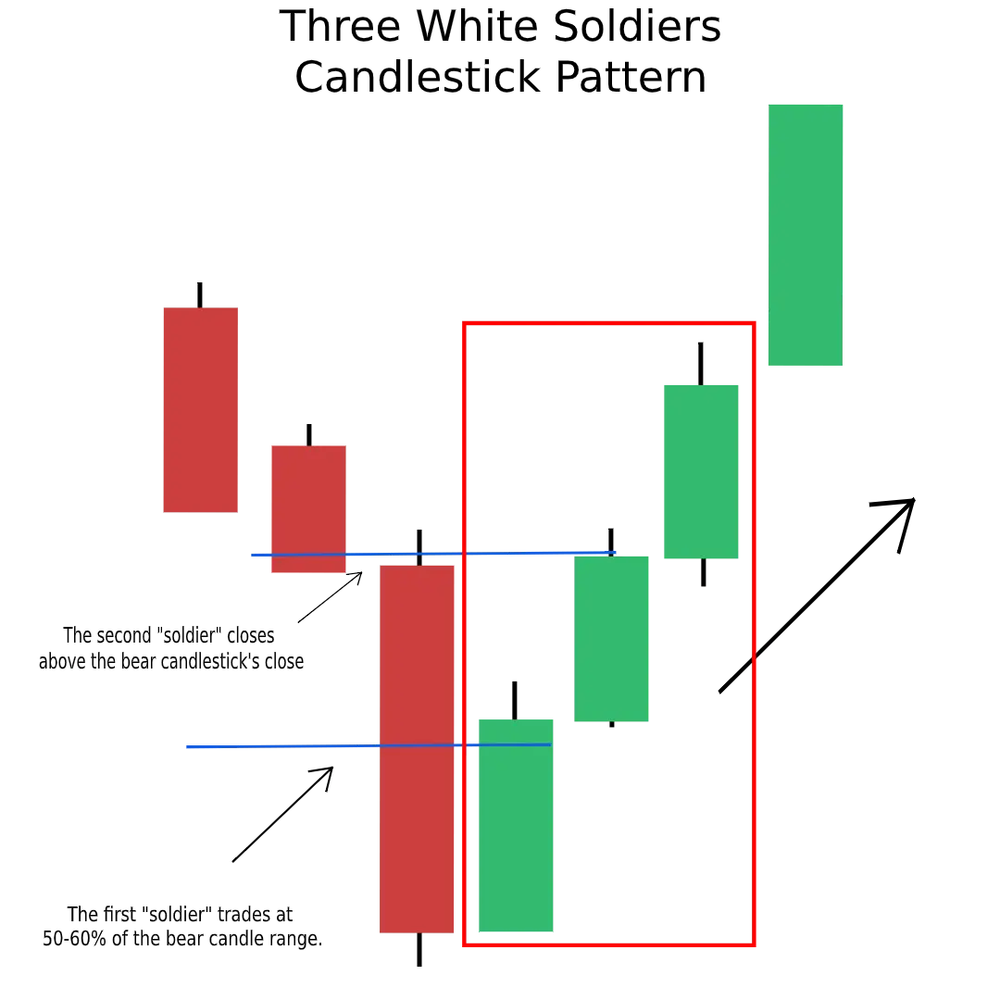

# Understanding Three White Soldiers Candlestick Pattern

After a downtrend, the bullish three white soldiers chart pattern can be useful in predicting a price reversal. Understand this candlestick pattern and how to trade it.

## What is Three White Soldiers Candlstick Pattern ?

There have been a number of different names for the Three White Soldiers pattern throughout history. Because they used a red candle instead of a white one, the Japanese called it "The Three Red Soldiers." During World War II, the design was known as the Three Marching Soldiers. Finally, the design is now known as the Three White Soldiers and is widely recognised.

In a downtrend, this pattern is classified as a bullish reversal. Any candle with a white body can create all three lines, which appear as lengthy lines. As a result, the following candles may appear: Long White Candle, White Candle, White Marubozu, Opening White Marubozu, and Closing White Marubozu, among others. No doji candles or spinning tops!

When a downtrend occurs, the first line is drawn. The second and third lines open and close above the prior candle's initial price.

Prior to this change, certain authors argued that both the second and third lines' starting prices should be located at least halfway up the prior candle's body height. In the opinion of other people, closing prices should be near the candle's peak, resulting in very brief shadows. The Three White Soldiers candlestick pattern is a wonderful example of this trend.

When three long white candles in a row have each closing price higher than the preceding, the market is controlled by the bulls.

**Notes**

- It is considered a reliable reversal pattern when validated by other technical indicators such as the relative strength index (RSI) .

- A retracement risk can be determined by measuring the size of the candles and their shadows.

- When three white soldiers are reversed by three black crows, it implies that an upward trend has reversed.

## What does Three White Soldiers Candlestick Pattern tells traders ?

An upward-trending candlestick pattern with three white soldiers is a bullish reversal candlestick. Because of this, bears are losing ground and the market is expected to reverse its course in the near future." In this design, each candle must be stacked on top of the preceding one, so that each step is taller than the one before it A new trend is set to begin as a result of the pattern's rising tendency.

This is a really effective and trustworthy pattern, as we've already described. When used in conjunction with other indicators, such as the Relative Strength Index, it's much more powerful. As a result, it's a terrific tool for developing trading strategies. As well as the price, dealers need also consider other elements such as volume.

The three white soldiers pattern is useful for starting new trade or ending existing ones. Three white soldiers emerge on the chart of a trader, followed by an opening gap up. Five-minute intervals or 15-minute intervals are available for searching the three white troops on intraday charts. A stop-loss should be established at the latest low, and profits should be taken anytime there is any indication that the trend is turning direction.
**This candlestick pattern is extremely rare, yet traders shouldn't ignore it.**

## Identifying Three White Soldiers Candlestick Pattern ?

The Three White Soldier Design, as its name suggests, has three candlesticks, making it a difficult pattern to recognise. As a result, you'll need the following traits to be able to recognise it:

1. Three consecutive bullish candlesticks are required for the three white soldiers candlestick pattern.

2. It is essential that all three candles open and close higher than the one before.

3. The second candle's body must be larger than the first.

4. The wicks of all three candles must be either nonexistent or very small.
   It's a sign that the buyers were able to gain control.
   In this case, the prices were able to be closed out at the highest point of a candle.

5. As the name suggests, the three white soldiers pattern appears at a support zone when three consecutive lengthy bullish candles follow a downtrend and forecast an impending rally.

## Limitation of Three White Soldier Candlestick pattern

When three white soldiers appear, it's easy to fall into the trap of believing that the current trend will continue rather than reverse itself. One of the most crucial things to keep an eye on is the volume supporting the creation of three white soldiers. It is more likely that the market behaviour of a few is suspicious when the volume is low.

In order to circumvent these constraints, traders use three white soldiers and other candlestick patterns in conjunction with technical indicators such as trendlines, moving averages, and bands. Before initiating a long position, traders might check for areas of upcoming resistance to confirm that there was a big quantity of dollar volume transacted. Traders may wait for further confirmation of a breakthrough before opening long positions, assuming the pattern occurred on low volume and near-term resistance.

### References

- https://blockoney.com/three-white-soldiers-candlestick/
- https://www.adigitalblogger.com/chart-patterns/three-white-soldiers/
- https://www.alphaexcapital.com/candlestick-patterns/
