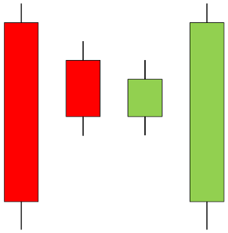
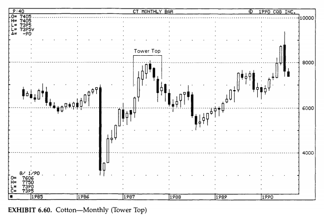
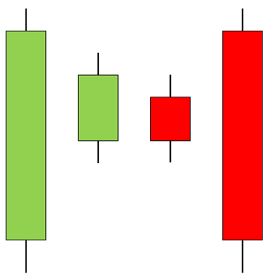
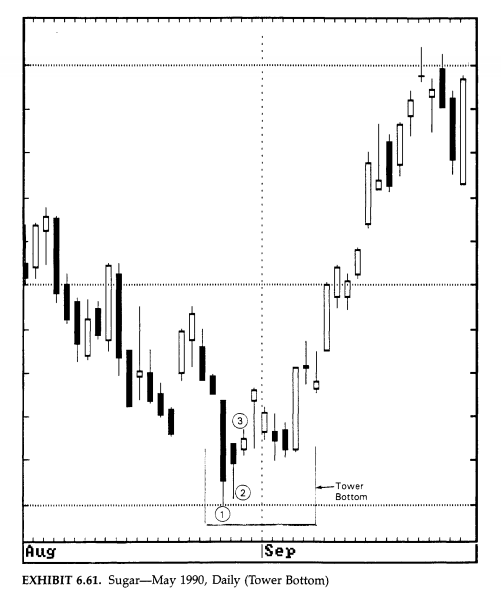

# Candlestick Pattern - Tower Top and Tower Bottom

Candlestick patterns are worth studying in depth, and while a strategy based purely on them will be unstable and unproductive, they can be a useful supplement to a whole trading system that incorporates other strategies.

**Tower Top and Tower Bottom Candlestick Pattern**:

In technical analysis, this is a classic pattern. When a trend reversal occurs, the price will often move in a flat (sideways) pattern before the trend direction shifts.

## Tower Top Candlestick Pattern

Several Japanese candlesticks make up a tower's top framework. A series of little bullish (green) candlesticks, or a single huge candlestick, might comprise the pattern's bullish phase. There is a slowdown on the subsequent candlesticks, resulting in lateral price movement with small candlesticks (which form the top). The structure is completed by one or more huge bearish candlesticks (red). This is the polar opposite of the bottom of the tower.

A long bullish candle forms the Tower Top pattern, after which the market moves sideways. Candlesticks of various colours and sizes can be seen during the sideways movement. These are frequently celebrities. A large bearish candle down appears at the end, which is usually a sign that the flat trend has ended and a downtrend has begun.

**Notes**:

- Normally, this would be a hint that the current Trend is about to reverse.

- After a great elevation, a tower top often appears, distinguished by multiple big green Japanese candlesticks.

- A tower top is a reversal pattern that suggests a bearish trend reversal. This represents the increasing fatigue of purchasers before the sellers reclaim control through force.

- It is not necessary to have two large bearish candlesticks to confirm the pattern; one is sufficient.

- The tower top structure is invalidated if the bearish candlestick(s) are not long.

### Tower Top Requirements

1. It happens during an uptrend, and the candles that follow the Pattern must confirm it.

2. The First Candle is a long, white candle.

3. The following Candles in the "Sideways" Phase are Spinning Tops (Black or White), which represent the Market's uncertainty.

4. The Last Candle is lengthy and dark, signalling the commencement of the current Trend's reversal.

### Tower Top Candlestick Chart Pattern

Above is an illustration of the tower top candlestick pattern. Five relatively tiny genuine body candlesticks follow a massive bullish candlestick that reaches a new high for the uptrend. The huge bearish candlestick that makes up the right side of the "tower" breached the lows set by these little bodied candlesticks. The chart above exhibited a head and shoulders pattern, with a bearish tower top formation being the "head" half of the pattern.

## Tower Bottom Candlestick Pattern

Bullish Tower Bottom candlestick patterns are reversal candlestick patterns that are bullish in nature. These patterns usually appear towards the bottom of a long-term decline in the price of a company.

Because the candlestick pattern takes several trading periods to mature, it must be detected through a series of observations.

When a tall red candlestick pattern appears at the end of an extended decline for a stock's share price, and the next couple of candlesticks fail to push lower than the tall red candlestick's close, you may be watching the formation of a Bullish Tower Bottom candlestick pattern.

When you observe a [Bullish Harami candlestick pattern](https://anothertechs.com/crypto/harami-pattern/) emerge, you can occasionally predict a Bullish Tower Bottom candlestick formation. A forerunner to a Bullish Tower Bottom candlestick pattern can be a [Bullish Harami](https://anothertechs.com/crypto/harami-pattern/) candlestick pattern.

### Tower Bottom Candlestick Chart Pattern

A massive bearish candlestick (left side of the tower) is followed by four smaller bearish candlesticks in the chart above. The enormous bullish candlestick (right side of the tower) that closed at the same price level as the bearish candlestick five days ago completes the tower bottom pattern.

## Limitations

When correctly detected, tower top and bottom patterns are quite effective. When they are misinterpreted, though, they can be highly harmful. As a result, before leaping to conclusions, one must exercise utmost caution and patience.

There's a considerable difference between a tower top and one that has failed, for example. A true tower top is a negative technical pattern that can result in a stock or asset dropping dramatically. To validate a tower top's authenticity, however, patience and identification of the important support level are required. A faulty reading of a tower top based only on the emergence of two successive peaks could lead to an early withdrawal from a position.
