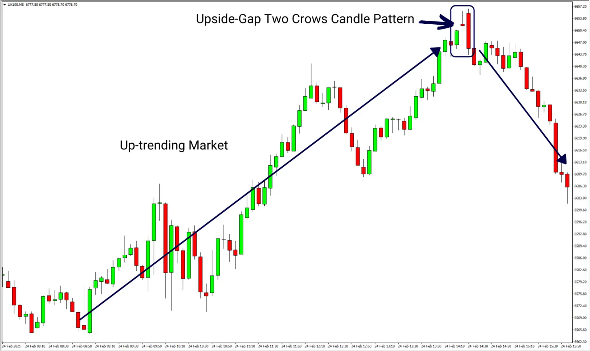
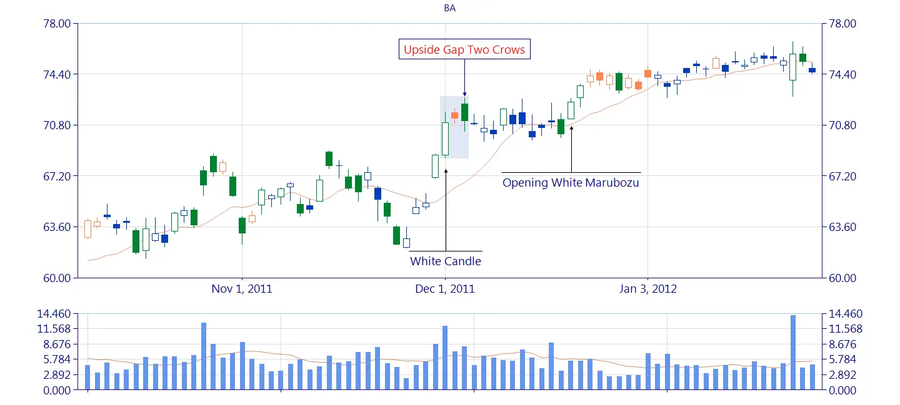

# Understanding the Upside Gap Two Crows Candlestick Pattern for Crypto Trading

When it comes to crypto trading, technical analysis plays a crucial role in identifying profitable trading opportunities. One such technical analysis tool is candlestick patterns, which help traders predict market trends based on past price movements.

The upside gap two crows candlestick pattern is one such pattern that traders should be aware of. This pattern consists of three candles, where the first and third candles are long and bullish, while the second candle is short and bearish. The second candle also has a gap up from the first candle, which creates an "upside gap."

The upside gap two crows pattern is a bearish reversal pattern, indicating a potential trend reversal from a bullish to a bearish market. It signifies that the bulls are losing momentum and the bears are taking over, leading to a potential downtrend.

To use this pattern effectively in your crypto trading strategy, it's essential to understand its characteristics and potential impact on the market. This pattern can be useful in identifying entry and exit points in the market and placing stop-loss orders.

## Upside Gap Two Crows

In an uptrend, the Upside Gap Two Crows is a three-line bearish reversal pattern.
Although the pattern's name implies that it is made up of two candles, it comprises three lines.

A candle that appears as a long line with a white/green body forms the first line.
It could be a white/green candle, a long white/green candle, a white/green [marubozu](https://anothertechs.com/crypto/belt-hold-line/), an opening white/green [marubozu](https://anothertechs.com/crypto/belt-hold-line/), or a closing white/green [marubozu](https://anothertechs.com/crypto/belt-hold-line/).

Any black/red candle, except for [doji](https://anothertechs.com/crypto/everything-you-need-to-know-about-doji-star/), whose body is positioned above the previous candle's body, can be used as the second line.
In other words, the candle must close higher than the previous close.

A black/red candle also forms the third line.
Its body [engulfs](https://anothertechs.com/crypto/the-engulfing-pattern/) the body of the previous candle.
Furthermore, the candle's closing price is higher than the closing price of the first line, forming a gap.

On the next candles, the pattern must be validated.
It's worth noting that the initial line of the pattern creates a support zone that must be disrupted.
It's possible that if the pattern isn't confirmed, it'll just be a brief stop in an upswing.

**NOTES**:

- The upside gap two crows is a three-candle pattern that indicates a slowing of momentum in an uptrend and may indicate a reversal lower.

- The pattern begins with a large up candle in an uptrend, followed by a gap higher into a down candle, and finally a larger down candle that engulfs the previous.

- A lower reversal is unlikely. After the pattern, the price may move sideways or rally.

- Before acting, some traders wait for "confirmation." Before selling or shorting, wait for the price to fall below the low of the third candle.

## Identify Upside Gap Two Crows

The upside gap two crows candlestick pattern is a bearish reversal pattern with three days of construction.
To successfully recognise the upward gap two crows pattern, a trader needs to look for the following features.

- This candle must be followed by a lengthy white/green first candle that signals the continuance of the uptrend and a solid bearish candlestick.

- A second bearish day is represented by a small black or colourful second candle with a small genuine body that gaps up.

- Because it opens above it and shuts below it, a larger black or coloured third candle that gaps up completely immerses the second candle.The third candle must also shut above the close of the previous day.

## What Does Upside Gap Two Crows Pattern Tell Us

In technical analysis, an upside gap two crows is a bearish reversal indicator. When the following conditions are met, the pattern emerges.

- A lengthy white (or green) candlestick represents a bullish candle that continues the uptrend, indicating a closing price much above the open price.

- Despite the security gapping higher at the open, candle 2 is bearish.
  As a result, this candle is black, with a closure below the open, and it gaps up from the previous candle.

- A third bearish candle has appeared.
  The candle opens higher than the open of Candle 2 and ends lower than Candle 2 but higher than the close of Candle 1.
  A larger down candle that "engulfs" Candle 2 visually represents this.

This design has various distinguishing characteristics.
The pattern must first appear during a substantial rise.
Second, the initial candle must be a large bullish candlestick (white or green) in the uptrend.
This candle should be followed by a bearish candlestick (black or red) with a bit of genuine body that gaps up.
Finally, the third candle must be a bearish candlestick that engulfs the previous candle, opening above it and closing below it.
The third candle, however, must close above the first day's closing.

The two-crow upside gap indicates that the security may be turning over as its upward trend comes to an end and a downturn begins. The reasoning behind this analysis is that the bulls have been unable to maintain upward momentum despite two strong opens (on Candles 2 and 3), implying that sentiment is shifting from bullish to negative.

Because the pattern is only three bars long, it is useful to look at the background and for confirmation when trading it. In a strong uptrend, the pattern could simply be a pause before the price resumes its upward trajectory. Waiting for confirmation includes waiting for the price to drop more before acting on the pattern. A current long trade, for example, is only terminated if the price continues to fall below the low of the third candle. A trader could alternatively short or sell near the third candle's closure (no confirmation), with a stop loss placed above the third candle's high if going short.

## Trading with Upside Gap Two Crows

Many beginner traders will try to short the markets as soon as they learn about a pattern like an upside gap two crows, but this is not a good idea.
To establish that a given price move is likely to occur, most candlestick patterns must be utilised in conjunction with other technical analysis techniques.

So, let's take a closer look at how you may use the upward gap two crows to your advantage in trading!

### Oversold

Seeing if the market is overbought is one way to tell if it's about to turn around as it develops a bearish reversal pattern.
A large number of markets exhibit strong mean-reverting tendencies.
This implies they make exaggerated movements in one direction, later corrected by a trend in the opposite direction.
As a result, these markets are prone to being overbought, implying that they have risen too far and will soon reverse.

#### When to know market gap is too much

Some methods are more popular than others.
Let's look at the two most prevalent approaches.

- RSI- Using the RSI indicator to determine when a market has risen too much is a time-tested strategy.
  An overbought market is defined as the RSI over 70, which is consistent with the indicator's primary meaning.

- Another typical strategy is to require that the market perform its highest close or open a particular number of bars back.
  This is also the definition that the double seven trading technique use.

### Volume

Another effective way is to use volume conditions, which provide a clearer picture of what's going on in the market.

If a market's volume rises, for example, it means that more transactions backed up a move, making it more relevant, at least in principle.

Here are a few of our favourite volume settings:

- We frequently compare the current candle's volume to the previous candle's volume.
  This allows us to determine whether the volume is high or low in comparison to previous data.

- Other times, we require volume to be at its maximum or lowest x-bars back reading.

As always, backtesting should be used freely, and you should soon find something that works.

## Limitaion of Upside Gap Two Crows

If the price does decrease following the construction of the pattern, this candlestick pattern does not predict how far it will fall.
This means that other types of technical analysis, such as price action analysis, are needed to discover an exit point for short positions or to forecast how far the price may fall.

The pattern does not always lead to a downward reversal.
Following the pattern, the price might either move sideways or continue higher.

## Conclusion

In conclusion, understanding candlestick patterns such as the upside gap two crows can help traders make informed decisions and maximize their profits in the crypto market. Incorporating technical analysis tools into your trading strategy can significantly improve your chances of success.

## References

- https://www.youtube.com/watch?v=jmmxeX4GYI8
- https://www.nothardtrading.com/upside-gap-two-crows-candle-pattern-explained/
- http://www.candlescanner.com/candlestick-patterns/upside-gap-two-crows/
