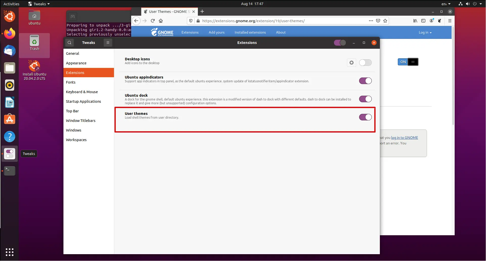
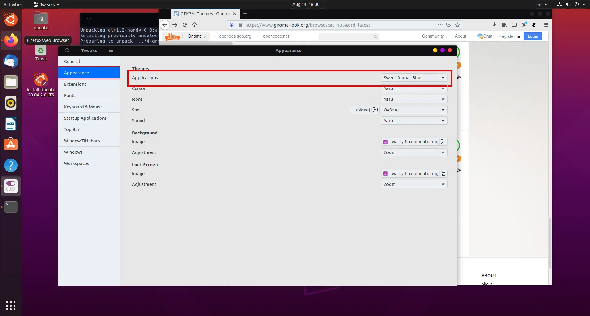
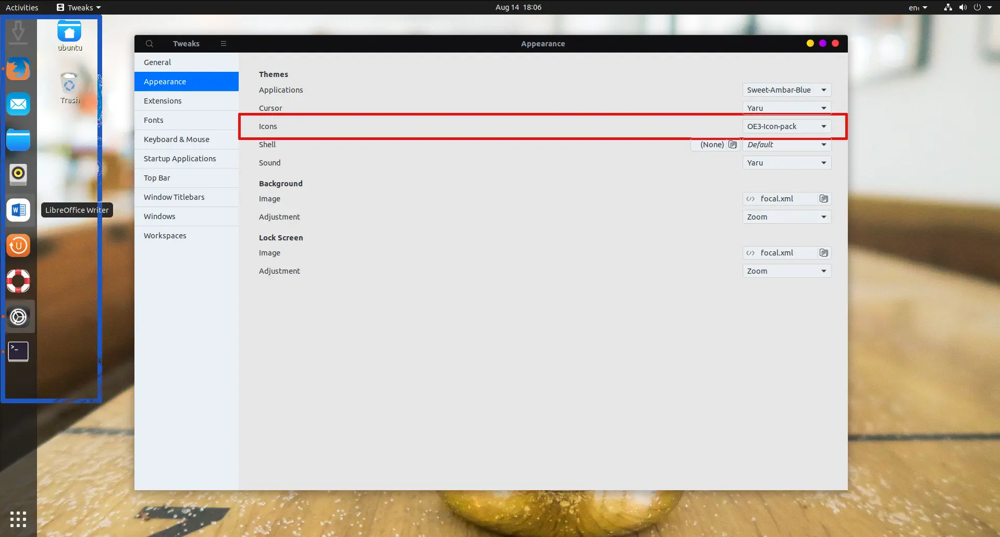
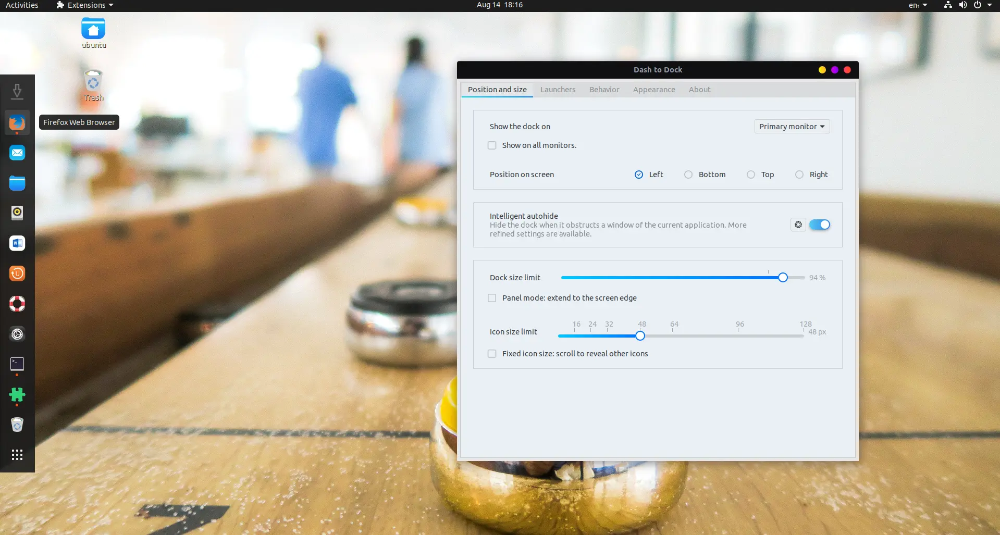
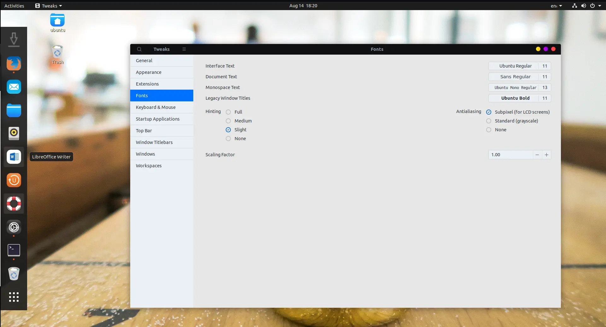
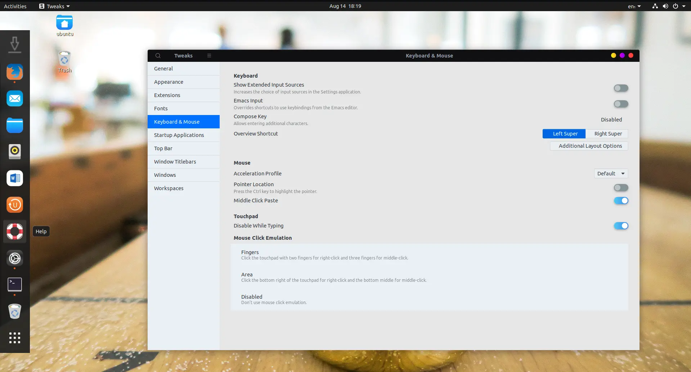
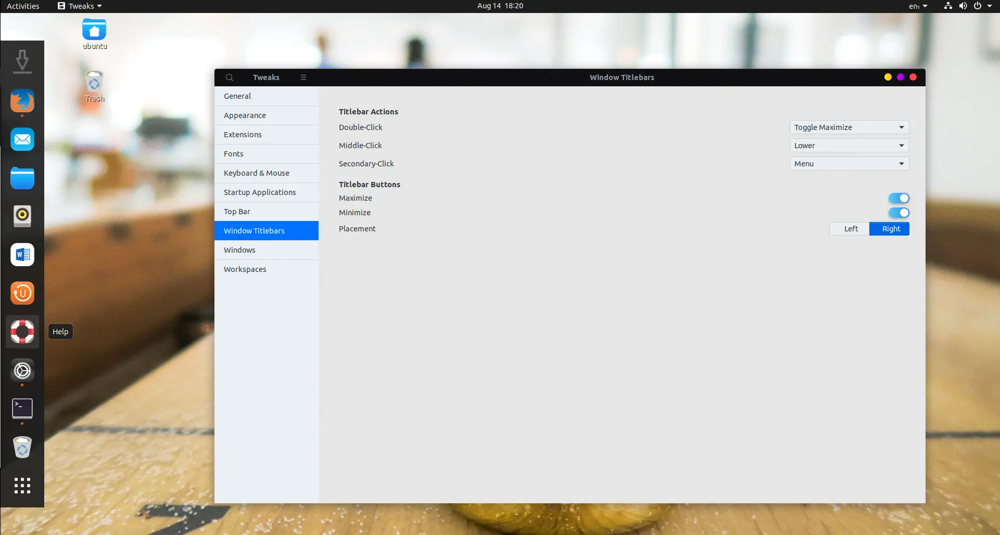

# Customize Your GNOME Desktop

A lot of people prefer GNOME's minimalist design, which is quite straightforward and streamlined for a Linux GUI.
In spite of its simplicity, GNOME may be customised to suit your needs.
It is possible to customise the top bar, window title bars, icons, cursors, and many other UI features with GNOME Tweaks and the User Themes Extension.

**Note: It is necessary to install Tweaks and enable the user themes [extension](https://extensions.gnome.org/#) in your browser before you may change your GNOME theme and customise your desktop.**

## Installing GNOME Tweaks

Fire up your terminal and write the following command to install gnome-tweaks:

**For Fedora based distros:**

```bash
sudo dnf install gnome-tweaks
```

**For Debian distros:**

```bash
sudo apt install gnome-tweaks
```

**For Ubuntu based distros:**

```bash
sudo add-apt-repository universe && sudo apt install gnome-tweaks
```

**For Arch/Manjaro:**

```bash
sudo pacman -S gnome-tweaks
```

## Customize GNOME Themes

### Enabling user themes



Launch Tweaks and click Extensions to enable the user themes extension.
User themes can be enabled by clicking on the slider next to it.

### Select Theme

Having completed the criteria, you're ready to search for and download themes.
[gnome-looks](https://www.gnome-look.org/browse/) is an excellent place to find new themes.

Left of the page is a list of topic categories.
Downloading a theme is the next step after you've found one you like.
You may need to create the directory first. I downloaded the.tar file directly to the `~/.themes` directory in my home directory.

```bash
mkdir ~/.themes
```

Having downloaded the file, extract the archive to `~/.themes` location on your computer. Save some disc space by deleting the.tar.xz file.

```bash
tar xvf theme_name.tar.xz
```

### Applying Theme

Tweaks' Appearance section is where you'll find your new theme to apply.
You can choose from a variety of choices for each part of your desktop in this section.



## Customize GNOME icons

Select and download icons from [gnome-looks](https://www.gnome-look.org/browse?cat=132&ord=latest).After you have downloaded icons next set is to create `~/.icons` directory and extract `*.tar.xz` file in `~/.icons` directory.

```bash
mkdir ~/.icons
```



Next step is to open your gnome-tweak application got to appereance section and there you will find icons. When you open the drow down list of the icons you will see your icon theme listed.

Just select it and you icons theme will change instantly.

## Enabling Extensions

You could get variety of extension at [GNOME Extension website](https://extensions.gnome.org/)

Some of the famous extension are:

- **Dash to panel**
- **User Themes**
- **Tray Icons**
- **Arch menu**
- **ShellTile**
- **Animation Tweaks**



Install all of the extensions listed below. Activate the appropriate extensions by clicking on the "OFF" button located on your browser's right sidebar.

**Note: There are certain GNOME Extensions that do not require setups to work. But some extension require little bit of configuration for eg. Dash to panel or Arch menu**

## Customize GNOME Fonts



The default typefaces on your desktop are making you grumpy.
The GNOME Tweaks Tool lets you download new fonts and apply them to your system. You can change the font for the interface text, document text, monospace text, and legacy window titles, as shown in the screenshot below.

Using GNOME Tweaks, you may also adjust font hinting and initialiasing as well as scaling.

## Tweaking your Keyboard & Touchpad



You can adjust the keyboard settings and set up extra layout options here, as well. My favourite feature is the ability to disable your laptop's touchpad when you're typing.

This is especially handy if you are typing quickly and your palm accidently contacts the touchpad, causing the cursor to jump to a random spot, slowing down your process and increasing the likelihood of making an error.

## Customzie GNOME Windows and Titlebars



In the Tweak Tool, you may change the settings for the programme window by selecting this item from the menu.
Options in the titlebar can be maximised or minimised here.
These options can also be moved from the top-right corner to the top-left corner of the programme window.

A double-click, middle-click, and secondary-click can also be configured here to change the behaviour of the programme window when they are performed.
