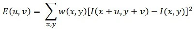
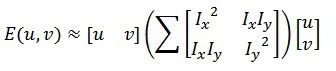
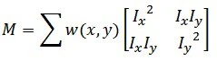
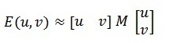
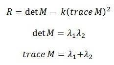
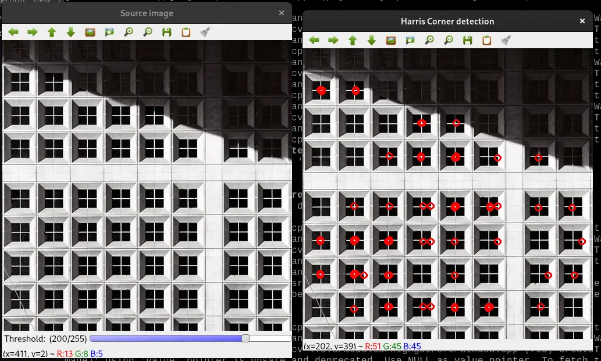
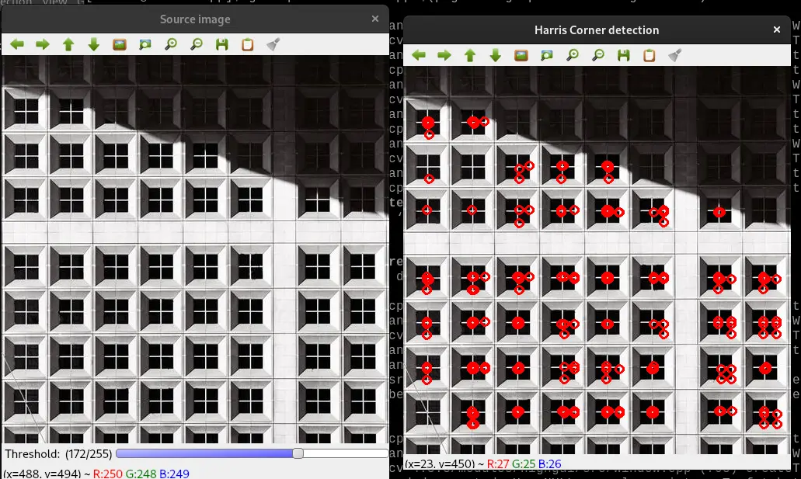

# Introduction

The Harris Corner Detector is a corner detection operator frequently used in computer vision algorithms to extract corners and infer image characteristics.
Chris Harris and Mike Stephens invented it in 1988 after improving Moravec's corner detector.

In comparison to the preceding one, Harris' corner detector directly considers the differential of the corner score concerning direction, instead of requiring shifting patches for every 45-degree angle, and has proven to be more accurate in discriminating between edges and corners.
It has since been developed and used in a variety of techniques to preprocess photos for subsequent applications.

## What is Corner in an Image ?

A corner is a point with two opposed edge orientations in its immediate surroundings.
In other terms, a corner is the intersection of two edges, each of which represents a sharp shift in image brightness.
Corners are the most essential features of the image, and they are usually referred to as interest points since they are unaffected by translation, rotation, or lighting.

So, let's look at why corners are thought to be superior features or suitable for patch mapping.
If we take the flat region in the above graphic, we can see no gradient change in any direction.
Similarly, no gradient change is detected along the edge direction in the edge region.
As a result, both the flat and edge regions are unsuitable for patch matching because they are not significantly different (there are many similar patches along the edge in the edge region).
When we are in the corner region, we notice a significant gradient difference in all directions.
Because of this, corners are said to be useful for patch matching (moving the window in any direction results in a considerable change in appearance) and generally more stable over the shift in viewpoint.

## How Harris Corner Detection Algorithm Works ?

Consider a small window surrounding each pixel p in an image.
We aim to find all of these one-of-a-kind pixel windows.
The amount of change in pixel values can be assessed by shifting each window by a tiny amount in a given direction and measuring the difference.

In more technical terms, we calculate the sum squared difference (SSD) between the pixel values before and after the shift and find pixel windows where the SSD is substantial for changes in all eight directions.
Let us define the change function E(u,v) as the sum of all sum squared differences (SSD), where u,v are the x,y coordinates of each pixel in our 3 x 3 window and I is the pixel's intensity value.
The image's features are all pixels with high E(u,v) values, as defined by some threshold.



**where:**

- w(x,y) is the window at position (x,y)
- I(x,y) is the intensity at (x,y)
- I(x+u,y+v) is the intensity at the moved window (x+u,y+v)

For corner detection, we must maximise the function E(u,v).
That is, we must maximise the second term.
Using Taylor Expansion on the previous equation and some mathematical processes, we arrive at the following final equation:



Now, we rename the summed-matrix, and put it to be M:



So the equation now becomes:



Remember that we want the SSD to be prominent in shifts in all eight directions, or the SSD to be tiny in none of them.
We can derive the directions for both the highest and most minor improvements in SSD by solving M's eigenvectors.
The real value amount of these increases is given by the relevant eigenvalues.

For each window, a R score is computed:



M's eigenvalues are numbered λ1 and λ2.
As a result, the values of these eigenvalues determine whether a region is a corner, an edge, or a flat surface.

- The region is flat when |R| is small, as it is when λ1 and λ2 are small.

- The region is an edge when R0, which happens when λ1>>λ2 or vice versa.

- When R is huge, like when λ1 and λ2 are large, and λ1~λ2 is large, the region is a corner.

## Harris Corner Detection Code C++

```cpp
#include "opencv2/highgui.hpp"
#include "opencv2/imgproc.hpp"
#include <iostream>

cv::Mat src, src_gray;
int thresh = 200;
int MAX_THRESH = 255;
std::string source_window("Source image");
std::string corners_window("Harris Corner detection");

void detectCornerHarris(int,void*)
{
    int blockSize = 2;
    int apertureSize = 3;
    double k = 0.04;
    cv::Mat dst = cv::Mat::zeros( src.size(), CV_32FC1 );
    cv::cornerHarris( src_gray, dst, blockSize, apertureSize, k );
    cv::Mat dst_norm, dst_norm_scaled;
    cv::normalize( dst, dst_norm, 0, 255, cv::NORM_MINMAX, CV_32FC1, cv::Mat() );
    cv::convertScaleAbs( dst_norm, dst_norm_scaled );
    for( int i = 0; i < dst_norm.rows ; i++ )
    {
        for( int j = 0; j < dst_norm.cols; j++ )
        {
            if( (int) dst_norm.at<float>(i,j) > thresh )
            {
                cv::circle( dst_norm_scaled, cv::Point(j,i), 5,  cv::Scalar(255), 2, 8, 0 );
            }
        }
    }
    cv::namedWindow( corners_window.c_str() );
    cv::imshow( corners_window.c_str(), dst_norm_scaled );
}


int main( int argc, char** argv )
{
    if(argc != 2) {
        std::cout << "Error!!\n\nPlease specify input file..\n";
        return -1;
    }
    src = cv::imread( argv[1] );
    if ( src.empty() )
    {
        std::cout << "Could not open or find the image!\n\n";
        std::cout << "Usage: " << argv[0] << " <Input image>\n" ;
        return -1;
    }
    cv::cvtColor( src, src_gray, cv::COLOR_BGR2GRAY );
    cv::namedWindow( source_window.c_str());
    cv::createTrackbar( "Threshold: ", source_window, &thresh, MAX_THRESH, detectCornerHarris );
    cv::imshow( source_window.c_str(), src );
    detectCornerHarris(0,0);
    cv::waitKey();
    return 0;
}

/**
Compiling:-
g++ <program_name>.cpp $(pkg-config opencv4 --cflags --libs)

Run:
./a.out <img_file>
**/
```

### Explanation

- First we read input file and convert it into **grayscale** using `cvtColor()`.
- Then we apply Harris Corner using `cornerHarris()` function.
- We then normalize the image since the pixel value of `dst` is very small.
- Finally, we check if the threshold value of each pixel in the image to our specified threshold value; if it is larger, we put a circle around it.

## Output





### References

- [Building Computer Vision Projects with OpenCV 4 and C++](https://amzn.to/3N7WwbC)
- [Learning OpenCV 3: Computer Vision In C++ With The OpenCV Library](https://amzn.to/3toR4sR)
- [OpenCV 4 Computer Vision Application Programming Cookbook: Build complex computer vision applications with OpenCV and C++, 4th Edition ](https://amzn.to/37ztG3o)
- [Object-Oriented Programming with C++ | 8th Edition ](https://amzn.to/3ilHaC5)

- https://docs.opencv.org/3.4/d4/d7d/tutorial_harris_detector.html
- https://medium.com/data-breach/introduction-to-harris-corner-detector-32a88850b3f6
- https://www.geeksforgeeks.org/python-corner-detection-with-harris-corner-detection-method-using-opencv/
