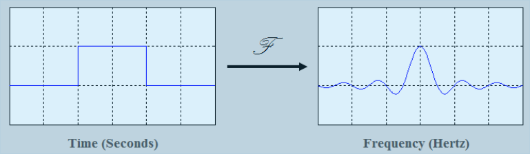
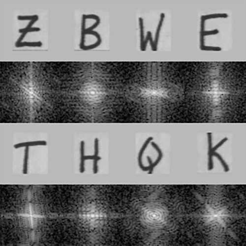
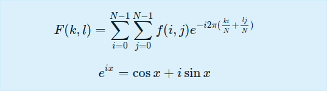
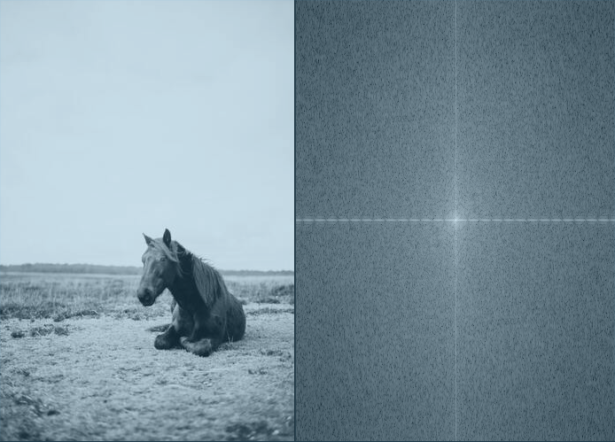

# OpenCV Fourier Transform using C++

In OpenCV, the idea of [Fourier Transform](https://en.wikipedia.org/wiki/Fourier_transform) is used in a lot of the processing you do on pictures and videos.

Joseph Fourier was a French mathematician who worked in the 18th century, discovering and popularising several mathematical concepts. He specialised in investigating the principles of heat and, in mathematics, all things waveform.

He discovered that all waveforms are simply the sum of basic sinusoids of various frequency.

## What is Fourier Transformation

The Fourier transform is a mathematical function that takes a time-based pattern and calculates the total cycle offset, rotation speed, and strength for each conceivable cycle in the pattern.



**The Fourier Transform shows that any waveform can be re-written as the sum of sinusoidals.**

Waveforms, which are essentially functions of time, space, or any other variable, are subjected to the Fourier transform.
A waveform is decomposed into a [sinusoid](https://en.wikipedia.org/wiki/Sine_wave) via the Fourier transform, which gives another way to express a waveform.

## Fourier Transform in Image Processing

The Fourier Transform is a useful image processing method for breaking down an image into sine and cosine components.

The image in the Fourier or frequency domain is represented by the output of the transformation, whilst the [spatial domain](https://homepages.inf.ed.ac.uk/rbf/HIPR2/spatdom.htm) equivalent is represented by the input image. Each point in the Fourier domain image indicates a frequency contained in the spatial domain image.



**Image analysis, picture filtering, image reconstruction, and image compression are among applications that use the Fourier Transform.**

## Example

Now let us try how to apply Fourier Transform using OpenCV.

The Fourier Transform separates a picture into sinus and cosine components.
In other words, it will change the spatial domain of an image to the frequency domain. The concept is that any function may be precisely approximated by adding infinite sinus and cosine functions. One method is to use the Fourier Transform. A two-dimensional image's Fourier transform is defined mathematically as:



The image value in the spatial domain is f, and the image value in the frequency domain is F. Complex numbers are the outcome of the transformation. This can be displayed in two ways: as a real image and a complex image, or as a magnitude and a phase image. However, only the magnitude image is interesting throughout the image processing methods since it provides all of the information we require about the image's geometric structure. However, if you want to make changes to the image in these forms and then retransform it, you'll need to keep both of them.

### Code

```cpp

#include <opencv2/highgui.hpp>
#include <opencv2/imgcodecs.hpp>
#include <opencv2/imgproc.hpp>
#include <iostream>


void showImg(cv::Mat&, const std::string& );

void expand_img_to_optimal(cv::Mat& , cv::Mat& );
cv::Mat fourier_transform(cv::Mat& );
void crop_and_rearrange(cv::Mat& );


int main(int argc,char** argv)
{
	cv::Mat input_img,fourier_img;
	input_img = cv::imread(argv[1],cv::IMREAD_GRAYSCALE);
	if(input_img.empty()) {
		fprintf(stderr,"Could not Open image\n\n");
		return -1;
	}

	showImg(input_img,"Input Image");

	fourier_img = fourier_transform(input_img);
	showImg(fourier_img,"Fourier Image");
	cv::waitKey();
	return 0;
}

void showImg(cv::Mat& img,const std::string& name)
{

	cv::namedWindow(name.c_str());
	cv::imshow(name.c_str(),img);

}

void expand_img_to_optimal(cv::Mat& padded,cv::Mat& img) {
	int row = cv::getOptimalDFTSize(img.rows);
	int col = cv::getOptimalDFTSize(img.cols);
	cv::copyMakeBorder(img,padded,0,row - img.rows,0,col - img.cols,cv::BORDER_CONSTANT,cv::Scalar::all(0));
}


cv::Mat fourier_transform(cv::Mat& img) {
	cv::Mat padded;
	expand_img_to_optimal(padded,img);

	// Since the result of Fourier Transformation is in complex form we make two planes to hold  real and imaginary value
	cv::Mat planes[] = {cv::Mat_<float>(padded),cv::Mat::zeros(padded.size(),CV_32F)};
	cv::Mat complexI;
	cv::merge(planes,2,complexI);

	cv::dft(complexI,complexI,cv::DFT_COMPLEX_OUTPUT); // Fourier Transform

	cv::split(complexI,planes);
	cv::magnitude(planes[0],planes[1],planes[0]);
	cv::Mat magI = planes[0];

	magI += cv::Scalar::all(1);
	cv::log(magI,magI);

	crop_and_rearrange(magI);

	cv::normalize(magI, magI, 0, 1, cv::NORM_MINMAX); // for visualization purposes
	return magI;
}

void crop_and_rearrange(cv::Mat& magI)
{
	  magI = magI(cv::Rect(0, 0, magI.cols & -2, magI.rows & -2));
    int cx = magI.cols/2;
    int cy = magI.rows/2;
		cv::Mat q0(magI, cv::Rect(0, 0, cx, cy));
		cv::Mat q1(magI, cv::Rect(cx, 0, cx, cy));  // Top-Right
    cv::Mat q2(magI, cv::Rect(0, cy, cx, cy));  // Bottom-Left
    cv::Mat q3(magI, cv::Rect(cx, cy, cx, cy)); // Bottom-Right
    cv::Mat tmp;                           // swap quadrants (Top-Left with Bottom-Right)
    q0.copyTo(tmp);
    q3.copyTo(q0);
    tmp.copyTo(q3)
    q1.copyTo(tmp);                    // swap quadrant (Top-Right with Bottom-Left)
    q2.copyTo(q1);
    tmp.copyTo(q2);

}

```

### Explanation

The above code shows the **magnitude image** of Fourier Transform.Digital Images are discret, this indicates they have the ability to take a value from a domain value. Values in a simple grey scale image, for example, are normally between zero and 255. As a result, the Fourier Transform must also be discrete, yielding a Discrete Fourier Transform (DFT).

#### `expand_img_to_optimal()`

The size of the image has an impact on the DFT's performance.
For image sizes that are multiples of the digits two, three, and five, it is the fastest.
As a result, padding border values to the image to create a size with such qualities is often a good idea to get maximum efficiency.
We can use the `copyMakeBorder()` function to expand the borders of an image (the appended pixels are initialised with zero): `getOptimalDFTSize()` returns this optimal size, and we can use the `copyMakeBorder()` function to expand the borders of an image.

#### Creating Two Planes for Complex and Real Values

```cpp
	cv::Mat planes[] = {cv::Mat_<float>(padded),cv::Mat::zeros(padded.size(),CV_32F)};
	cv::Mat complexI;
	cv::merge(planes,2,complexI);

```

A Fourier Transform produces a complex output. This means that the output is two image values for each image value (one per component). Furthermore, the frequency domain's range is substantially larger than that of the spatial domain. As a result, we normally save these in float format. As a result, we'll are changing the type of our input image and add another channel to carry the complex values.

#### Transform the real and complex values to magnitude

There are two parts to a complex number: real (Re) and complex (imaginary - Im).
A DFT yields complex numbers as a consequence.
A DFT has the following magnitude:

```cpp
	cv::split(complexI,planes);
	cv::magnitude(planes[0],planes[1],planes[0]);
	cv::Mat magI = planes[0];
```

The dynamic range of the Fourier coefficients turns out to be too large to display on the screen. We have certain little and large shifting variables that we are unable to see in this manner. As a result, the high values will all appear as white spots, while the low values will appear as black. We may convert our linear scale to a logarithmic one to use the grey scale values for visualisation:

```cpp

	magI += cv::Scalar::all(1);
	cv::log(magI,magI);
```

#### `crop_and_rearrange(cv::Mat& )`

Remember how we extended the image in the first step?
Now is the time to discard the newly inserted values.
We can also rearrange the quadrants of the result for display purposes, so that the origin (zero, zero) corresponds to the image centre.

### Result



#### References

- [Building Computer Vision Projects with OpenCV 4 and C++](https://amzn.to/3N7WwbC)
- [Learning OpenCV 3: Computer Vision In C++ With The OpenCV Library](https://amzn.to/3toR4sR)
- [OpenCV 4 Computer Vision Application Programming Cookbook: Build complex computer vision applications with OpenCV and C++, 4th Edition ](https://amzn.to/37ztG3o)
- [Object-Oriented Programming with C++ | 8th Edition ](https://amzn.to/3ilHaC5)

- https://pyimagesearch.com/
