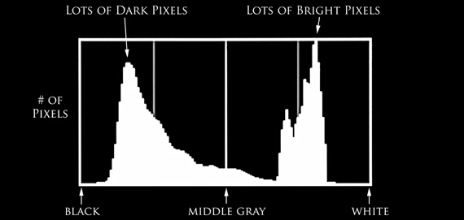

# calHist() - Calculate histogram using openCV and C++

In practically every element of computer vision, histograms are used. For threshold, we employ gray-scale histograms. For white balance, we employ histograms.
For object tracking in photos, such as with the CamShift technique, we use colour histograms.
Color histograms are used as features, and colour histograms in several dimensions are included.

In a more abstract sense, they form the HOG and SIFT descriptors from histograms of visual gradients.

A histogram is also a bag-of-visual-words representation, which is widely employed in image search engines and machine learning.
And, more than likely, this isn’t the first time you’ve seen histograms in your studies.

So, why do histograms come in handy?

Because histograms depict a set of data frequency distribution.
And it turns out that looking at these frequency distributions is a dominant method to develop simple image processing techniques... as well as really powerful machine learning algorithms.

This blog post will summarize image histograms, as well as how to calculate colour histograms from video using openCV and C++.

## What is Histogram ?

You might think of a histogram as a graph or plot that shows how an image’s intensity distribution is distributed.
It’s a graph with pixel values (usually ranging from 0 to 255) on the X-axis and the number of pixels in the picture on the Y-axis.

It’s just a different way of looking at the image.
When you look at the histogram of an image, you may get a sense of the image’s contrast, brightness, intensity distribution, and so on.

Almost all image processing software today includes a histogram feature.



## calHist() function in openCV

`cv.calcHist(images, channels, mask, histSize, ranges[, hist[, accumulate]])`

So now we use calcHist() function to find the histogram. Let’s familiarize with the function and its parameters :

1. **images** : this is the uint8 or float32 source image.

“[img]” should be written in square brackets.

2. **channels**: It is the channel index for which the histogram is calculated.

If the input is a gray-scale image, the value is [0].

To calculate the histogram of the blue, green, or red channel in a colour image, pass [0], [1], or [2].

3. **mask**: It is given as “None” to find the histogram of the entire image.

But if you want to find histogram of a particular region of image, create a mask image for that and give it as a mask.

4. **histSize**: Our BIN count is represented by histSize. Must be enclosed in square brackets. We pass [256] for full scale.

5. **range**: It’s usually [0,256].

## Code

```cpp

#include "opencv2/highgui.hpp"
#include "opencv2/imgcodecs.hpp"
#include "opencv2/imgproc.hpp"
#include <iostream>


const int histSize = 256;

void drawHistogram(cv::Mat& b_hist,cv::Mat& g_hist,cv::Mat& r_hist) {

    int hist_w = 512;
    int hist_h = 400;
    int bin_w = cvRound((double)hist_w / histSize);

    cv::Mat histImage(hist_h, hist_w, CV_8UC3, cv::Scalar(0, 0, 0));

    cv::normalize(b_hist, b_hist, 0, histImage.rows, cv::NORM_MINMAX, -1,
                  cv::Mat());
    cv::normalize(g_hist, g_hist, 0, histImage.rows, cv::NORM_MINMAX, -1,
                  cv::Mat());
    cv::normalize(r_hist, r_hist, 0, histImage.rows, cv::NORM_MINMAX, -1,
                  cv::Mat());

    for (int i = 1; i < histSize; i++) {
      cv::line(
          histImage,
          cv::Point(bin_w * (i - 1), hist_h - cvRound(b_hist.at<float>(i - 1))),
          cv::Point(bin_w * (i), hist_h - cvRound(b_hist.at<float>(i))),
          cv::Scalar(255, 0, 0), 2, 8, 0);
      cv::line(
          histImage,
          cv::Point(bin_w * (i - 1), hist_h - cvRound(g_hist.at<float>(i - 1))),
          cv::Point(bin_w * (i), hist_h - cvRound(g_hist.at<float>(i))),
          cv::Scalar(0, 255, 0), 2, 8, 0);
      cv::line(
          histImage,
          cv::Point(bin_w * (i - 1), hist_h - cvRound(r_hist.at<float>(i - 1))),
          cv::Point(bin_w * (i), hist_h - cvRound(r_hist.at<float>(i))),
          cv::Scalar(0, 0, 255), 2, 8, 0);
    }

    cv::namedWindow("calcHist Demo", cv::WINDOW_AUTOSIZE);
    cv::imshow("calcHist Demo", histImage);

}

int main(int argc, char **argv) {
  cv::Mat src, dst;

  cv::VideoCapture cap;
  if (argc != 2)
    cap.open(0);
  else
    cap.open(argv[1]);

  if (!cap.isOpened()) {
    std::cerr << "Failed to load webcam/Video ...\n";
    return -1;
  }

  for (;;) {
    if(!cap.read(src)) {
      std::cerr << "Cannot read file\n";
      break;
    }
    cv::imshow("Src", src);
    std::vector<cv::Mat> bgr_planes;
    cv::split(src, bgr_planes);


    float range[] = {0, 256};
    const float *histRange = {range};

    bool uniform = true;
    bool accumulate = false;

    cv::Mat b_hist, g_hist, r_hist;

    cv::calcHist(&bgr_planes[0], 1, 0, cv::Mat(), b_hist, 1, &histSize,
                 &histRange, uniform, accumulate);
    cv::calcHist(&bgr_planes[1], 1, 0, cv::Mat(), g_hist, 1, &histSize,
                 &histRange, uniform, accumulate);
    cv::calcHist(&bgr_planes[2], 1, 0, cv::Mat(), r_hist, 1, &histSize,
                 &histRange, uniform, accumulate);

    drawHistogram(b_hist,g_hist,r_hist);

    if (cv::waitKey(30) == 27)
      break;
  }

  return 0;
}

```

## Explanation

- We start the code by first reading our input file, which is a video frame by frame using `cap.read()` method.

- Using [split()](https://docs.opencv.org/3.4/d2/de8/group__core__array.html#ga0547c7fed86152d7e9d0096029c8518a) function we divide multi-channel array (i.e RGB) into separate single-channel array which we store in `bgr_planes`.

- Then we calculate histogram of each plane and stores value in the variable `b_hist`,`g_hist`,`r_hist`.

- In our histogram we want our [bins](https://www.quora.com/What-are-bins-in-histograms) to have same size and we want to clear our histogram at the beginning therefore, we set `uniform` and `accumulate` to `true.

- After calculating histogram we create an image `histImage` to display our histogram.

- Then we simply draw the line using [cv::line](https://docs.opencv.org/3.4/d6/d6e/group__imgproc__draw.html#ga7078a9fae8c7e7d13d24dac2520ae4a2) at each pixel for each channel i.e `b_hist`,`g_hist`,`r_hist`.

### Output


### Refrences

- [Building Computer Vision Projects with OpenCV 4 and C++](https://amzn.to/3N7WwbC)
- [Learning OpenCV 3: Computer Vision In C++ With The OpenCV Library](https://amzn.to/3toR4sR)
- [OpenCV 4 Computer Vision Application Programming Cookbook: Build complex computer vision applications with OpenCV and C++, 4th Edition ](https://amzn.to/37ztG3o)
- [Object-Oriented Programming with C++ | 8th Edition ](https://amzn.to/3ilHaC5)
- https://www.picturecorrect.com/tips/the-histogram-explained/
- https://docs.opencv.org/3.4/d8/dbc/tutorial_histogram_calculation.html

