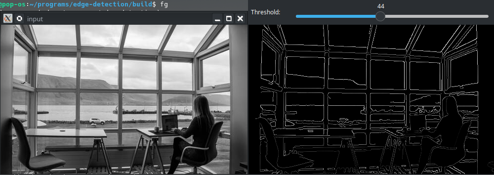

# OpenCV - Understanding Canny Edge Detection Using C++

Edge detection is a type of image processing that identifies the borders (edges) of objects or regions inside a picture.
The edges of an image are one of the most important aspects of it.
Through an image's edges, we can learn about its underlying structure.
As a result, edge detection is widely used in applications in computer vision processing pipelines.

## How to Identify Edges ?

Sudden fluctuations in pixel intensity characterise edges.
We need to check for similar changes in surrounding pixels to find edges.
Come learn how to use Canny Edge Detection, edge-detection algorithm available in OpenCV. We'll go over the theory and illustrate how to apply each in OpenCV.

## Canny Edge Detection

John F. Canny invented the Canny Edge detector in 1986. The Canny algorithm, often known as the best detector, seeks to meet three basic criteria:

1. **Low error rate**: This refers to the ability to detect only existing edges.

2. **Good localization**: The distance between detected edge pixels and real edge pixels must be kept to a minimum.

3. Only one detector response per edge is required for a minimal response.

For extracting edges from an image, the algorithm uses a three-stage method.
Then there's image blurring, which is an essential preprocessing step for reducing noise. This results in a four-stage procedure, which contains the following steps:

1. **Noise Reduction**

2. **Calculating the Image's Intensity Gradient**

3. **Suppression of False Edges**
4. **Hysteresis Thresholding**

### Noise Reduction

Because noisy edges are frequently caused by raw picture pixels, it is critical to decrease noise before computing edges. A Gaussian blur filter is employed in Canny Edge Detection to essentially remove or minimise superfluous detail that could contribute to undesired edges.

Take a look at the the two photographs below; the image on the right has been blurred with Gaussian blur. As you can see, it's little blurred, but there's still enough detail to compute edges from.


### Calculating Intensity

After the image has been smoothed (blurred), it is filtered horizontally and vertically with a [Sobel kernel](https://en.wikipedia.org/wiki/Sobel_operator). The intensity [gradient](https://en.wikipedia.org/wiki/Image_gradient) magnitude (G) and direction (&Theta;) for each pixel are calculated using the results of these filtering operations, as shown below.


After that, the gradient is rounded to the nearest 45 degree angle.
The result of this combined processing phase is shown in the picture below (right).

### Removing False Edge

The method in this phase uses a technique called non-maximum suppression of edges to filter out undesired pixels after decreasing noise and computing the intensity gradient (which may not actually constitute an edge). Each pixel is compared to its neighbours in both the positive and negative gradient directions to achieve this. If the current pixel's gradient magnitude is greater than that of its neighbours, it is left alone. Otherwise, the current pixel's magnitude is set to zero. An example can be seen in the image below. As you can see, the tiger's fur has a lot of 'edges' that have been greatly reduced.

### Hysteresis Thresholding

The gradient magnitudes are compared with two threshold values, one smaller than the other, in the last phase of Canny Edge Detection.

- Those pixels are associated with strong edges and are included in the final edge map if the gradient magnitude value is greater than the larger threshold value.

- The pixels are suppressed and excluded from the final edge map if the gradient magnitude values are less than the smaller threshold value.

- All remaining pixels with gradient magnitudes in the middle of these two thresholds are labelled as 'weak' edges (i.e. they become candidates for being included in the final edge map).

- The 'weak' pixels are included in the final edge map if they are connected to those associated with strong edges.

### References

- [Learning OpenCV 3 with Python](https://amzn.to/3iyDkG0)
- [Building Computer Vision Projects with OpenCV 4 and C++](https://amzn.to/3N7WwbC)
- [Learning OpenCV 3: Computer Vision In C++ With The OpenCV Library](https://amzn.to/3toR4sR)
- [OpenCV 4 Computer Vision Application Programming Cookbook: Build complex computer vision applications with OpenCV and C++, 4th Edition ](https://amzn.to/37ztG3o)
- [Object-Oriented Programming with C++ | 8th Edition ](https://amzn.to/3ilHaC5)
- https://docs.opencv.org/3.4/da/d5c/tutorial_canny_detector.html

## Code Explanation

1.  Declaring Variable:

    ```cpp
    const std::string window = "Canny Edge Detection"; //Window Name
    int lowThreshold = 0;
    const int maxThreshold = 100;
    const int ratio = 3;
    const int kernel_size = 3;

    cv::Mat input,output; //input and output images;
    cv::Mat detected_edges; //Edge Detected image;
    ```

2.  Loads the source image:

    ```cpp
    if (argc < 2 )
    	return ErrorMsg("Specify Image in command line");

    input = cv::imread(argv[1],cv::IMREAD_GRAYSCALE);

    if(input.empty())
    	return ErrorMsg("Could Not Open Image");
    ```

3.  Now let's check `CannyEdgeDetection()` step by step:

    1.  First we blur the image using _GaussianBlur_:
        `cv::GaussianBlur(input,detected_edges,cv::Size(5,5),0);`

    2.  The we appy `cv::Canny()` function:

        `cv::Canny(detected_edges,detected_edges,lowThreshold,lowThreshold * ratio,kernel_size);`

        the following are the arguments:

        - detected_edges: grayscale source image
        - detected_edges: The detector's output (can be the same as the input)
        - lowThreshold: The value input by the user when he or she moves the Trackbar.
        - maxThreshold: Three times the lower threshold (as per Canny's recommendation) is set in the programme.
        - kernel size: i.e. 3

4.  A dst picture is filled with zeros (meaning the image is completely black).
    `output = cv::Scalar::all(0);`

5.  Finally, we'll use the `cv::Mat::copy` function. Only the parts of the image that have been identified as edges should be mapped (on a black background). `cv::Mat::copy` To copy the src picture to the destination (dst). However, it will only copy pixels with non-zero values in non-zero locations. Because the Canny detector's output is edge contours on a black background, the dst will be black everywhere except the detected edges.

### Result



### Code

```cpp
#include <iostream>
#include "opencv2/imgproc.hpp"
#include "opencv2/highgui.hpp"


int ErrorMsg(const std::string& msg) {
	std::cerr << "\n !!! Error !!!\n " << msg << "\n";
	return -1;
}

/** Variable Declaration **/

const std::string window = "Canny Edge Detection"; //Window Name
int lowThreshold = 0;
const int maxThreshold = 100;
const int ratio = 3;
const int kernel_size = 3;

cv::Mat input,output; //input and output images;
cv::Mat detected_edges; //Edge Detected image;

/***/

static void CannyEdgeDetection(int,void*)
{
	cv::GaussianBlur(input,detected_edges,cv::Size(5,5),0); // Applying Gaussian Blur with kernel 5x5
	cv::Canny(detected_edges,detected_edges,lowThreshold,lowThreshold * ratio,kernel_size);

	output = cv::Scalar::all(0);

	input.copyTo(output,detected_edges);

	cv::imshow(window,output);
}


int main ( int argc,char** argv) {

	if (argc < 2 )
		return ErrorMsg("Specify Image in command line");

	input = cv::imread(argv[1],cv::IMREAD_GRAYSCALE);

	if(input.empty())
		return ErrorMsg("Could Not Open Image");

	output.create(input.size(),input.type());
	cv::namedWindow(window,cv::WINDOW_AUTOSIZE);

	cv::createTrackbar("Threshold: ",window,&lowThreshold,maxThreshold,CannyEdgeDetection);

	CannyEdgeDetection(0,0);

	cv::waitKey(0);
	return 0;


}

```
