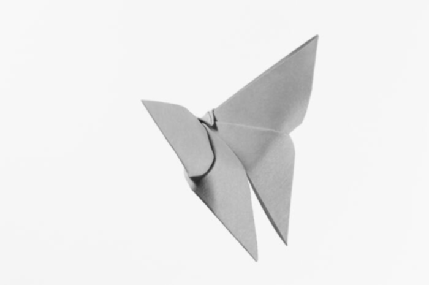
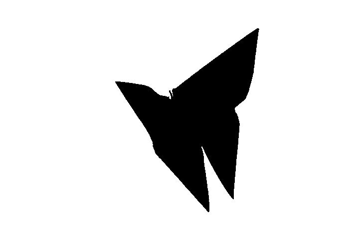
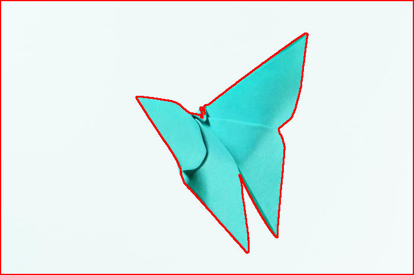

# OpenCV - Contour Detection Using C++

Contour detection is an important task in computer vision, not only because of the obvious element of detecting contours of subjects in an image or video frame, but also because of the derivative processes associated with identifying contours.

We can recognise the edges of objects and simply pinpoint them in a picture using contour detection. Many intriguing applications, such as image-foreground extraction, simple-image segmentation, detection, and identification, use it as a starting point.

So, using OpenCV, let's learn about contours and contour detection, and see how they may be utilised to create a variety of applications.

## What is Contour ?

Contours are just a curve that connects all of the continuous points (along the border) that are the same colour or intensity. The contours are a useful tool for object detection and recognition as well as form analysis.

In this section we will learn how to find and draw contours using functions `findContour()` and `drawContour()`.Let's talk about the stages involved in detecting contours now that you've learned about them.

## Step involved for Finding and Drawing Contour

1.  **Reading and Converting Image to GrayScale**:

    The image should be read and converted to grayscale format.
    The conversion to grayscale is crucial because it prepares the image for the following stage.
    The image must be converted to a single channel grayscale image for thresholding, which is required for the contour detection technique to perform effectively.

    ```cpp
    input = cv::imread(argv[1]);
    showImg(input,"Input Image");
    cv::cvtColor(input,input_grey,cv::COLOR_BGR2GRAY);

    ```


2.  Applying **[Gaussian Blur](https://anothertechs.com/programming/cpp/opencv/canny-edge-detection/)**:

        	cv::GaussianBlur(input_grey,blur_img,kernel,0); // Applying Gaussian Blur with kernel 5x5
        	showImg(blur_img,"Blur Image");



3.  **Apply Binary Thresholding**

    Always perform binary thresholding or Canny edge detection to the grayscale image before looking for contours. We'll use binary thresholding in this case.

    This turns the image to black and white, highlighting the points of interest to make the contour-detection algorithm's job easier.
    Thresholding makes the image's object's border totally white, with the same intensity across all pixels.
    From these white pixels, the programme can now discern the object's edges.

    _Note that black pixels with a value of 0 are considered background pixels and are disregarded._

    One question may arise at this moment. What if we used single channels instead of grayscale (thresholded) images, such as R (red), G (green), or B (blue)? The contour detection algorithm will not perform well in this scenario. As previously stated, the algorithm detects contours by looking for borders and pixels of similar intensity. This information is significantly better provided by a binary image than by a single (RGB) colour channel image.

        	cv::threshold(blur_img,thresh_img,200,255,cv::THRESH_BINARY );
        	showImg(thresh_img,"Thresh Image");

    A value of 255 will be assigned to any pixel with a value greater than 200 (white).In the resultant image, all remaining pixels will be set to 0. (black). You can play around with the threshold value of 200 because it is a configurable option.



4.  **Drawing Contours**

Begin by calling the findContours() method.
There are three arguments that must be provided, as indicated below.
Please see the documentation page for more information on optional arguments.

- **image**: The binary input picture obtained in the preceding step is called image.

- **contour-retrieval mode**: The algorithm will retrieve all potential contours from the binary picture if this is set to `RETR_TREE`. More contour retrieval modes are available. More information on these alternatives can be found [here](https://docs.opencv.org/4.x/d3/dc0/group__imgproc__shape.html#ga819779b9857cc2f8601e6526a3a5bc71).

- **method**: This is where the contour-approximation approach is defined. We'll use `CHAIN_APPROX_NONE` in this case. We'll use this method to store ALL contour points, even though it's a little slower than `CHAIN_APPROX_SIMPLE`.

It's important to note that mode relates to the type of contours that will be retrieved, whilst method refers to the points that will be saved within a contour.
Both will be discussed in greater depth further down.

On the same image, the outcomes of several methods are easily visualised and understood.

As a result, in the code samples below, we make a clone of the original image before demonstrating the methods (not wanting to edit the original).

Then, to overlay the contours over the RGB image, use the `drawContours()` function. There are four necessary arguments and several optional arguments for this function. The first four arguments are mandatory.

_Please see the documentation page for more information on the optional arguments._

- **image**: This is the RGB input image on which the contour should be drawn.
- **contours**: Returns the contours obtained by calling `findContours()`.
- **contourIdx**: In the obtained contours, the pixel coordinates of the contour points are reported.
  You can provide the index position from this list with this input, indicating exactly the contour point you want to draw.
  If you enter a negative value, all of the contour points will be drawn.
- **colour**: The colour of the contour points you want to draw is indicated here.
  The points are drawn in green.
- The thickness of contour points is measured in this parameter.

```cpp
	std::vector<std::vector<cv::Point>> contours;
	std::vector<cv::Vec4i> hierarchy;
	cv::findContours(thresh_img,contours,hierarchy,cv::RETR_TREE,cv::CHAIN_APPROX_SIMPLE);

	cv::Scalar red(0,0,255);
	cv::drawContours(input,contours,-1,red,2);
	showImg(input,"Detected Contour");
```

## Output



## Contours Hierarchies

The parent-child relationship between contours is represented by hierarchies. You'll learn how each contour-retrieval option impacts image contour detection and generates hierarchical results.

### Parent-Child Relationship

Contour-detection algorithms may detect the following objects in an image:

- Single things strewn about in an image (as in the first example), or
- objects and forms nestled together (as in the second example).

We can fairly assume that the outer form is a parent of the inner shape in most circumstances where a shape contains other shapes.

### Contour Relationship Representation

The `findContours()` function gives two outputs: the contours list and the hierarchy, as you can see.
Let's take a closer look at the contour hierarchy output.

The contour hierarchy is represented as an array, which is made up of four different arrays.
It's written like this:

**[Next, Previous, First Child, Parent]**

So, what exactly do all of these numbers mean?

- **Next**: Indicates the next contour in a picture that is on the same hierarchical level as the previous one.
- **Previous**: At the same hierarchical level, this denotes the previous contour. This means that the Previous value of contour 1 will always be -1.
- **First_Child**: The first child contour of the contour we're looking at right now.
- **Parent**: Indicates the current contour's parent contour's index position.

### Different Contour Retrieval Techniques

We've only used one retrieval approach, `RETR_TREE`, to discover and draw contours thus far, but OpenCV also includes three other contour retrieval techniques: `RETR_LIST`, `RETR_EXTERNAL`, and `RETR_CCOMP`.

### RETR_LIST

There is no parent-child link between the extracted contours when using the RETR LIST contour retrieval method. As a result, the First Child and Parent index position values for all identified contour areas are always -1.

### RETR_EXTERNAL

The contour retrieval method RETR EXTERNAL is a fascinating one. It only recognises parent contours and ignores child contours.

### RETR_CCOMP

`RETR_CCOMP`, unlike `RETR_EXTERNAL`, recovers all of the contours in a picture. It also creates a two-level hierarchy for all of the forms or objects in the image.

This translates to:

- Level 1 hierarchy will be applied to all outside outlines.

- Level 2 hierarchy will be applied to all inner shapes.

### RETR_TREE

`RETR_TREE`, like `RETR_CCOMP`, retrieves all of the contours. It also generates a whole hierarchy, with levels that aren't limited to one or two. Each contour can have its own hierarchy, which is determined by the level it is on and the parent-child relationship it has.

### References

- [Learning OpenCV 3 with Python](https://amzn.to/3iyDkG0)
- [Building Computer Vision Projects with OpenCV 4 and C++](https://amzn.to/3N7WwbC)
- [Learning OpenCV 3: Computer Vision In C++ With The OpenCV Library](https://amzn.to/3toR4sR)
- [OpenCV 4 Computer Vision Application Programming Cookbook: Build complex computer vision applications with OpenCV and C++, 4th Edition ](https://amzn.to/37ztG3o)
- [Object-Oriented Programming with C++ | 8th Edition ](https://amzn.to/3ilHaC5)
- https://docs.opencv.org/3.4/da/d5c/tutorial_canny_detector.html

## Code

```cpp
#include <iostream>
#include "opencv2/imgproc.hpp"
#include "opencv2/highgui.hpp"
#include <vector>


int ErrorMsg(const std::string& msg) {
	std::cerr << "\n !!! Error !!!\n " << msg << "\n";
	return -1;
}


void showImg(const cv::Mat& img, const std::string& name)
{
	cv::namedWindow(name.c_str());
	cv::imshow(name.c_str(),img);
}


void detect_contour(cv::Mat& thresh_img,cv::Mat input)
{
	std::vector<std::vector<cv::Point>> contours;
	std::vector<cv::Vec4i> hierarchy;
	cv::findContours(thresh_img,contours,hierarchy,cv::RETR_TREE,cv::CHAIN_APPROX_SIMPLE);

	cv::Scalar red(0,0,255);
	cv::drawContours(input,contours,-1,red,2);
	showImg(input,"Detected Contour");

}

int main ( int argc,char** argv) {
/** Variable Declaration **/
	int threshold = 100;
	cv::Mat input,input_grey,blur_img,thresh_img;
	cv::Size kernel(3,3);
/***/

	if (argc < 2 )
		return ErrorMsg("Specify Image in command line");

	input = cv::imread(argv[1]);
	showImg(input,"Input Image");
	cv::cvtColor(input,input_grey,cv::COLOR_BGR2GRAY);

	if(input.empty())
		return ErrorMsg("Could Not Open Image");

	cv::GaussianBlur(input_grey,blur_img,kernel,0);
	showImg(blur_img,"Blur Image");

	cv::threshold(blur_img,thresh_img,200,255,cv::THRESH_BINARY );
	showImg(thresh_img,"Thresh Image");

	detect_contour(thresh_img,input);


	cv::waitKey(0);
	return 0;


}
```
