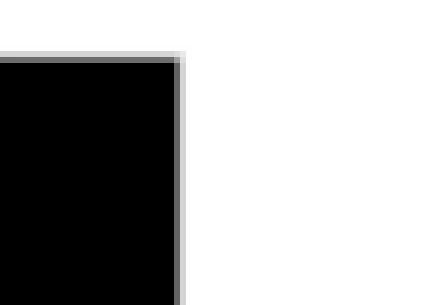
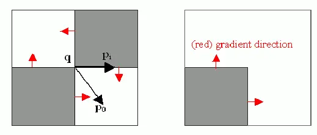
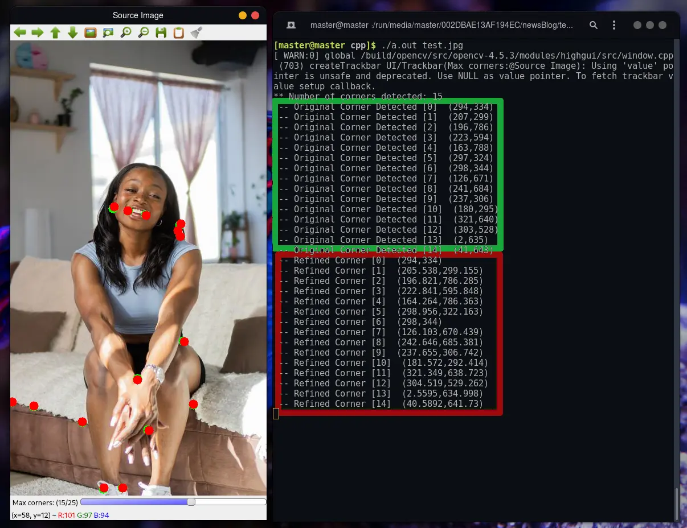

# OpenCV - Detecting corner location in subpixel(cornerSubPix()) using C++

A digital photo's smallest component is called a "pixel". Between pixel information is just inaccessible to the human sight. There are some applications that require more accuracy than a camera can provide. Exact measurements are needed, for example, when recreating a 3D object from an image. Mathematical strategies were developed to improve the accuracy of corner recognition.

## Why there is need of subpixel accuracy ?

Take a look at this square! It is zoomed in quite a bit, so you can see the pixel-by-pixel breakdown. Look at this image and see if you can spot the corner.



As you can see, there isn't a single pixel in the corner. In reality, it's nearly impossible to get corners to line up perfectly with pixels.

The [Shi-Tomasi](./https://docs.opencv.org/master/d4/d8c/tutorial_py_shi_tomasi.html) and [Harris](https://anothertechs.com/programming/cpp/opencv-corner-harris-cpp/) methods, for example, will give you something like this (53, 786).
Scientists and others want a place like this (53.786, 786.110).

Here we have absolute pixel-perfect precision on display. Despite the fact that 53.786, 786.110 is not available, you've confirmed that the corner is exactly at this address.

What's the point of going through the hassle of figuring out the decimal?
They are one of the most crucial aspects of an image.
Also, you'll need the extra precision in a variety of circumstances:

- Stereo vision
- 3D reconstruction
- Camera calibration
- Tracking

As a result, a lot of effort has gone into improving accuracy and speed.

## Subpixel corners in OpenCV

Subpixel corners can be found using OpenCV's built-in feature. Using the [dot product](https://en.wikipedia.org/wiki/Dot_product) methodology, it refines corners identified by previous systems, such as the [corner harris detector](https://anothertechs.com/programming/cpp/opencv-corner-harris-cpp/). Iterative refining occurs once a termination criteria is met.



## OpenCV cornerSubPixel function

`void cv::cornerSubPix( InputArray image, InputOutputArray corners, Size winSize, Size zeroZone, TermCriteria criteria )`

**Parameter**:

- **image**: Input image.
- **corners**: As the name suggests, this array stores the approximate corners at the start of the process.
  As a result of the function, this array is modified with revised corner positions.
- **winSize**: This function relies on a number of equations to perform its job. Several pixels around the corner are used to get this effect, as well. If you use winSize, you may control how many pixels are extracted from a certain window.
- **zeroZone**: This function also solves numerous equations using the same way. When it comes to "solving" problems, a matrix is used. This matrix is inverted in order to find a solution to this problem. But some matrices cannot be inverted. Some pixels surrounding the corner are ignored to prevent this. That area is zeroZone.
- **criteria**: Criteria for stopping the iterative corner refinement procedure. To put it another way, the process of refining the angle of the corner comes to an end either once a set of conditions is met.(`CV_TERMCRIT_ITER` or `CV_TERMCRIT_EPS` or both)

## OpenCV - TermCriteria

`TermCriteria()` is commonly used to generate the structure we need.
To terminate the method, we can specify the number of iterations to be performed or the convergence metric to achieve a certain value in the `CV_TERMCRIT_ITER` or `CV_TERMCRIT_EPS` arguments (respectively). They specify whether one or both of these criteria should be used to terminate the algorithm based on their values.

In order to be able to halt when either limit is reached, we have both types of termination available: `CV_TERMCRIT_ITER` | `CV_TERMCRIT_EPS`

## C++ code for calculating sub-pixel corner

```cpp

#include "opencv2/highgui.hpp"
#include "opencv2/imgproc.hpp"
#include <iostream>


cv::Mat src, src_gray;

int maxCorners = 10;
const int MAXTRACKBAR = 25;

const std::string source_window = "Source Image";

void trackFeatures( int, void* );

int main( int argc, char** argv )
{

    if(argc < 2 ) {
        std::cout << "Usage: " << argv[0] << " <Input image>\n";
        return -1;
    }

    src = cv::imread(argv[1]) ;

    if( src.empty() )
    {
        std::cout << "Could not open or find the image!\n\n" ;
        std::cout << "Usage: " << argv[0] << " <Input image>\n";
        return -1;
    }
    cv::cvtColor( src, src_gray, cv::COLOR_BGR2GRAY );

    cv::namedWindow( source_window );

    cv::createTrackbar( "Max corners:", source_window, &maxCorners, MAXTRACKBAR, trackFeatures );

    trackFeatures( 0, 0 );

    cv::waitKey();
    return 0;
}

void trackFeatures( int, void* )
{
    maxCorners = MAX(maxCorners, 1);
    std::vector<cv::Point2f> corners;
    double qualityLevel = 0.01;
    double minDistance = 10;
    int blockSize = 3, gradientSize = 3;
    bool useHarrisDetector = true;
    double k = 0.04;

    cv::Mat copy = src.clone();

    cv::goodFeaturesToTrack( src_gray,
                         corners,
                         maxCorners,
                         qualityLevel,
                         minDistance,
                         cv::Mat(),
                         blockSize,
                         gradientSize,
                         useHarrisDetector,
                         k );


    std::cout << "** Number of corners detected: " << corners.size() << "\n";
    int radius = 8;
    for( size_t i = 0; i < corners.size(); i++ )
    {
        std::cout << " -- Original Corner Detected [" << i << "]  (" << corners[i].x << "," << corners[i].y << ")\n" ;
        cv::circle( copy, corners[i], radius, cv::Scalar(0,255,0), cv::FILLED );
    }


    cv::Size winSize =  cv::Size( 5, 5 );
    cv::Size zeroZone = cv::Size( -1, -1 );
    cv::TermCriteria criteria = cv::TermCriteria( cv::TermCriteria::EPS + cv::TermCriteria::COUNT, 40, 0.001 );


    std::vector<cv::Point2f> refinedCorners(corners);
    cv::cornerSubPix( src_gray, refinedCorners, winSize, zeroZone, criteria );

    for( size_t i = 0; i < refinedCorners.size(); i++ )
    {
        std::cout << " -- Refined Corner [" << i << "]  (" << refinedCorners[i].x << "," << refinedCorners[i].y << ")\n" ;
        cv::circle( copy, refinedCorners[i], radius, cv::Scalar(0,0,255), cv::FILLED );
    }

    cv::namedWindow( source_window.c_str() );
    cv::imshow( source_window, copy );

}
```

## Code Explanation

- We start by reading our input image using `cv::imread()` and converting it into gray scale using `cv::cvtColor()`.

- Then we use `goodFeaturesToTrack()` function to find corners in the image. In this function we have used corner [Harris detection algorithm](https://vovkos.github.io/doxyrest-showcase/opencv/sphinx_rtd_theme/page_tutorial_corner_subpixeles.html) to detect corner in the image. The coordinate of image corners are stored in `corners` variable.

- Out of this coordinates in `corner` variable we find corners at sub-pixel level using `cv::cornerSubPix()` function.

## Output



In this output **green** circle represent corner detected using [Harris Corner detection algorithm](https://vovkos.github.io/doxyrest-showcase/opencv/sphinx_rtd_theme/page_tutorial_corner_subpixeles.html) and **red** circle represent the refined corner which is calculated using `cv::cornerSubPix()` function.

### References

- [Building Computer Vision Projects with OpenCV 4 and C++](https://amzn.to/3N7WwbC)
- [Learning OpenCV 3: Computer Vision In C++ With The OpenCV Library](https://amzn.to/3toR4sR)
- [OpenCV 4 Computer Vision Application Programming Cookbook: Build complex computer vision applications with OpenCV and C++, 4th Edition ](https://amzn.to/37ztG3o)
- [Object-Oriented Programming with C++ | 8th Edition ](https://amzn.to/3ilHaC5)
- https://stackoverflow.com/questions/18955760/how-does-cvtermcriteria-work-in-opencv
- https://vovkos.github.io/doxyrest-showcase/opencv/sphinx_rtd_theme/page_tutorial_corner_subpixeles.html
- https://aishack.in/tutorials/subpixel-corners-increasing-accuracy/

