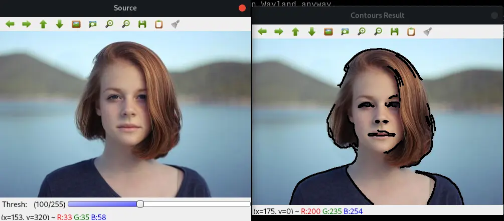
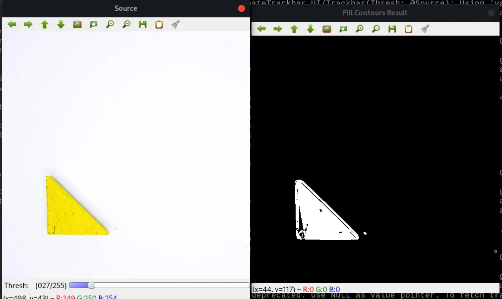
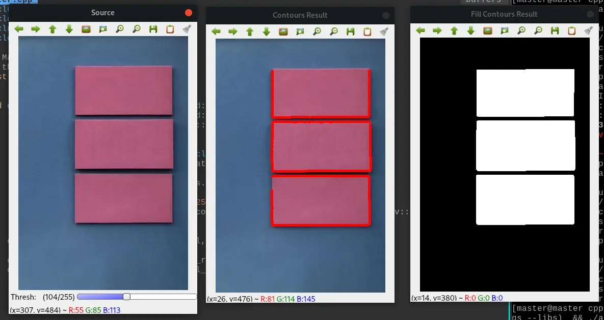
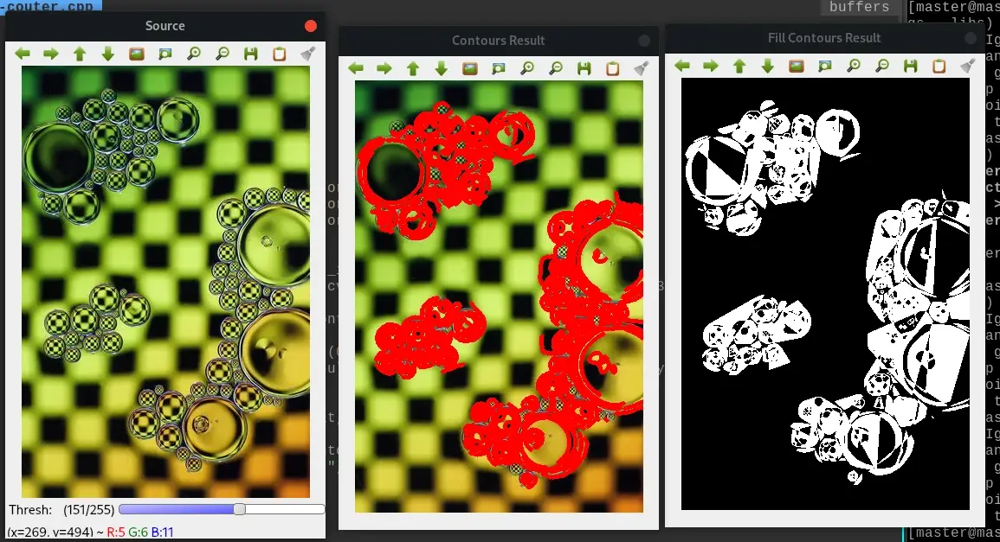

# Introduction

Have you ever seen lines drawn around mountain ranges and elevations on topographical maps? Topographical contours are the names given to these lines. They provide an elevation profile of a terrain. These lines are either created by hand or generated by a computer. This tutorial will look at how to draw contour lines on images and fill them using OpenCV.

## What are Contours?

Contours are essentially curves that connect all continuous points (along the border) with the same hue or intensity. Contours are an effective tool for shape analysis as well as to object detection and recognition.

**Use binary pictures for greater precision. Apply threshold or canny edge detection before looking for contours.**

`findContours()` in OpenCV is like finding a white object against a black background. **So, keep in mind that the object to be found should be white, and the background should be dark.**

We can recognise the edges of objects and pinpoint them in a picture using contour detection. Many fascinating applications, such as image-foreground extraction, simple-image segmentation, detection, and identification, rely on it as the first step.



## What is Convex Hull?

A region/shape is considered convex if the line connecting any two points (chosen from the region) is contained inside that region. To put it another way, a convex hull is a convex polygon produced by joining the outermost points of a set of points on a two-dimensional plane.

Calculating the convex hull of an object and then calculating its convexity flaws is a handy technique to analyse its form or contour.



## Code

```cpp
#include "opencv2/imgcodecs.hpp"
#include "opencv2/highgui.hpp"
#include "opencv2/imgproc.hpp"
#include <iostream>

cv::Mat img_gray,input_img;
int thresh = 100;
const int MAX_THRESH = 255;


void draw_and_fill_contours(std::vector<std::vector<cv::Point>>& contours,
                            std::vector<std::vector<cv::Point>>& hull,
                            std::vector<cv::Vec4i>& hierarchy)
{

      cv::Mat contours_result = input_img.clone();
      cv::Mat fill_contours_result = cv::Mat::zeros(img_gray.size(), CV_8UC3);

      for (unsigned int i = 0, n = contours.size(); i < n; ++i)
      {
        cv::Scalar color = cv::Scalar(0,0,255);
        cv::drawContours(contours_result, contours, i,color, 4, 8, hierarchy,0, cv::Point());
      }

     cv::fillPoly(fill_contours_result,hull,cv::Scalar(255,255,255));

     cv::imshow("Contours Result",contours_result);
     cv::imshow("Fill Contours Result",fill_contours_result);

}


void find_contours(int,void*) {
    cv::Mat canny_output;
    cv::Canny( img_gray, canny_output, thresh, thresh*2 );
    std::vector<std::vector<cv::Point> > contours;
    std::vector<cv::Vec4i> hierarchy;
    cv::findContours( canny_output, contours, hierarchy, cv::RETR_TREE, cv::CHAIN_APPROX_SIMPLE );

    std::vector<std::vector<cv::Point>> hull(contours.size());
    for(unsigned int i = 0,n = contours.size(); i < n; ++i) {
        cv::convexHull(cv::Mat(contours[i]),hull[i],false);
    }

    draw_and_fill_contours(contours,hull,hierarchy);
}


int main (int argc, char** argv) {
    input_img = cv::imread(argv[1]);
    if (input_img.empty()) {
        fprintf(stdout,"Could not open image\n\n");
        fprintf(stdout,"Usage:  %s <input image>\n",argv[0]);
        return -1;
    }

    cv::cvtColor(input_img,img_gray,cv::COLOR_BGR2GRAY);
    cv::blur(img_gray,img_gray,cv::Size(3,3));
    const std::string source_window("Source");
    cv::namedWindow(source_window.c_str()) ;
    cv::imshow(source_window.c_str(),input_img);

    cv::createTrackbar("Thresh: ",source_window,&thresh,MAX_THRESH,find_contours);
    find_contours(0,0);

    cv::waitKey();
    return 0;

}

/**
Compiling:-
g++ <program_name>.cpp $(pkg-config opencv4 --cflags --libs)
​
Run:
./a.out <img_file>

**/

```

## Code Explanation

The code is straightforward:-

- First we use [imread()](https://docs.opencv.org/3.4/d4/da8/group__imgcodecs.html#ga288b8b3da0892bd651fce07b3bbd3a56) to read the input file and [cvtColor()](https://docs.opencv.org/3.4/d8/d01/group__imgproc__color__conversions.html#ga397ae87e1288a81d2363b61574eb8cab) to convert the input image into gray scale.
- Before finding contours or boundaries of the image, we first find edges of the image. For that, we have used [cv::Canny()](https://docs.opencv.org/3.4/dd/d1a/group__imgproc__feature.html#ga04723e007ed888ddf11d9ba04e2232de) edge detection algorithm.
- After that, we apply [findContours()](https://docs.opencv.org/3.4/d3/dc0/group__imgproc__shape.html#ga17ed9f5d79ae97bd4c7cf18403e1689a) to find the contours of the image.
- The [convexHull()](https://docs.opencv.org/3.4/d3/dc0/group__imgproc__shape.html#ga014b28e56cb8854c0de4a211cb2be656) algorithm is used to calculate the maximum area under the contours.
- Then, we use [drawContours()](https://docs.opencv.org/3.4/d6/d6e/group__imgproc__draw.html#ga746c0625f1781f1ffc9056259103edbc) function to draw contours of the image and [fillPoly()](https://docs.opencv.org/4.5.2/d6/d6e/group__imgproc__draw.html#ga8c69b68fab5f25e2223b6496aa60dad5) function to fill the contours

### Output





### References

- [Building Computer Vision Projects with OpenCV 4 and C++](https://amzn.to/3N7WwbC)
- [Learning OpenCV 3: Computer Vision In C++ With The OpenCV Library](https://amzn.to/3toR4sR)
- [OpenCV 4 Computer Vision Application Programming Cookbook: Build complex computer vision applications with OpenCV and C++, 4th Edition ](https://amzn.to/37ztG3o)
- [Object-Oriented Programming with C++ | 8th Edition ](https://amzn.to/3ilHaC5)
- https://docs.opencv.org/3.4/df/d0d/tutorial_find_contours.html
- https://stackoverflow.com/questions/33645213/how-to-fill-contour-line-using-opencv
- https://www.programmersought.com/article/10265183451/
