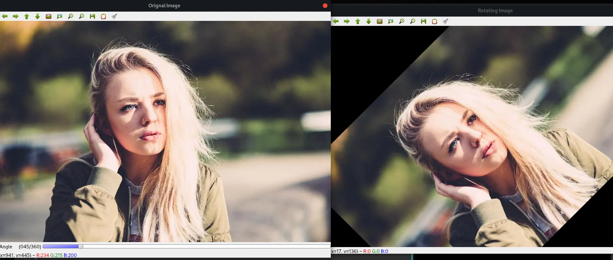
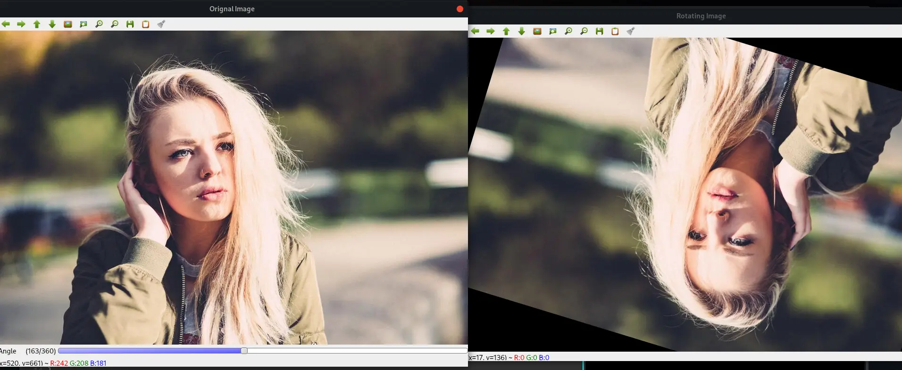

# OpenCV - Image Roatation using C++

Image editing is becoming increasingly popular as mobile phones have built-in capabilities that allow you to crop, rotate, and do other things with your images.

A common image processing operation is to rotate images by a specified angle. Although it appears to be a little complicated, OpenCV has some built-in functions that make it simple. Here is a straightforward OpenCV C++ code for rotating a picture. In this case, I'm using a track bar to dynamically modify the spinning angle.

## Fundamental Image Transformation Operations

Image rotation and translation are two of the most fundamental procedures in image editing. Both belong to the larger class of Affine transformations. Before delving into more complex transformations, you should first understand how to rotate and translate an image using OpenCV's functions.

## Image Rotation in OpenCV

By specifying a transformation matrix M, you can rotate an image by a specific angle theta. This matrix is often of the following form:


OpenCV allows you to specify the image's centre of rotation as well as a scale factor to resize it. In this situation, the transformation matrix is altered.


In the above matrix:


where c_x & c_y are the coordinates along which the image is rotated.

## Steps in Rotating Image using OpenCV

1. First, you must determine the centre of rotation. This is usually the middle of the image you're attempting to rotate.
2. Create the 2D-rotation matrix next. The above-mentioned getRotationMatrix2D() method is provided by OpenCV.
3. Finally, using the rotation matrix you created in the previous step, apply the affine transformation on the image. OpenCV's warpAffine() function does the job.

## getRotationMatrix2D()

`getRotationMatrix2D(center, angle, scale)`

The following arguments are passed to the getRotationMatrix2D() function:

- centre: the rotational axis of the input image.
- angle: the rotational angle in degrees.
- scale: an isotropic scale factor that scales the image up or down based on the value entered.

If the angle is positive, the image will be turned counter-clockwise. If you want to rotate the image by the same amount clockwise, the angle must be negative.

## warpAffine()

The warpAffine() method transforms the image using an affine transformation. All parallel lines in the source image will remain parallel in the output image after applying the affine transformation.

`warpAffine(src, M, dsize[, dst[, flags[, borderMode[, borderValue]]]])`

The function's arguments are as follows:

- src: Source image.
- M stands for the transformation matrix.
- dsize: the output image's size
- borderMode: the pixel extrapolation technique
- dst: the output image
- flags: a collection of interpolation methods such as INTER_LINEAR or INTER_NEAREST
- borderValue: the value that will be used in the case of a constant border, with a default value of 0.

Okay, now that you understand the code and functions, let's look at a specific example and try it out.

## Code

```cpp

#include "opencv3/highgui.hpp"
#include "opencv2/imgproc.hpp"
#include <iostream>

int angle = 40;
const int ANGLE_MAX = 360;
cv::Mat image;
const std::string SOURCE_WINDOW = "Orignal Image";

void rotate_image(int,void* ) {

    cv::Point2f center((image.cols - 1)/2.0, (image.rows - 1)/2.0);

    const std::string FINAL_WINDOW = "Rotating Image";
    cv::namedWindow( FINAL_WINDOW, cv::WINDOW_AUTOSIZE );

    cv::Mat matRotation = cv::getRotationMatrix2D( center,angle , 1.0 );

    cv::Mat rotated_image;

    cv::warpAffine(image, rotated_image, matRotation, image.size());

    cv::imshow(FINAL_WINDOW.c_str(), rotated_image);

}

int main(int argc,char** argv) {
		if( argc != 2) {
			std::cerr << "Usage:\n"<< argv[0] << " <imagefile>\n";
			return -1;
		}

    image = cv::imread( argv[1]);

    cv::namedWindow( SOURCE_WINDOW, cv::WINDOW_AUTOSIZE );
    cv::imshow( SOURCE_WINDOW, image );

    cv::createTrackbar("Angle", SOURCE_WINDOW, &angle, ANGLE_MAX,rotate_image);
    rotate_image(0,0);

    cv::waitKey(0);

     return 0;

}


```

### Output




### References

- [Building Computer Vision Projects with OpenCV 4 and C++](https://amzn.to/3N7WwbC)
- [Learning OpenCV 3: Computer Vision In C++ With The OpenCV Library](https://amzn.to/3toR4sR)
- [OpenCV 4 Computer Vision Application Programming Cookbook: Build complex computer vision applications with OpenCV and C++, 4th Edition ](https://amzn.to/37ztG3o)
- [Object-Oriented Programming with C++ | 8th Edition ](https://amzn.to/3ilHaC5)
