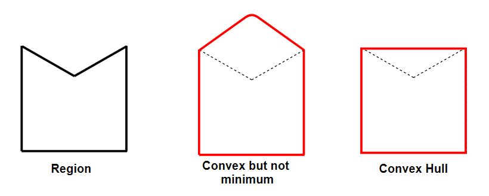
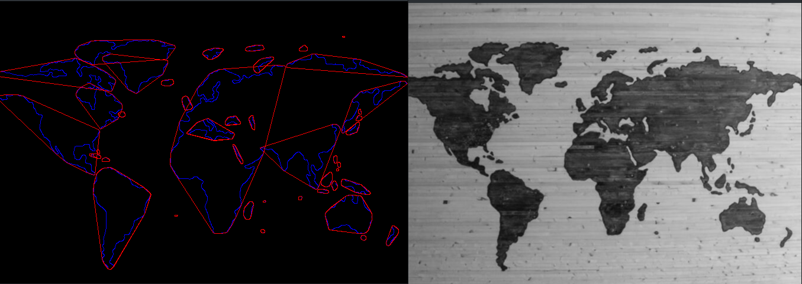
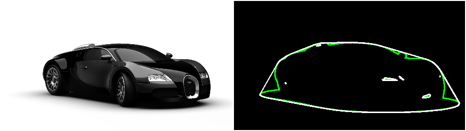

# OpenCV - Understanding Convex Hull using C++

Finding and analysing the forms present in an image is one technique to solving most computer vision problems, and getting the contour is one of them.
I would describe a contour to a newbie as "just a curve joining all the points lying on the shape's perimeter."

Let's say I have the image of my hand below, and the contour of the hand is represented by the green line.
The red dots represent the spots that we link to form the contour curve.


My advanced mathematics lesson, where they introduced contours, is still fresh in my mind. However, it was difficult to connect with the importance of this topic because the teacher never highlighted any real-world applications of the contour. And today is the day when I discover just how crucial they are in computer vision.

## What is Convex Hull?

An item that has no interior angles higher than 180 degrees is said to be **convex**. Non-Convex or Concave refers to a shape that is not convex.
The exterior or shape of an object is referred to as the **hull**.  
As a result, a shape's or a group of points' **Convex Hull** is a tightly fitting convex boundary around the points or the shape.



**A convex hull of an object, in layman's terms, is the smallest boundary that can completely encircle or wrap the thing (or contour of that object).**

The convex hull can be found using a variety of approaches. The following are some of the most frequent algorithms and their associated temporal complexities. The number of input points is n, while the number of points on the hull is h.

- [Sklansky](https://www.sciencedirect.com/science/article/pii/0167865582900162) (1982) — O(nlogn) ( OpenCV uses this algorithm)
- [Gift wrapping](https://en.wikipedia.org/wiki/Gift_wrapping_algorithm), a.k.a. Jarvis march — O(nh)
- [Graham scan](https://en.wikipedia.org/wiki/Graham_scan) — O(nlogn)
- [Chan’s algorithm](https://en.wikipedia.org/wiki/Chan%27s_algorithm) — O(nlogh)

## Implementing Convex Hull Using OpenCV

## 1. Read the Input Image

```cpp
src = cv::imread( argv[1],cv::IMREAD_GRAYSCALE);

```

## 2. Convert Input Image into Binary Form

1. Convert Image to grayscale (Which we have done while reading image).
2. Remove Noise from the image by applying any blurring algorithm (Here I have used Gaussain Blur)
3. Then Thershold the image to make it into Binary Form.

```cpp
...

 cv::GaussianBlur( src, src, cv::Size(3,3),0 ); //Applying GaussianBlur of Kernel(3x3)
    ShowImg("Image After Applying Blur",src);

    const int max_thresh = 255;

    const std::string source_window = "Canny ";
    cv::createTrackbar( "Canny thresh:", source_window, &thresh, max_thresh, thresh_callback );
    thresh_callback( 0, 0 );
    cv::waitKey();
    return 0;
}
void thresh_callback(int, void* )
{
    cv::Mat canny_output;
    cv::Canny( src, canny_output, thresh, thresh*2 );
....

```

3. Finding Contour
   Next, we use OpenCV's `findContour` function to find the contour around each image.

If you're a newbie, you might be wondering why we didn't just utilise edge detection. Edge detection would simply have provided us with the position of the edges.

However, we're curious about how edges are connected to one another. findContour finds the connections and returns a list of the points that make up a contour.

```cpp
...

    std::vector<std::vector<cv::Point> > contours;
    cv::findContours( canny_output, contours, cv::RETR_TREE, cv::CHAIN_APPROX_SIMPLE );
...

```

4. Finding Convex Hull using `convexHull` function
   We can now get the Convex Hull for each of the contours now that we've got the contours. The `convexHull` function can be used to do this.

```cpp
...
   std::vector<std::vector<cv::Point> >hull( contours.size() );
   for( size_t i = 0; i < contours.size(); i++ )
   {
       cv::convexHull( contours[i], hull[i] );
   }

...

```

5. Drawing Convex Hull
   The last step is to visualise the convex hulls we've discovered so far. Because a convex hull is essentially a contour, we can use OpenCV's `drawContours` function to create one.

```cpp
...

    cv::Scalar contours_color = cv::Scalar(255,0,0); //Blue Color
    cv::Scalar hull_color = cv::Scalar(0,0,255); //Red Color
    for( size_t i = 0; i< contours.size(); i++ )
    {
        cv::Scalar color = cv::Scalar( rng.uniform(0, 256), rng.uniform(0,256), rng.uniform(0,256) );
        cv::drawContours( drawing, contours, (int)i, contours_color );
        cv::drawContours( drawing, hull, (int)i, hull_color );
    }

...

```

## Output




## Applications

### From a set of points, create a boundary

Regular readers of our blog would recall that we utilised convexHull in our face swap application previously. We used the convex hull to find the face's boundary based on the facial landmarks discovered by Dlib.

We can retrieve feature points information instead of contour information in a variety of additional applications. We recover a grayscale depth map that is a collection of points in several active illumination systems, such as Kinect. The convex hull of these points can be used to find the boundaries of an object in the scene.

### Avoidance of Collisions



Consider an automobile to be a collection of points, with the polygon (minimum set) holding all of them. If the convex hull can avoid the obstructions, the automobile should be able to as well.

Finding the intersection of random contours is substantially more computationally intensive than finding the collision of two convex polygons.
As a result, a convex hull is preferable for collision detection and avoidance.

## References

- [OpenCV Computer Vision Application Programming Cookbook](https://amzn.to/3L9k6TD)
- [OpenCV 4 Computer Vision Application Programming Cookbook: Build complex computer vision applications with OpenCV and C++, 4th Edition](https://amzn.to/3D8zOeL)
- [Modern C++ Programming Cookbook](https://amzn.to/3iowMJM)
- [OpenCV Docs](https://www.google.com/url?sa=t&rct=j&q=&esrc=s&source=web&cd=&cad=rja&uact=8&ved=2ahUKEwiwqLG6r_P2AhVR4HMBHf2mCX0QFnoECAMQAQ&url=https%3A%2F%2Fdocs.opencv.org%2F3.4%2Fd7%2Fd1d%2Ftutorial_hull.html&usg=AOvVaw0bLlPkmERpjI_jW3p-tPZC)

## Code

```cpp

#include "opencv2/imgcodecs.hpp"
#include "opencv2/highgui.hpp"
#include "opencv2/imgproc.hpp"
#include <iostream>

cv::Mat src;
int thresh = 100;

void thresh_callback(int, void* );

void ErrorMsg(std::string msg) {
    std::cout << "!! Error !! \n" ;
    std::cout << msg << std::endl;
}

void ShowImg(const std::string windowName,cv::Mat& img)
{
    cv::namedWindow( windowName );
    cv::imshow( windowName, img );
}

int main( int argc, char** argv )
{
    if(argc < 1) {
        ErrorMsg("Please Provide Input Image\n");
    }
    src = cv::imread( argv[1],cv::IMREAD_GRAYSCALE);
    if( src.empty() )
    {
        ErrorMsg("Could not open or find the image!\n");
        return -1;
    }

    cv::GaussianBlur( src, src, cv::Size(3,3),0 ); //Applying GaussianBlur of Kernel(3x3)
    ShowImg("Image After Applying Blur",src);

    const int max_thresh = 255;

    const std::string source_window = "Canny ";
    cv::createTrackbar( "Canny thresh:", source_window, &thresh, max_thresh, thresh_callback );
    thresh_callback( 0, 0 );
    cv::waitKey();
    return 0;
}
void thresh_callback(int, void* )
{
    cv::Mat canny_output;
    cv::Canny( src, canny_output, thresh, thresh*2 );
    std::vector<std::vector<cv::Point> > contours;
    cv::findContours( canny_output, contours, cv::RETR_TREE, cv::CHAIN_APPROX_SIMPLE );
    std::vector<std::vector<cv::Point> >hull( contours.size() );
    for( size_t i = 0; i < contours.size(); i++ )
    {
        cv::convexHull( contours[i], hull[i] );
    }
    cv::Mat drawing = cv::Mat::zeros( canny_output.size(), CV_8UC3 );

    cv::Scalar contours_color = cv::Scalar(255,0,0); //Blue Color
    cv::Scalar hull_color = cv::Scalar(0,0,255); //Red Color
    for( size_t i = 0; i< contours.size(); i++ )
    {
        cv::Scalar color = cv::Scalar( rng.uniform(0, 256), rng.uniform(0,256), rng.uniform(0,256) );
        cv::drawContours( drawing, contours, (int)i, contours_color );
        cv::drawContours( drawing, hull, (int)i, hull_color );
    }

    ShowImg("Hull: ", drawing);
}


```
