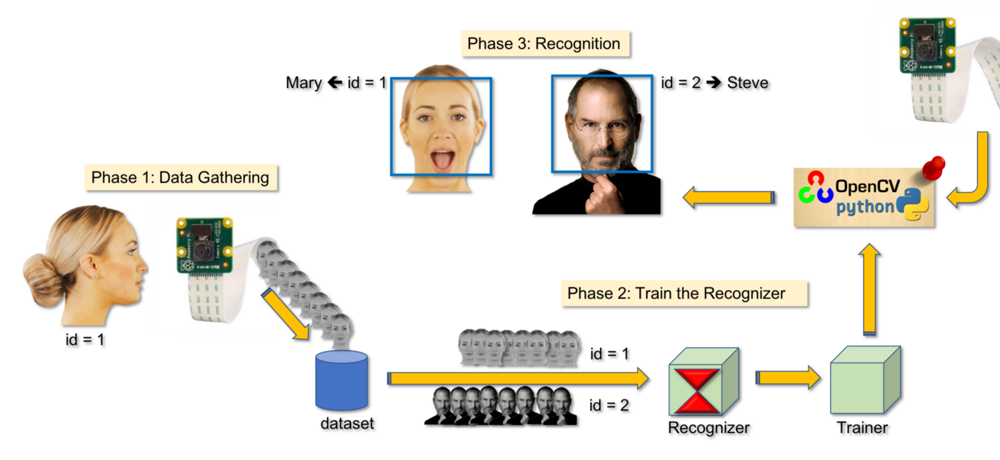

# OpenCV - Face Recognition using LBPH Classifier in C++

We learned [HOW TO RECOGNIZE FACES](https://anothertechs.com/programming/cpp/opencv/opencv-face-detection/) in my OpenCV tutorial.
Now, as shown below, we will gather and use our own data to recognize different faces using LBPH:


To complete a Face Recognition project, we must work on three distinct phases:

- Face Recognition and data collection
- Train the recognizer.
- Recognition of Faces

The following block diagram summarises those phases:



## Face Recognition and Data Collection

In our [last](https://anothertechs.com/programming/cpp/opencv/opencv-face-detection/) tutorial we have seen how to recognize faces in the given photo using Cascade Classifier. In this tutorial we will go one step further.

That is we will give our algorithm different images and we will extract the faces from the images and store it in some variable for our next step.

Here the input image which we will provide will be out dataset. Here you can give any person images but in our case I have given images of famous celebrities **Alexandra Daddario** and **Scarlett Johansson**.

Directory Structure is as follows:

```
./datasets

	alexandra-daddari-0/
		img1
		img2
		img3

	scarlet-johansson-1/
		img1
		img2
		img3
```

Extracting Faces from images:

```cpp

cv::CascadeClassifier classifier;

int extractfaces(cv::Mat &img, cv::Mat &face) {
  cv::Mat img_gray;
  cv::cvtColor(img, img_gray, cv::COLOR_BGR2GRAY);
  std::vector<cv::Rect> features;
  classifier.detectMultiScale(img, features);

  /* Under Assumption that image consist of only single face */
  if (features.size() > 0) {
    face = img_gray(features[0]);
    return 1;
  } else
    return 0;
}

```

## Train the Recognizer

After extracting faces from the images we will train those images. For this Opencv provide us with a wonderfull algorithm called **Local Binary Pattern Histogram(LBPH)** Face-Recognition algorithm.It is well-known for its performance and ability to recognise a person's face from both the front and side faces.

To know how LBPH Face Algorihtm Work read [this](https://www.analyticsvidhya.com/blog/2021/07/understanding-face-recognition-using-lbph-algorithm/).

```cpp
cv::Ptr<cv::face::LBPHFaceRecognizer> model =
    cv::face::LBPHFaceRecognizer::create();

void train_dataset(const std::string &in_dir) {
  std::cout << "Starting To Train Dataset...\n";

  std::vector<int> faceIds;
  std::vector<cv::Mat> faceSamples;

  for (const auto &file : std::filesystem::directory_iterator(in_dir)) {
    std::string label = file.path().filename();
    std::cout << "Images in directory: " << label << "...\n";

    /*Directory Format: dir_name_0 ,dir_name_1 */
    int faceID = std::stoi(label.substr(label.rfind("_") + 1, label.size()));

    for (const auto &f : std::filesystem::directory_iterator(file.path())) {
      cv::Mat src, face;
      std::cout << f << "\n";
      src = cv::imread(f.path());
      if (extractfaces(src, face)) {
        faceSamples.emplace_back(face);
        faceIds.emplace_back(faceID);
      }
    }
    model->train(faceSamples, faceIds);
    std::cout << "Done!!\n";
  }

  std::cout << "Training Datasets Done !! \n";
}

```

Here `faceSamples` variable stores faces and `faceID` variable is refrence to whoes face it belongs to i.e. 0 means that face is of Alexandra Daddario and 1 means face is of Scarlett Johansson.

## Recognition of Faces

After our classifier(LBPH) is trainned enough images it's time to test our model.

For this just create a test directory and put the images which you want to test. In testing phase once again we will extract faces from our test image and then feed it to our model for pridiction.

```cpp

void test_dataset(const std::string &in_dir) {
  std::cout << "Testing Datasets... \n";
  const std::vector<std::string> names = {
      "Alexender Dadario", "Scarlet Johanson"}; // Arrange name according to
                                                // directory in train_dataset

  for (const auto &file : std::filesystem::directory_iterator(in_dir)) {
    cv::Mat src = cv::imread(file.path());
    cv::Mat face;
    extractfaces(src, face);
    int predictedLabel = -1;
    double confidence = 0.0;
    model->predict(face, predictedLabel, confidence);
    std::cout << predictedLabel << "\n";

    /* If No Match Found prediction will be -1 */
    if (predictedLabel != -1) {
      cv::putText(src, names[predictedLabel], cv::Point(10, src.rows / 2),
                  cv::FONT_HERSHEY_DUPLEX, 1.0, CV_RGB(118, 185, 0), 1);

      cv::imshow(file.path().filename(), src);

      std::cout << "File: " << file.path().filename()
                << "\nPrediction: " << names[predictedLabel]
                << "\nConfidence: " << confidence << "\n\n\n";
    } else {
      cv::putText(src, "Match Not Found", cv::Point(10, src.rows / 2),
                  cv::FONT_HERSHEY_DUPLEX, 1.0, CV_RGB(118, 185, 0), 1);

      cv::imshow(file.path().filename(), src);
      std::cout << "File: " << file.path().filename()
                << "Prediction: Unknown To Model"
                << "\n";
    }
  }
}
```

## Output


## References

- [OpenCV Computer Vision Application Programming Cookbook](https://amzn.to/3L9k6TD)
- [OpenCV 4 Computer Vision Application Programming Cookbook: Build complex computer vision applications with OpenCV and C++, 4th Edition](https://amzn.to/3D8zOeL)
- [Modern C++ Programming Cookbook](https://amzn.to/3iowMJM)
- [OpenCV Docs](https://docs.opencv.org/3.4/da/d60/tutorial_face_main.html)
- [OpenCV Docs](https://docs.opencv.org/3.4/dc/d88/tutorial_traincascade.html)

## Code

```cpp

#include "opencv2/face.hpp"
#include "opencv2/highgui.hpp"
#include "opencv2/imgproc.hpp"
#include <cassert>
#include <filesystem>
#include <iostream>
#include <vector>

cv::CascadeClassifier classifier;
cv::Ptr<cv::face::LBPHFaceRecognizer> model =
    cv::face::LBPHFaceRecognizer::create();

int extractfaces(cv::Mat &img, cv::Mat &face) {
  cv::Mat img_gray;
  cv::cvtColor(img, img_gray, cv::COLOR_BGR2GRAY);
  std::vector<cv::Rect> features;
  classifier.detectMultiScale(img, features);

  /* Under Assumption that image consist of only single face */
  if (features.size() > 0) {
    face = img_gray(features[0]);
    return 1;
  } else
    return 0;
}

void train_dataset(const std::string &in_dir) {
  std::cout << "Starting To Train Dataset...\n";

  std::vector<int> faceIds;
  std::vector<cv::Mat> faceSamples;

  for (const auto &file : std::filesystem::directory_iterator(in_dir)) {
    std::string label = file.path().filename();
    std::cout << "Images in directory: " << label << "...\n";

    /*Directory Format: dir_name_0 ,dir_name_1 */
    int faceID = std::stoi(label.substr(label.rfind("_") + 1, label.size()));

    for (const auto &f : std::filesystem::directory_iterator(file.path())) {
      cv::Mat src, face;
      std::cout << f << "\n";
      src = cv::imread(f.path());
      if (extractfaces(src, face)) {
        faceSamples.emplace_back(face);
        faceIds.emplace_back(faceID);
      }
    }
    model->train(faceSamples, faceIds);
    std::cout << "Done!!\n";
  }

  std::cout << "Training Datasets Done !! \n";
}

void test_dataset(const std::string &in_dir) {
  std::cout << "Testing Datasets... \n";
  const std::vector<std::string> names = {
      "Alexender Dadario", "Scarlet Johanson"}; // Arrange name according to
                                                // directory in train_dataset

  for (const auto &file : std::filesystem::directory_iterator(in_dir)) {
    cv::Mat src = cv::imread(file.path());
    cv::Mat face;
    extractfaces(src, face);
    int predictedLabel = -1;
    double confidence = 0.0;
    model->predict(face, predictedLabel, confidence);
    std::cout << predictedLabel << "\n";

    /* If No Match Found prediction will be -1 */
    if (predictedLabel != -1) {
      cv::putText(src, names[predictedLabel], cv::Point(10, src.rows / 2),
                  cv::FONT_HERSHEY_DUPLEX, 1.0, CV_RGB(118, 185, 0), 1);

      cv::imshow(file.path().filename(), src);

      std::cout << "File: " << file.path().filename()
                << "\nPrediction: " << names[predictedLabel]
                << "\nConfidence: " << confidence << "\n\n\n";
    } else {
      cv::putText(src, "Match Not Found", cv::Point(10, src.rows / 2),
                  cv::FONT_HERSHEY_DUPLEX, 1.0, CV_RGB(118, 185, 0), 1);

      cv::imshow(file.path().filename(), src);
      std::cout << "File: " << file.path().filename()
                << "Prediction: Unknown To Model"
                << "\n";
    }
  }
}

int main(int argc, char **argv) {
  if (argc < 3) {
    std::cout << "!! ERROR !!!\n";
    std::cout << "<Program> <DatasetFolder> <Test Folder>\n";
    return -1;
  }

  std::cout << "Loading Haarcascade File ...\n";
  assert(classifier.load("haarcascade_frontalface_alt.xml"));
  std::cout << "Done!!\n";

  train_dataset(argv[1]);

  test_dataset(argv[2]);

  cv::waitKey(0);

  return 0;
}

```
