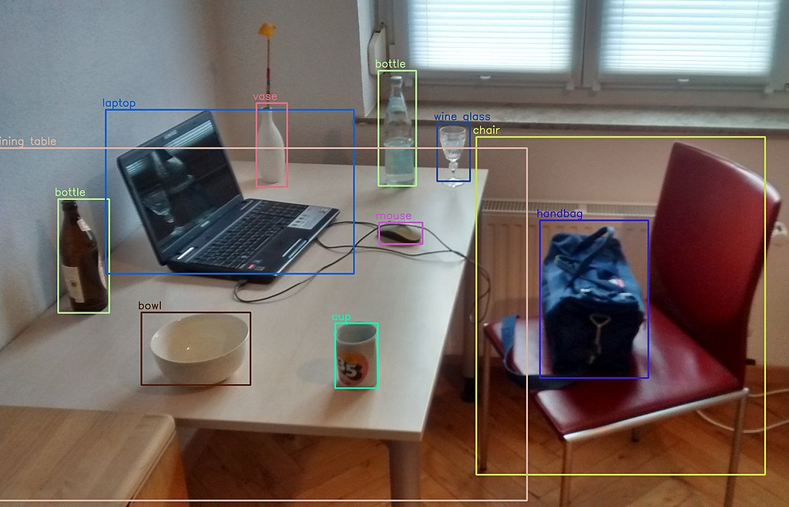
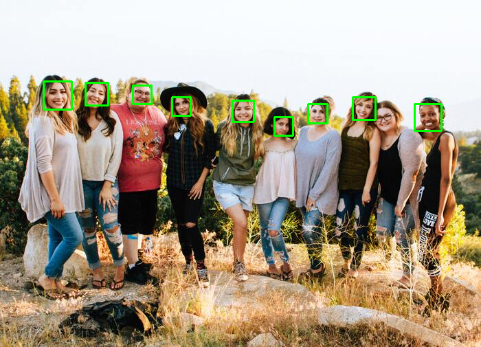

# OpenCV - Face Detection using Haar cascade classifiers (C++)

The fact that computer vision makes very futuristic-sounding jobs a reality is one of the many reasons why it is a fascinating subject. Face detection is one such feature. Face detection is a built-in feature of OpenCV, and it has nearly endless uses in the real world, ranging from security to entertainment.


This article walks you through some of OpenCV's face detection features, as well as the data files that define different sorts of trackable objects. We focus on **Haar cascade classifiers**, which use contrast between adjacent image regions to evaluate if a particular image or subimage corresponds to a recognised type.

## Visualizing Haar cascades

What exactly are we hoping to pinpoint when we talk about classifying objects and tracking their location? What constitutes a distinguishable feature of an object?

Photographic images, even those captured by a webcam, can contain a great deal of detail for our (human) viewing pleasure. Image detail, on the other hand, is prone to instability due to changes in lighting, viewing angle, viewing distance, camera shake, and digital noise. Furthermore, even real differences in physical detail may not be of interest to us for classification purposes.

As a result, some method of abstracting image detail is beneficial in producing consistent classification and tracking results. The abstractions are known as **features**, and they are said to be extracted from image data.



Though each pixel may influence multiple features, there should be far fewer features than pixels. The degree of similarity between two images can be calculated using Euclidean distances between their corresponding features.

Distance, for example, could be defined in terms of spatial coordinates or colour coordinates. Haar-like features are a common type of feature used in real-time face tracking. Each Haar-like feature describes the contrast pattern between adjacent image regions. Edges, vertices, and thin lines, for example, all produce distinct features.

The features of any given image may vary depending on the size of the region; this is referred to as the window size. Two images that differ only in scale should produce similar results, albeit for different window sizes. As a result, it is advantageous to generate features for a variety of window sizes. A cascade is a collection of such features. A Haar cascade is said to be scale-invariant, or resistant to changes in scale. OpenCV includes a classifier and tracker for scale-invariant Haar cascades that are in a specific file format.

## Theroy

We will be working with face detection in this section. To train the classifier, the algorithm requires a large number of positive images (images of faces) and negative images (images without faces). Then we must extract characteristics from it. Haar features such as those shown in the image below are used for this. They are analogous to our convolutional kernel. Each feature is a single value obtained by subtracting sum of pixels under the white rectangle from sum of pixels under the black rectangle.


Many features are now calculated using all possible sizes and locations of each kernel. (Can you imagine how much computation is required? Even a 24x24 window yields more than 160000 features). We must find the sum of the pixels under white and black rectangles for each feature calculation. They used the integral image to solve this problem. Whatever the size of your image, it reduces the calculations for a given pixel to a four-pixel operation. Isn't it lovely? It accelerates everything.

However, the majority of the features we calculated are irrelevant. Take a look at the image below. Two good features are shown in the top row. The first feature chosen appears to emphasise the fact that the area around the eyes is frequently darker than the area around the nose and cheeks. The second feature chosen is the fact that the eyes are darker than the bridge of the nose. However, applying the same windows to the cheeks or any other location is pointless. So, how do we pick the best features from a list of over 160000? Adaboost accomplishes this.


For this, we use every feature on all of the training images. It determines the best threshold for each feature to classify the faces as positive or negative. Errors and misclassifications are unavoidable. We choose the features with the lowest error rate, which means they accurately classify face and non-face images. (The procedure is not as straightforward as this. At first, each image is given the same weight. The weights of misclassified images are increased after each classification. Then the process is repeated. Error rates are calculated at a new level. There are also new weights. The process is repeated until the required accuracy or error rate is obtained (or until the required number of features is discovered).

The final classifier is a weighted average of these poor classifiers. It is called weak because it cannot classify an image on its own, but when combined with others, it forms a strong classifier. According to the paper, even 200 features provide detection with 95% accuracy. Their final configuration included around 6000 features. (Imagine going from 160000+ features to 6000 features. That is a significant gain). So you take a picture now. Consider each 24x24 window. Apply a total of 6000 features to it. Check to see if it is a face or not. Wow.. Isn't it inefficient and time-consuming? It is, indeed. The authors have a good solution to this problem.

The majority of an image is non-face region. As a result, it is preferable to have a simple method for determining whether or not a window is a face region. If it isn't, discard it in one go and don't process it again. Instead, concentrate on areas where a face could appear. This allows us to spend more time inspecting potential face regions.

They introduced the concept of Cascade of Classifiers to accomplish this. Instead of applying all 6000 features to a single window, the features are divided into stages of classifiers and applied one at a time. (Normally, the first few stages will have far fewer features.) If a window fails the first stage, it should be discarded. We do not take into account the remaining features on it. If it passes, move on to the second stage of features and repeat the process. A face region is a window that passes through all stages. How's that plan coming along?

The authors' detector had more than 6000 features and 38 stages, with 1, 10, 25, 25, and 50 features in the first five stages. (The two features in the above image are the best two features obtained from Adaboost.) According to the authors, 10 features out of 6000+ are evaluated on average per sub-window.

## Implementing Haar Cascade Classifier

Now let's see how to implement haar cascade classifier using OpenCV and C++

### 1. Reading Image(or Video) and Loading Haar Cascade pre-trainned model

In the example below I will be using a image and pre-trainned model of haar cascade for face detection. There are few more pre-trainned model provided by OpenCV [here](https://github.com/opencv/opencv/tree/3.4/data/haarcascades). All you have to do is download xml file of pre-trainned model and load it into your code.

```cpp

  cv::Mat src = cv::imread(argv[1]);

  assert(!src.empty());

  cv::CascadeClassifier classifier; //Haar Cascade Classifier

  assert(classifier.load(argv[2])); //Loading xml here

```


### 2. Converting original Image(or frame if Video) to grayscale

```cpp
void detectFeatures(cv::CascadeClassifier &cls, cv::Mat &img) {
...
  cv::Mat img_gray;
  cv::cvtColor(img, img_gray, cv::COLOR_BGR2GRAY);
...
}
```

### 3. Detecting Feature

After loading haarcascades classifier with our pre-trainned model of face detection,we will now extract this feature from our input image(or frame if video):

```cpp
void detectFeatures(cv::CascadeClassifier &cls, cv::Mat &img) {
...

  std::vector<cv::Rect> features;
  cls.detectMultiScale(img, features);

...
	}

```

### 4. Displaying Detected Features

Now let us dispaly features which are being detected:

```cpp
void detectFeatures(cv::CascadeClassifier &cls, cv::Mat &img) {
...

  cv::Scalar green(0, 255, 0);
  for (auto &feature : features)
    cv::rectangle(img, feature, green, 2, 1, 0);

  cv::imshow("Output", img);
...

}

```

## Output



## References

- [OpenCV Computer Vision Application Programming Cookbook](https://amzn.to/3L9k6TD)
- [OpenCV 4 Computer Vision Application Programming Cookbook: Build complex computer vision applications with OpenCV and C++, 4th Edition](https://amzn.to/3D8zOeL)
- [Modern C++ Programming Cookbook](https://amzn.to/3iowMJM)
- [OpenCV Docs](https://docs.opencv.org/3.4/db/d28/tutorial_cascade_classifier.html)

## Code

```cpp
#include "opencv2/highgui.hpp"
#include "opencv2/imgproc.hpp"
#include "opencv2/objdetect.hpp"
#include <cassert>
#include <iostream>
#include <vector>

void detectFeatures(cv::CascadeClassifier &cls, cv::Mat &img) {
  cv::Mat img_gray;
  cv::cvtColor(img, img_gray, cv::COLOR_BGR2GRAY);
  std::vector<cv::Rect> features;
  cls.detectMultiScale(img, features);
  cv::Scalar green(0, 255, 0);
  for (auto &feature : features)
    cv::rectangle(img, feature, green, 2, 1, 0);

  cv::imshow("Output", img);
  cv::imwrite("output.png", img);
}

int main(int argc, char **argv) {
  if (argc < 3) {
    std::cout << "!! ERROR !!!\n";
    std::cout << "<Program> <image> <harcascade file>\n";
    return -1;
  }

  cv::Mat src = cv::imread(argv[1]);

  assert(!src.empty());

  cv::CascadeClassifier classifier;
  assert(classifier.load(argv[2]));
  detectFeatures(classifier, src);

  cv::waitKey(0);
  return 0;
}


```
