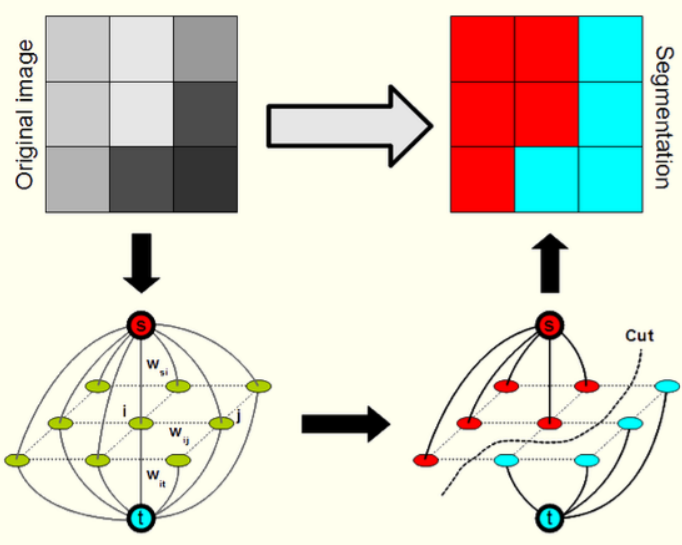
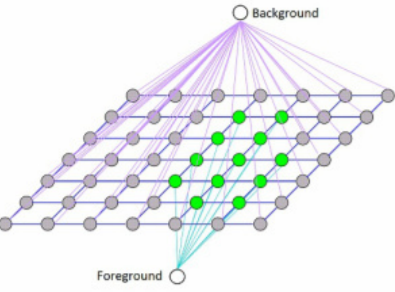
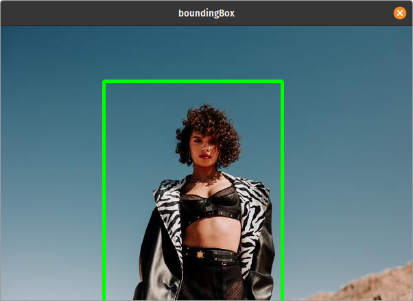
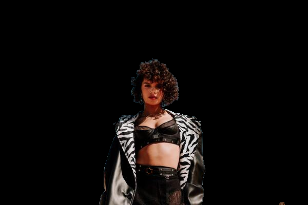

# OpenCV - Removing Background from an Image using GrabCut Algorithm (C++)

This may be appropriate for you if you are a newbie in the field of computer vision, as I am. Let's get this party started! Oh, and without the code, as well... Making object segmentation work on computers has been a difficult task for computers and even engineers. Until recently (well, maybe not so recently), an algorithm was used to make this task appear simple. Before we get into detail about the algorithm, let's define object segmentation at a high level.

Object segmentation is the process of breaking down an image into smaller pieces (as the name implies). Specifically, following object segmentation, the computer can determine how many items are there in the image and whether an object in the image belongs in the forefront or background. This is where the GrabCut algorithm comes in. To segment the image into foregrounds and backgrounds, we'll utilise the GrabCut algorithm.

## GrabCut

Carsten Rother, Vladimir Kolmogorov, and Andrew Blake of Microsoft Research Cambridge, UK, developed the GrabCut method in their article "GrabCut": interactive foreground extraction with iterated graph cuts. GrabCut was created to solve the problem of foreground extraction with minimal user interaction.

## How does it function from the user's perspective?

The user first draws a rectangle around the foreground area (foreground region should be completely inside the rectangle).
The algorithm then segments it iteratively until the best result is obtained. Done. However, the segmentation may not be perfect in other circumstances, such as when it mistakenly labels some foreground regions as background and vice versa. In this instance, the user must perform delicate touch-ups.

Simply draw some strokes on the photographs where there are some erroneous results. Strokes essentially indicate _"Hey, this section should be foreground, but you marked it as background; fix it in the next iteration"_ or the inverse for background. Then you achieve better results in the next iteration.

## How GrabCut Algorithm Works

- You begin by sketching a rectangle on an image, which should include the image's subjects, such as a human or a dog. As a result, the background is automatically determined as the area outside of the rectangle you just drew. Within the defined rectangle, the data in the background is used as a reference to distinguish background from foreground locations.

- Based on the facts we provided, the computer does an initial labelling. It identifies the pixels in the foreground and background (or it hard-labels).

- To put it simply, this approach uses the Gaussian Mixture Model (GMM) to define the area in the rectangle as a colour distribution model, with each pixel labelled to indicate whether it is foreground, background, or unknown. If you know a little bit about image processing, you'll know that each pixel is connected to the next by a gradient, therefore this model will encourage pixels with similar colour distributions to have the same label.



- GMM learns and creates new pixel distributions based on the data we provide. In other words, the unknown pixels are labelled as probable foreground or probable background based on their colour statistical relationship with the other hard-labelled pixels (It is just like clustering).

- This pixel distribution is used to create a graph. Pixels are the nodes in the graphs. Two new nodes have been added: a **Source node** and a **Sink node**. Every pixel in the foreground is connected to the Source node, while every pixel in the background is connected to the Sink node.

- The likelihood of a pixel being foreground/background determines the weights of edges connecting pixels to source node/end node. The edge information or pixel similarity determines the weights between the pixels. If there is a significant colour difference between pixels, the edge between them will have a low weight.

- After creating graph with initialized weghts, we use **Min-Cut** algorithm, to yield 2 group of vertices.



- Then we create a graph with N vertices (N=number of pixels) and connect them with edges whose weights are determined by the colour similarity of the vertices (pixels). After that, we'll add two vertices to the network (labels for foreground and background), each of which will be linked to N pixels based on the likelihood of the pixel matching a colour distribution of the backdrop or foreground.

To put it another way, the GrabCut approach creates two labels, one for the background and one for the foreground, and uses the colour distribution of each pixel to link all the pixels to itself.

## Implementing GrabCut Algorithm in OpenCV using C++

Now let's looks how to implement grabcut algorithm using c++

### 1. Reading Image

```cpp

  cv::Mat src = cv::imread(argv[1]);
    assert(!src.empty());

```


### 2. Getting Bounding Box

The rectangle is entered by the user. Outside of this region, everything will be treated as a solid background (That is the reason it is mentioned before that your rectangle should include all the objects). The contents of the rectangle are unknown. Similarly, any user input that specifies foreground and background is considered hard-labelling, meaning it will not alter during the procedure.

```cpp
void showImg(const std::string& name,cv::Mat& img) {
    cv::imshow(name,img);
    cv::waitKey(0);
}

void getBoundingBox(cv::Mat& img,cv::Rect& rect)
{

    cv::Point pt,pt2;
    int size;
    for(;;) {
        cv::Mat temp = img.clone();
        std::cout << "Insert x1,y1,x2,y2 Point:\n";
        std::cin >> pt.x >> pt.y >> pt2.x >> pt2.y;
        cv::rectangle(temp,pt,pt2,cv::Scalar(0,255,0),3);
        showImg("boundingBox",temp);
        char choice;
        std::cout << "Do You want to change paramters (y/n)";
        std::cin >> choice;
        if(choice == 'n'){
            rect = cv::Rect(pt.x,pt.y,pt2.x,pt2.y);
            break;
        }
    }
}

...

cv::React boundingBox;
getBoundingBox(src,boundingBox)

...

```



### 3. Creating Gaussain Mixture Model(GMM)

- Based on the facts we provided, the computer does an initial labelling. It identifies the pixels in the foreground and background (or it hard-labels) The foreground and background are now modelled using a Gaussian Mixture Model (GMM).
- GMM learns and creates new pixel distributions based on the data we provide.
- In other words, the unknown pixels are labelled as probable foreground or probable background based on their colour statistical relationship with the other hard-labelled pixels (It is just like clustering).

```cpp
...

 cv::Mat mask = cv::Mat::zeros(src.rows,src.cols,CV_8UC1);
 cv::Mat bgModel,fgModel; //Model which will store background and foreground pixel respectively

...

```

### 4. Implementing GrabCut Algorithm

```cpp
...

	unsigned int iteration = 5; //Tune Parameter according to need
	cv::grabCut(src,mask,boundingBox,bgModel,fgModel,iteration,cv::GC_INIT_WITH_RECT);

	cv::Mat mask2 = (mask == 1) + (mask == 3);  // 0 = cv::GC_BGD, 1 = cv::GC_FGD, 2 = cv::PR_BGD, 3 = cv::GC_PR_FGD

...

```

### 5. Displaying Image

```cpp
...

 cv::Mat dest;
 src.copyTo(dest, mask2);
 showImg("dest", dest);

...

```

## Output



## References

- [OpenCV Computer Vision Application Programming Cookbook](https://amzn.to/3L9k6TD)
- [OpenCV 4 Computer Vision Application Programming Cookbook: Build complex computer vision applications with OpenCV and C++, 4th Edition](https://amzn.to/3D8zOeL)
- [Modern C++ Programming Cookbook](https://amzn.to/3iowMJM)
- [OpenCV Docs](https://docs.opencv.org/3.4/d8/d83/tutorial_py_grabcut.html)

## Code

```cpp

#include <iostream>
#include <cassert>
#include <opencv2/opencv.hpp>


void showImg(const std::string& name,cv::Mat& img) {
    cv::imshow(name,img);
    cv::waitKey(0);
}

void getBoundingBox(cv::Mat& img,cv::Rect& rect)
{

    cv::Point pt,pt2;
    int size;
    for(;;) {
        cv::Mat temp = img.clone();
        std::cout << "Insert x1,y1,x2,y2 Point:\n";
        std::cin >> pt.x >> pt.y >> pt2.x >> pt2.y;
        cv::rectangle(temp,pt,pt2,cv::Scalar(0,255,0),3);
        showImg("boundingBox",temp);
        char choice;
        std::cout << "Do You want to change paramters (y/n)";
        std::cin >> choice;
        if(choice == 'n'){
            rect = cv::Rect(pt.x,pt.y,pt2.x,pt2.y);
            break;
        }
    }
}


int main(int argc,char** argv) {
    cv::Mat src = cv::imread(argv[1]);
    assert(!src.empty());


//    cv::Rect boundingBox(150,80,410,500); //My Image Bounding Box Value

    /* Reading Bounding Box */
    cv::React boundingBox;
    getBoundingBox(src,boundingBox);

    cv::Mat mask = cv::Mat::zeros(src.rows,src.cols,CV_8UC1);
    cv::Mat bgModel,fgModel;

    unsigned int iteration = 5; //Tune Parameter according to need
    cv::grabCut(src,mask,boundingBox,bgModel,fgModel,iteration,cv::GC_INIT_WITH_RECT);

    cv::Mat mask2 = (mask == 1) + (mask == 3);  // 0 = cv::GC_BGD, 1 = cv::GC_FGD, 2 = cv::PR_BGD, 3 = cv::GC_PR_FGD
    cv::Mat dest;
    src.copyTo(dest, mask2);

    showImg("dest", dest);
    cv::waitKey(0);
    return 0;

}

```
