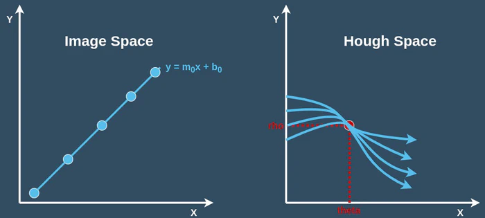
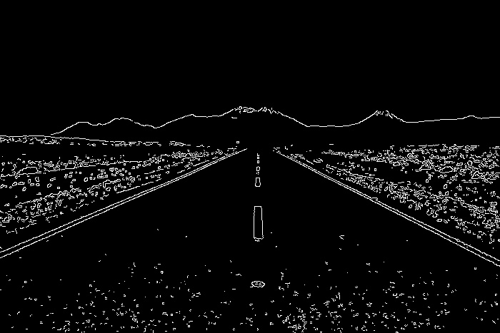

# OpenCV - Understanding Hough Transform Using C++

Before we can apply the Hough transform to images, we must first learn what a Hough space is, which we shall do through an example.

## Parameter Space

When working with photos, we can consider the image to be a 2d matrix with x and y coordinates, with a line defined as `y = mx + b`.

But in Hough Space,instead of representing that identical line as `m` vs `b`, I can express it as `m-b`, which means that the characterisation of a line in image space will be a single point at `m-b` in Hough space.

However, we have a problem: we can't describe a vertical line with `y = mx + b` because the slope is infinite. As a result, we require a more efficient method of parametrization, polar coordinates (rho and theta).

## Hough Space



- **rho**: describes the distance between the origin and the line.
- **theta**: specifies the angle between horizontal and vertical.

What occurs when we take numerous points around a line and change into our Hough space is an essential insight.

**A single dot in image space corresponds to a curve in Hough space, with the exception that points within a line in image space are represented by several curves with a single touchpoint.**

Finding the spots where a set of curves intersects will be our goal.

## What is Hough Transform ?

In an image, the Hough transform is a feature extraction method for detecting simple objects like circles and lines.

A "simple" shape is one that has only a few parameters to represent it.
A line, for example, can be represented by two parameters (slope and intercept), while a circle can be represented by three parameters (centre coordinates and radius) (x, y, r).
When it comes to finding such shapes in a picture, the Hough transform excels.

The Hough transform's key advantage is that it is unaffected by occlusion.

Let's look at an example of how the Hough transform works.

## How Does Hough Transform Works ?

A line in image space can be described with two variables, as you may know.
Consider the following scenario:

1. Parameters in the Cartesian coordinate system: (m,b).

2. Parameters in the Polar coordinate system: (r,θ)


We shall express lines in the Polar system for Hough Transforms. Hence, a line equation can be represented as:

`r=xcosθ+ysinθ`

1. In general, we can define the family of lines that passes through each point (x0,y0) as follows:

`r0=x0⋅cosθ+y0⋅sinθ`

Each pair (r,θ) denotes one of the lines that passes by (x0,y0).

2. A sinusoid is obtained by plotting the family of lines that passes through a given (x0,y0).

For instance, for x0=8 and y0=6 we get the following graphic (on a plane θ - r):


Only points with r>0 and 0<θ<2π. are considered.

3. We may repeat the procedure above for all of the points in an image. When the curves of two different points intersect in the plane - r, both points are part of the same line.

For example, if we continue with the previous example and plot two more points: x1=4, y1=9 and x2=12, y2=3, we get:


The three plots come together at a single location (0.925,9.6); these coordinates are the parameters (,r), or the line that connects (x0,y0), (x1,y1), and (x2,y2).

4. What does all of the foregoing imply? It means that the number of intersections between curves can be used to detect a line in general. The more curves that connect, the more points there are on the line represented by that intersection. In general, we can set a minimum number of intersections required to detect a line as a threshold.

5. The Hough Line Transform accomplishes this. It maintains note of where the curves of each point in the image cross. If the number of intersections exceeds a certain threshold, it is declared as a line with the intersection point's parameters (θ,r).

## Hough Transform Using OpenCV and C++

1. First we read the image and convert it into grey scale form.

```cpp
...
	//Reading Image
	if(argc <= 1) {
		std::cerr << "!!! ERROR !!!\n";
		std::cerr << "Please provide Image Path\n";
		std::cerr << "<program> <input_image>\n";
		return -1;
	}

	cv::Mat src = cv::imread(argv[1]);
	cv::Mat img(src);
	cv::cvtColor(img,img,cv::COLOR_BGR2GRAY);
	showImg(img,"input Image");

	if(img.empty()){
		std::cerr << "!!! ERROR !!!\n";
		std::cerr << "Error while Opening the Image\n";
		return -1;
	}
...

```


2. After Converting into gray scale we reduced the noise from the image using any blur function which in provided in OpenCV and then we apply Canny Edge Detection algorithm to find border in the image

```cpp
....

	auto cannyEdgeDetection = [](cv::Mat& input, cv::Mat& output,double minThresh,double maxThresh) {

		cv::blur(input,output,cv::Size(5,5));
		cv::Canny(input,output,minThresh,maxThresh);
	};


....
```


3. After getting border from the image we apply **Hough Transform**.

_Note: In the example below I have used **Probabilistic Hough Line Transform** Function which is a more efficient implementation of Hough Line transform then Standar Hough Line Transform_.

`houghLinesP` function takes the following argument:

- **edges**: Output of the edge detector.
- **lines**: A vector to store the coordinates of the start and end of the line.
- **rho**: The resolution parameter \rho in pixels.
- **theta**: The resolution of the parameter \theta in radians.
- **threshold**: The minimum number of intersecting points to detect a line.

```cpp
....

std::vector<cv::Vec4i>* houghLineP(cv::Mat& canny_img,double thresh){

	auto linesP = new  std::vector<cv::Vec4i>;
	cv::HoughLinesP(canny_img,*linesP,1,CV_PI/180,thresh,10,10);
	return linesP;
}

....

```

## Line Detection Output



### References

- [OpenCV Computer Vision Application Programming Cookbook](https://amzn.to/3L9k6TD)
- [OpenCV 4 Computer Vision Application Programming Cookbook: Build complex computer vision applications with OpenCV and C++, 4th Edition](https://amzn.to/3D8zOeL)
- [Modern C++ Programming Cookbook](https://amzn.to/3iowMJM)
- [live code stream](https://livecodestream.dev/post/hough-transformation/)
- [OpenCV Docs](https://docs.opencv.org/3.4/d9/db0/tutorial_hough_lines.html)

## Code

```cpp
#include <iostream>
#include "opencv2/imgcodecs.hpp"
#include "opencv2/highgui.hpp"
#include "opencv2/imgproc.hpp"
#include <algorithm>

std::vector<cv::Vec4i>* houghLineP(cv::Mat& canny_img,double thresh){

	auto linesP = new  std::vector<cv::Vec4i>;
	cv::HoughLinesP(canny_img,*linesP,1,CV_PI/180,thresh,10,10);
	return linesP;
}

int main(int argc,char** argv) {

	// Defining Functions
	auto showImg = [](cv::Mat& img,const std::string& win_name){
		cv::imshow(win_name,img);
	};

	auto cannyEdgeDetection = [](cv::Mat& input, cv::Mat& output,
															double minThresh,double maxThresh) {

		cv::blur(input,output,cv::Size(5,5));
		cv::Canny(input,output,minThresh,maxThresh);
	};


	//Reading Image
	if(argc <= 1) {
		std::cerr << "!!! ERROR !!!\n";
		std::cerr << "Please provide Image Path\n";
		std::cerr << "<program> <input_image>\n";
		return -1;
	}

	cv::Mat src = cv::imread(argv[1]);
	cv::Mat img(src);
	cv::cvtColor(img,img,cv::COLOR_BGR2GRAY);
	showImg(img,"input Image");

	if(img.empty()){
		std::cerr << "!!! ERROR !!!\n";
		std::cerr << "Error while Opening the Image\n";
		return -1;
	}

	// Finding Line Using Hough Detection
	cv::Mat dst;

	cannyEdgeDetection(img,dst,180,250); // Tweak Argument as per need
	showImg(dst,"Canny Ouput");

	auto *phtld = houghLineP(dst,120); //Probablistic Hough Transform

  cv::Scalar blue(255,0,0); //for Probablistic Hough Transform

	std::for_each(phtld->cbegin(),phtld->cend(),[&src,&blue](const auto &line){
			// Drawing Line
			auto l = line;
			cv::line(src,cv::Point(l[0],l[1]),cv::Point(l[2],l[3]),blue,2,cv::LINE_AA);
			});

	showImg(src,"Hough Lines");
	cv::waitKey();


	// Cleaning
	delete phtld;
	return 0;
}

```
