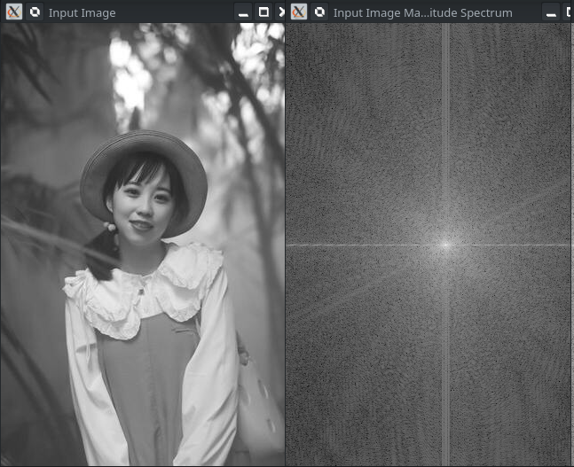
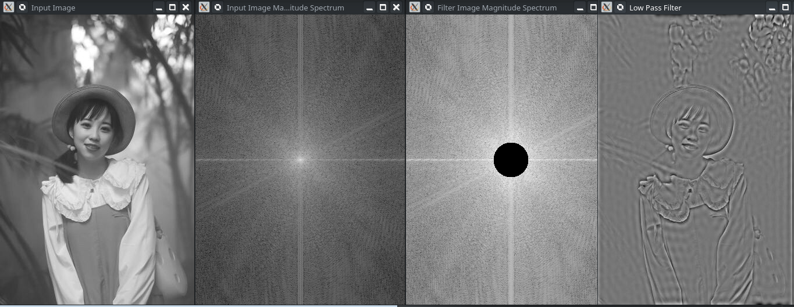
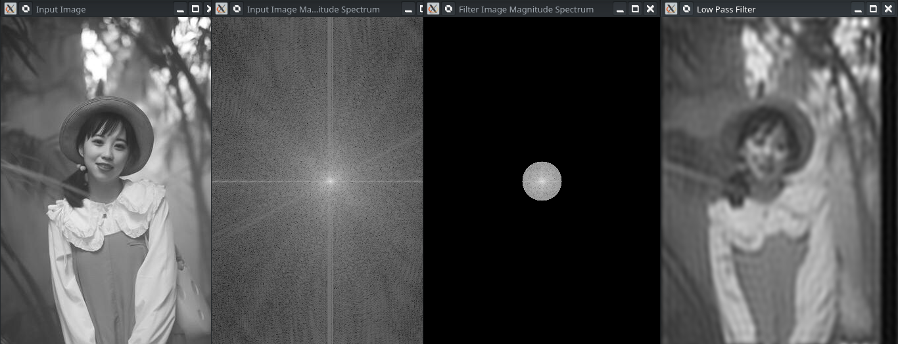

# OpenCV - Understanding Low Pass And High Pass Filter using C++

In the past post, we took in a few basic insights regarding the Fourier change and why it merits learning. We additionally told the best way to change a picture into its recurrence area. I suggest you read about it [here](https://anothertechs.com/programming/cpp/opencv-fourier-transform-cpp/) in the event that you haven't. In this part, we would zero in on sifting in the recurrence space. We would see the impacts of applying a low and high pass filter

## 1. Low Pass Filter

Let's start with an example by looking at the spectrum of a real image on the right side of the page.



You can see this incredibly white dazzling shiny item in the middle of the magnitude spectrum above. You can see that the centre has a lot of power. With that in mind, you might as well pay attention as you go away from the bright shiny thing and toward the edges. It begins to fade, or to put it another way, it darkens.

What if we wanted to get rid of all low-frequency content? It's where the white dot is on the power spectrum. So, what should we do? First, we must create a power spectrum from the image. Second, after that, we must delete everything associated with the lower frequency. To put it another way, zero out all the numbers surrounding the brighter section of the magnitude spectrum. There would, without a doubt, be no high-frequency components.

We'll recreate the image for the sake of illustration, which will entail using the inverse Discrete Fourier transform. As a result, the image is reduced to a series of unsightly lines. Ringing is a common term for this. We've included some code examples below to show you how to do it yourself.

```cpp
#include <opencv2/highgui.hpp>
#include <opencv2/imgcodecs.hpp>
#include <opencv2/imgproc.hpp>
#include <iostream>


void showImg(cv::Mat& img,const std::string& name)
{
	cv::namedWindow(name.c_str());
	cv::imshow(name.c_str(),img);
}

void expand_img_to_optimal(cv::Mat& padded,cv::Mat& img);
cv::Mat fourier_transform(cv::Mat& );
void lowpassFilter( cv::Mat& dft_filter,int distance);
void crop_and_rearrange(cv::Mat& magI);
void showMagnitudeSpectrum(cv::Mat&,const std::string& );


int main(int argc,char** argv)
{

	cv::Mat input_img,fourier_img;
	input_img = cv::imread(argv[1],cv::IMREAD_GRAYSCALE);
	if(input_img.empty()) {
		fprintf(stderr,"Could not Open image\n\n");
		return -1;
	}

	showImg(input_img,"Input Image");

	cv::Mat complexI = fourier_transform(input_img);
	showMagnitudeSpectrum(complexI,"Input Image Magnitude Spectrum");

	cv::Mat filter = complexI.clone();
	lowpassFilter(filter,30); //Our Low Pass Filter of Radius 30

	crop_and_rearrange(complexI);
	cv::mulSpectrums(complexI,filter,complexI,0); //Multiplying original image with filter image to get final image
	crop_and_rearrange(complexI);

	showMagnitudeSpectrum(complexI,"Filter Image Magnitude Spectrum");

	cv::Mat planes[2],imgOutput;
	cv::idft(complexI,complexI); //Reversing dft process to get our final image

	cv::split(complexI,planes);
	cv::normalize(planes[0], imgOutput, 0, 1, cv::NORM_MINMAX);


	showImg(imgOutput,"Low Pass Filter");
	cv::waitKey();
	cv::destroyAllWindows();
	return 0;
}

cv::Mat fourier_transform(cv::Mat& img) {
	cv::Mat padded;
	expand_img_to_optimal(padded,img);

	// Since the result of Fourier Transformation is in complex form we make two planes to hold  real and imaginary value
	cv::Mat planes[] = {cv::Mat_<float>(padded),cv::Mat::zeros(padded.size(),CV_32F)};
	cv::Mat complexI;
	cv::merge(planes,2,complexI);

	cv::dft(complexI,complexI,cv::DFT_COMPLEX_OUTPUT); // Fourier Transform

	return complexI;
}

void expand_img_to_optimal(cv::Mat& padded,cv::Mat& img) {
	int row = cv::getOptimalDFTSize(img.rows);
	int col = cv::getOptimalDFTSize(img.cols);
	cv::copyMakeBorder(img,padded,0,row - img.rows,0,col - img.cols,cv::BORDER_CONSTANT,cv::Scalar::all(0));
}

void lowpassFilter( cv::Mat& dft_filter,int distance)
{
	cv::Mat tmp = cv::Mat(dft_filter.rows,dft_filter.cols,CV_32F);
	cv::Point center = cv::Point(dft_filter.rows/2,dft_filter.cols/2);
	double radius;
	for(int i = 0; i < dft_filter.rows;++i) {
		for(int j=0; j < dft_filter.cols;++j) {
			radius = (double)(sqrt(pow((i-center.x),2.0)+pow((j-center.y),2.0)));
			if(radius < distance)
				tmp.at<float>(i,j) = 0.0; //if point is in the radius make it zero
			else
				tmp.at<float>(i,j) = 1.0;// Else make it one
		}
	}
	cv::Mat toMerge[] = {tmp,tmp};
	cv::merge(toMerge,2,dft_filter); //since we are dealing with Two Channel image which is greyscale
}

void crop_and_rearrange(cv::Mat& magI)
{
	  magI = magI(cv::Rect(0, 0, magI.cols & -2, magI.rows & -2));
    int cx = magI.cols/2;
    int cy = magI.rows/2;
		cv::Mat q0(magI, cv::Rect(0, 0, cx, cy));
		cv::Mat q1(magI, cv::Rect(cx, 0, cx, cy));  // Top-Right
    cv::Mat q2(magI, cv::Rect(0, cy, cx, cy));  // Bottom-Left
    cv::Mat q3(magI, cv::Rect(cx, cy, cx, cy)); // Bottom-Right
    cv::Mat tmp;                           // swap quadrants (Top-Left with Bottom-Right)
    q0.copyTo(tmp);
    q3.copyTo(q0);
    tmp.copyTo(q3);
    q1.copyTo(tmp);                    // swap quadrant (Top-Right with Bottom-Left)
    q2.copyTo(q1);
    tmp.copyTo(q2);

}

void showMagnitudeSpectrum(cv::Mat& complexI,const std::string& name)
{
	cv::Mat p[2];

	cv::split(complexI,p);
	cv::magnitude(p[0],p[1],p[0]);
	cv::Mat magI = p[0];

	magI += cv::Scalar::all(1);
	cv::log(magI,magI);

	crop_and_rearrange(magI);

	cv::normalize(magI, magI, 0, 1, cv::NORM_MINMAX);
	showImg(magI,name.c_str());

}


```



## 2. High Pass Filter

We'd like to do something a little different to liven things up a little.
We're going to do the polar opposite of keeping low-frequency stuff. This means retaining high-frequency content while eliminating all low-frequency content. In other words, zero out the white dot in the centre of the magnitude spectrum while leaving the rest alone.

What we're going to see is a better question now. Before we provide the solution. Take 5 seconds to think about what our outcome will be. Are you finished? Okay. We are left with an edge image after removing the centre region and reconstructing it. If you think about it, the high-frequency components show us where the image's edges are. Also included is the code that was used to create these images.

```cpp
#include <opencv2/highgui.hpp>
#include <opencv2/imgcodecs.hpp>
#include <opencv2/imgproc.hpp>
#include <iostream>


void showImg(cv::Mat& img,const std::string& name)
{
	cv::namedWindow(name.c_str());
	cv::imshow(name.c_str(),img);
}

void expand_img_to_optimal(cv::Mat& padded,cv::Mat& img);
cv::Mat fourier_transform(cv::Mat& );
void lowpassFilter( cv::Mat& dft_filter,int distance);
void crop_and_rearrange(cv::Mat& magI);
void showMagnitudeSpectrum(cv::Mat&,const std::string& );


int main(int argc,char** argv)
{

	cv::Mat input_img,fourier_img;
	input_img = cv::imread(argv[1],cv::IMREAD_GRAYSCALE);
	if(input_img.empty()) {
		fprintf(stderr,"Could not Open image\n\n");
		return -1;
	}

	showImg(input_img,"Input Image");

	cv::Mat complexI = fourier_transform(input_img);
	showMagnitudeSpectrum(complexI,"Input Image Magnitude Spectrum");

	cv::Mat filter = complexI.clone();
	lowpassFilter(filter,30); //Our Low Pass Filter of Radius 30

	crop_and_rearrange(complexI);
	cv::mulSpectrums(complexI,filter,complexI,0); //Multiplying original image with filter image to get final image
	crop_and_rearrange(complexI);

	showMagnitudeSpectrum(complexI,"Filter Image Magnitude Spectrum");

	cv::Mat planes[2],imgOutput;
	cv::idft(complexI,complexI); //Reversing dft process to get our final image

	cv::split(complexI,planes);
	cv::normalize(planes[0], imgOutput, 0, 1, cv::NORM_MINMAX);


	showImg(imgOutput,"Low Pass Filter");
	cv::waitKey();
	cv::destroyAllWindows();
	return 0;
}

cv::Mat fourier_transform(cv::Mat& img) {
	cv::Mat padded;
	expand_img_to_optimal(padded,img);

	// Since the result of Fourier Transformation is in complex form we make two planes to hold  real and imaginary value
	cv::Mat planes[] = {cv::Mat_<float>(padded),cv::Mat::zeros(padded.size(),CV_32F)};
	cv::Mat complexI;
	cv::merge(planes,2,complexI);

	cv::dft(complexI,complexI,cv::DFT_COMPLEX_OUTPUT); // Fourier Transform

	return complexI;
}

void expand_img_to_optimal(cv::Mat& padded,cv::Mat& img) {
	int row = cv::getOptimalDFTSize(img.rows);
	int col = cv::getOptimalDFTSize(img.cols);
	cv::copyMakeBorder(img,padded,0,row - img.rows,0,col - img.cols,cv::BORDER_CONSTANT,cv::Scalar::all(0));
}

void lowpassFilter( cv::Mat& dft_filter,int distance)
{
	cv::Mat tmp = cv::Mat(dft_filter.rows,dft_filter.cols,CV_32F);
	cv::Point center = cv::Point(dft_filter.rows/2,dft_filter.cols/2);
	double radius;
	for(int i = 0; i < dft_filter.rows;++i) {
		for(int j=0; j < dft_filter.cols;++j) {
			radius = (double)(sqrt(pow((i-center.x),2.0)+pow((j-center.y),2.0)));
			if(radius > distance)
				tmp.at<float>(i,j) = 0.0; //if point is out of the radius make it zero
			else
				tmp.at<float>(i,j) = 1.0;// Else make it one
		}
	}
	cv::Mat toMerge[] = {tmp,tmp};
	cv::merge(toMerge,2,dft_filter); //since we are dealing with Two Channel image which is greyscale
}

void crop_and_rearrange(cv::Mat& magI)
{
	  magI = magI(cv::Rect(0, 0, magI.cols & -2, magI.rows & -2));
    int cx = magI.cols/2;
    int cy = magI.rows/2;
		cv::Mat q0(magI, cv::Rect(0, 0, cx, cy));
		cv::Mat q1(magI, cv::Rect(cx, 0, cx, cy));  // Top-Right
    cv::Mat q2(magI, cv::Rect(0, cy, cx, cy));  // Bottom-Left
    cv::Mat q3(magI, cv::Rect(cx, cy, cx, cy)); // Bottom-Right
    cv::Mat tmp;                           // swap quadrants (Top-Left with Bottom-Right)
    q0.copyTo(tmp);
    q3.copyTo(q0);
    tmp.copyTo(q3);
    q1.copyTo(tmp);                    // swap quadrant (Top-Right with Bottom-Left)
    q2.copyTo(q1);
    tmp.copyTo(q2);

}

void showMagnitudeSpectrum(cv::Mat& complexI,const std::string& name)
{
	cv::Mat p[2];

	cv::split(complexI,p);
	cv::magnitude(p[0],p[1],p[0]);
	cv::Mat magI = p[0];

	magI += cv::Scalar::all(1);
	cv::log(magI,magI);

	crop_and_rearrange(magI);

	cv::normalize(magI, magI, 0, 1, cv::NORM_MINMAX);
	showImg(magI,name.c_str());

}
```



### References

- [OpenCV Computer Vision Application Programming Cookbook](https://amzn.to/3L9k6TD)
- [OpenCV 4 Computer Vision Application Programming Cookbook: Build complex computer vision applications with OpenCV and C++, 4th Edition](https://amzn.to/3D8zOeL)
- [Modern C++ Programming Cookbook](https://amzn.to/3iowMJM)
