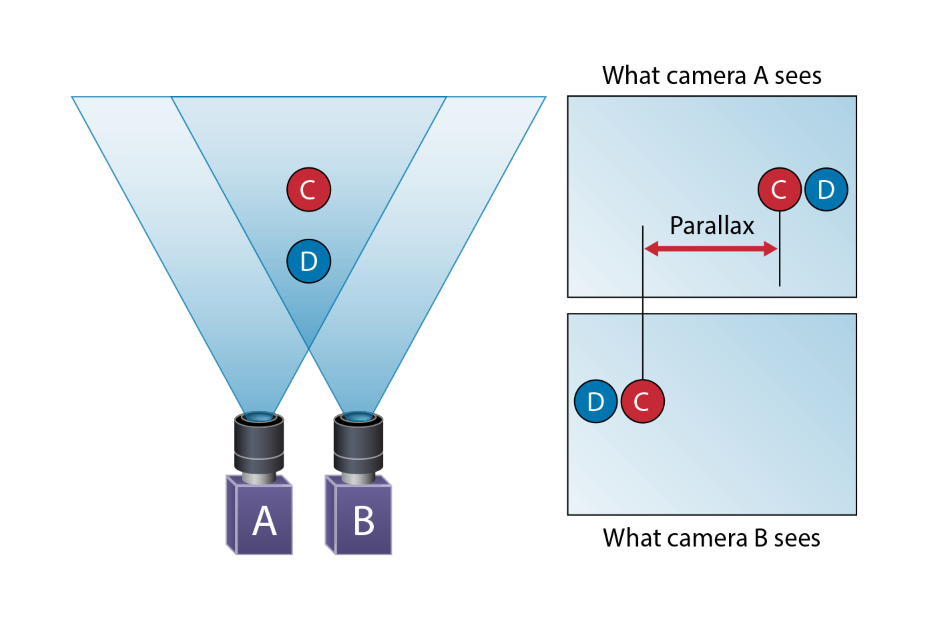
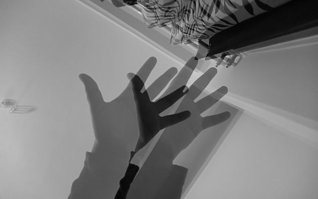
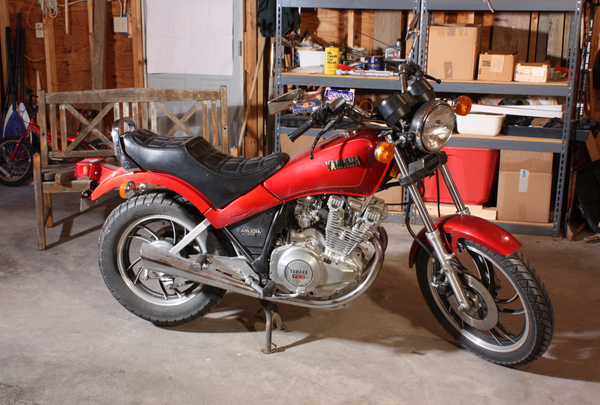
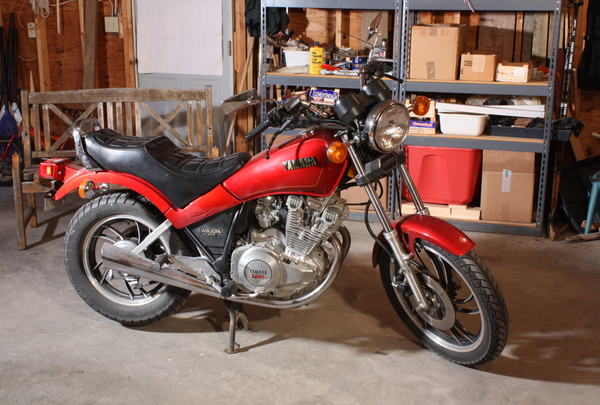
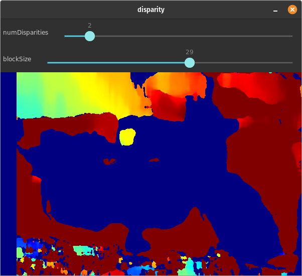

# OpenCV - Stereo Vision and Depth Estimation using C++

Have you ever wondered how robots travel by themselves, grip various things, or avoid collisions while moving? For such purposes, stereo vision-based depth estimate is a common method. In this piece, we'll look at traditional stereo matching and depth perception approaches.

## What is Stereo Vision ?

Two cameras are positioned parallel to each other in the stereo vision technique. The cameras should have the same focal length for the application, with their X-axis intersecting and aligning with the baseline.



## Why Do we need Stereo Vision ?

Try this entertaining experiment: Close one eye and hold your hands in front of you, about a foot apart, with your index fingers extended. Now try to touch the tips of your index fingers by moving your hands closer together. Isn't it harder than it appears? That is the value of in-depth knowledge.

By default, cameras capture images in such a way that depth information is lost. This is due to the fact that a camera converts a 3D scene into a 2D image.

However, because to the geometry of the scene and the camera, if you capture two photographs of the same scene with slightly different camera locations, you'll receive two images with a relationship between them. We can use this geometry to figure out the scene's depth relationship with the camera. Look up Epipolar geometry for further details on how to do this.

This setup of two pictures slightly shifted is the same as having two cameras placed slightly apart and each camera giving us one of the two images. This is what we call stereo vision and its primary application is being able to estimate depth of a scene.

Our eyes work in the same way, with each eye acting as a camera. Our brain is amazing enough to apply Epipolar geometry directly to these two slightly shifted pictures, allowing us to detect depth of objects in our perspective and so effortlessly touch our index fingers.

## What is Depth Estimation ?

Depth estimate is an important step in inferring scene geometry from two-dimensional photographs. Given only a single RGB image as input, the purpose of depth estimation is to forecast the depth value of each pixel or infer depth information. This example will demonstrate how to use a convnet and simple loss functions to build a depth estimation model.

**In Simple terms Depth Estimation is the process of figuring out the distance of any object from the camera or distance of one object from other that is weather the object is nearer or far from camera or from each other**

## Calculating Depth from stereo image or camera


The above diagram contains equivalent triangles. Writing their equivalent equations will yield us following result:

` disparity =x−x′=Bf/Z`

The distance between points in the image plane corresponding to scene points 3D and their camera centre is given by x and x′. B is the known distance between two cameras, and f is the focal length of the camera (already known). In other words, the depth of a point in a scene is inversely proportional to the distance between matching picture points and their camera centres, according to the preceding equation. We can calculate the depth of all pixels in an image using this information.

## What is Disparity ?



If you examine the photos obtained by the mono cameras closely, you will notice that they are not identical. By integrating the two photos into a single image with 50 percent contribution from each image, the difference is easily visible. The placements of the corresponding points are different.
Disparity is the term for this disparity.

**Depth is inversely proportional to the disparity.**

Using template matching or similar methods, you may find the comparable locations in the second image. Millions of pixels make up an image obtained by high-resolution cameras. As a result, if we do it for the complete picture, it will be quite time consuming. Fortunately, our cameras have been calibrated, and the photos have been corrected. As a result, we simply need to look for the horizontal line.

## Calculating Depth Estimation of Stereo Image using OpenCV and C++

### 1. Reading Stereo Image

Since Stereo images consists of two image we will read both image left and right respectively:

```cpp
...

	if(argc < 2) {
		std::cerr << "!!! ERROR !!! \n";
		std::cerr << "<program> <img1> <img1>\n";
	}

	imgL = cv::imread(argv[1]);
	imgR = cv::imread(argv[2]);

...

```





### 2. Calculating Disparity of two images

- Two calculate disparity of image we will using `StereoSGBM` class provided in opencv:

      ...
      cv::Ptr<cv::StereoSGBM> stereo = cv::StereoSGBM::create();
      ...

- We will also need two parameter used two compute disparity of image:

  1. **Number of disparity (numDisparities)**: Sets the range of disparity values to be searched. The overall range is from minimum disparity value to minimum disparity value + number of disparities. The following pair of images shows the disparity map calculated for two different disparity ranges. It is clearly visible that increasing the number of disparities increases the accuracy of the disparity map.

  ```cpp
  	stereo->setNumDisparities(numDisparity * 16);
  ```

  2. **Block size(blockSize)**: The size of the sliding window used for block matching in a corrected stereo picture pair to find corresponding pixels. A larger window size is indicated by a higher value. Increasing this value results in more smooth disparity maps, as shown in the GIF below.

     ```cpp
     	stereo->setBlockSize(blockSize);
     ```

- Computing disparity of two images:

  ```cpp
  stereo->compute(imgL,imgR,disp);
  disp.convertTo(disparity,CV_8U); //converting to 8bit/pixel i.e pixel can have value from 0-255

  ```

## Output



In the above output blue color represent the object in nearer and red color represent the object is far.

## References

- [OpenCV Computer Vision Application Programming Cookbook](https://amzn.to/3L9k6TD)
- [OpenCV 4 Computer Vision Application Programming Cookbook: Build complex computer vision applications with OpenCV and C++, 4th Edition](https://amzn.to/3D8zOeL)
- [Modern C++ Programming Cookbook](https://amzn.to/3iowMJM)
- [OpenCV Docs](https://opencv24-python-tutorials.readthedocs.io/en/latest/py_tutorials/py_calib3d/py_depthmap/py_depthmap.html)

## Code

```cpp
#include <iostream>
#include "opencv2/imgproc.hpp"
#include "opencv2/highgui.hpp"
#include <opencv2/calib3d.hpp>

int numDisparity = 8;
int blockSize = 5;
cv::Ptr<cv::StereoSGBM> stereo = cv::StereoSGBM::create();
cv::Mat disp,disparity; //Disparity
cv::Mat imgL;
cv::Mat imgR;
std::string disparity_window = "disparity";

static void trackbar1(int , void* )
{
	stereo->setNumDisparities(numDisparity * 16);
	numDisparity = numDisparity * 16;
	stereo->compute(imgL,imgR,disp);
	disp.convertTo(disparity,CV_8U);
	cv::applyColorMap(disparity,disparity,cv::COLORMAP_JET);
	cv::imshow(disparity_window.c_str(),disparity);
}

static void trackbar2(int , void* )
{
	stereo->setBlockSize(blockSize);
  blockSize = blockSize;
	stereo->compute(imgL,imgR,disp);
	disp.convertTo(disparity,CV_8U);
	cv::applyColorMap(disparity,disparity,cv::COLORMAP_JET);

	cv::imshow(disparity_window.c_str(),disparity);
}


int main(int argc,char** argv) {


	if(argc < 2) {
		std::cerr << "!!! ERROR !!! \n";
		std::cerr << "<program> <img1> <img1>\n";
	}

	imgL = cv::imread(argv[1]);
	imgR = cv::imread(argv[2]);


	cv::namedWindow(disparity_window);

	cv::createTrackbar("numDisparities", disparity_window.c_str(), &numDisparity, 18, trackbar1);
	cv::createTrackbar("blockSize", disparity_window.c_str(), &blockSize, 50, trackbar2);


	cv::waitKey(0);
	return 0;

}

```
