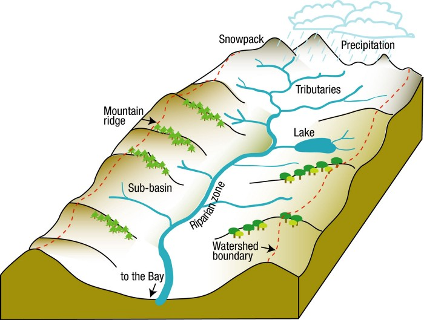
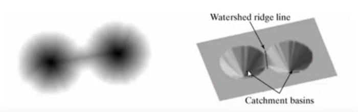
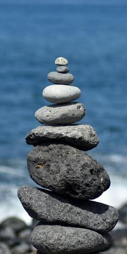
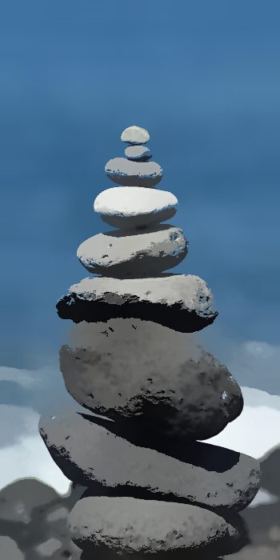
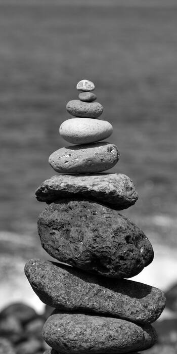
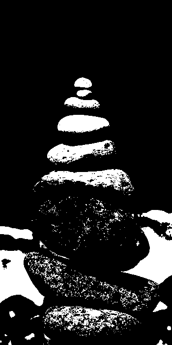
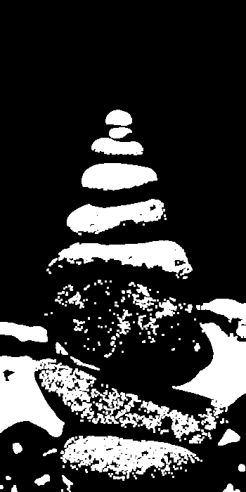
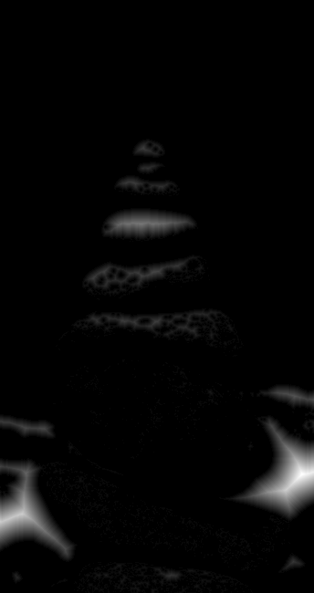
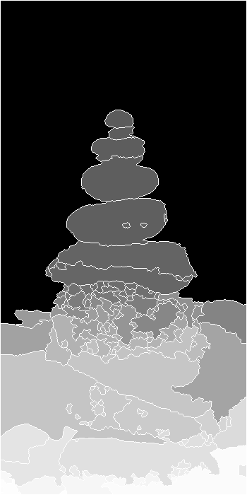
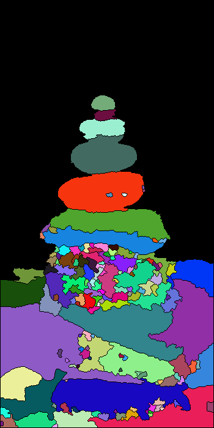

# OpenCV - Image Segmentation using Watershed algorithm C++

The watershed technique is a well-known segmentation algorithm that is particularly good for extracting touching or overlapping items in photographs.

## Marker-based Watershed algorithm

We must start with user-defined markers when using the watershed method.
These markers can be manually defined using point-and-click, or they can be defined automatically or heuristically using thresholding and/or morphological processes.



The watershed technique treats pixels in our input image as local elevation (called topography) based on these markers — the method "floods" valleys from the markers outwards until the valleys of various markers meet.
The markers must be set accurately in order to produce an accurate watershed segmentation.

We used an OpenCV marker-based watershed technique to designate which valley points should be merged and which should not. It is an interactive image segmentation rather than an automatic image segmentation.

## Theory

Any grayscale image can be regarded as a topographic surface, with peaks and hills denoting high intensity and valleys denoting low intensity. You begin by filling isolated valleys (local minima) with a variety of coloured water (labels). River from separate valleys, plainly of different colours, will start to blend as the water rises, depending on the neighbouring peaks (gradients). To avoid this, you construct barriers where water meets water. You keep filling the water and erecting obstacles until all of the peaks are submerged. The segmentation outcome is then determined by the obstacles you created. The watershed's "philosophy" is as follows. You may learn more about watershed on the CMM website, which includes animations.



However, due to noise or other anomalies in the image, this method produces an oversegmented result. As a result, OpenCV created a marker-based watershed method that allows you to select which valley points should be merged and which should not. It's a segmentation of an image that you may interact with. What we do is assign distinct labels to the objects we are familiar with. Label the zone that we are certain is the foreground or object with one colour (or intensity), the region that we are certain is the background or non-object with another colour, and the region that we are unsure about with 0.That's where we'll put our marker. After that, use the watershed algorithm. The bounds of objects will have a value of -1, and our marker will be updated with the labels we provided.

## Implementing Watershed Algorithm Using OpenCV and C++

### 1. Read Image

```cpp
	if(argc < 2)
	{
		std::cerr << "Error\n";
		std::cerr << "Provide Input Image:\n<program> <inputimage>\n";
		return -1;
	}
	cv::Mat original_img = cv::imread(argv[1]);

	if(original_img.empty())
	{
		std::cerr << "Error\n";
		std::cerr << "Cannot Read Image\n";
		return -1;
	}

```



### 2. Applying Filter to remove noise from the image

```cpp

	cv::Mat shifted;
	cv::pyrMeanShiftFiltering(original_img,shifted,21,51);
	showImg("Mean Shifted",shifted);

```



Mean shift blur is a type of image edge preservation filtering algorithm that is frequently used to eliminate noise before image watershed segmentation, which can considerably improve the watershed segmentation effect.

### 3. Converting the original image to grayscale and binary image

```cpp
	cv::Mat gray_img;
	cv::cvtColor(original_img,gray_img,cv::COLOR_BGR2GRAY);
	showImg("GrayIMg",gray_img);

	cv::Mat bin_img;
	cv::threshold(gray_img,bin_img,0,255,cv::THRESH_BINARY | cv::THRESH_OTSU);
	showImg("thres img",bin_img);

```





### 4. Finding Sure Background of Image

In this step we find the area in the image which is sure to us that it is image background.

```cpp
void getBackground(const cv::Mat& source,cv::Mat& dst) {


	cv::dilate(source,dst,cv::Mat::ones(3,3,CV_8U)); //Kernel 3x3
}

```



### 5. Finding Sure Foreground of Image

For finding foreground of an image we use distance transform algorithm

```cpp
void getForeground(const cv::Mat& source,cv::Mat& dst) {

	cv::distanceTransform(source,dst,cv::DIST_L2,3,CV_32F);
	cv::normalize(dst, dst, 0, 1, cv::NORM_MINMAX);
}
```



### 6. Finding Marker

Before applying watershed algorithm we need markers. For this, we will use `findContour()` function provided in opencv to find marker in the image.

```cpp

void findMarker(const cv::Mat& sureBg,cv::Mat& markers,
							std::vector<std::vector<cv::Point>>& contours)
{
	cv::findContours(sureBg,contours,cv::RETR_EXTERNAL,
															cv::CHAIN_APPROX_SIMPLE);

	// Draw the foreground markers
	for (size_t i = 0,size = contours.size(); i < size; i++)
			drawContours(markers, contours, static_cast<int>(i),
								cv::Scalar(static_cast<int>(i)+1), -1);
}

```

### 7. Applying Watershed algorithm

```cpp
	cv::watershed(original_img,markers);
	cv::Mat mark;
	markers.convertTo(mark, CV_8U);
	cv::bitwise_not(mark, mark); //Convert white to black and black to white
	showImg("MARKER",mark);
```



## References

- [OpenCV Computer Vision Application Programming Cookbook](https://amzn.to/3L9k6TD)
- [OpenCV 4 Computer Vision Application Programming Cookbook: Build complex computer vision applications with OpenCV and C++, 4th Edition](https://amzn.to/3D8zOeL)
- [Modern C++ Programming Cookbook](https://amzn.to/3iowMJM)

## Code

```cpp

#include <iostream>
#include "opencv2/imgcodecs.hpp"
#include "opencv2/highgui.hpp"
#include "opencv2/imgproc.hpp"
#include <vector>


void showImg(const std::string& windowName,const cv::Mat& img){
	cv::imshow(windowName,img);
}


void getBackground(const cv::Mat& source,cv::Mat& dst) {


	cv::dilate(source,dst,cv::Mat::ones(3,3,CV_8U)); //Kernel 3x3
} void getForeground(const cv::Mat& source,cv::Mat& dst) {

	cv::distanceTransform(source,dst,cv::DIST_L2,3,CV_32F);
	cv::normalize(dst, dst, 0, 1, cv::NORM_MINMAX);
}

void findMarker(const cv::Mat& sureBg,cv::Mat& markers,
							std::vector<std::vector<cv::Point>>& contours)
{
	cv::findContours(sureBg,contours,cv::RETR_EXTERNAL,
															cv::CHAIN_APPROX_SIMPLE);

	// Draw the foreground markers
	for (size_t i = 0,size = contours.size(); i < size; i++)
			drawContours(markers, contours, static_cast<int>(i),
								cv::Scalar(static_cast<int>(i)+1), -1);
}


void getRandomColor(std::vector<cv::Vec3b>& colors,size_t size)
{
	for (int i = 0; i < size ; ++i)
	{
			int b = cv::theRNG().uniform(0, 256);
			int g = cv::theRNG().uniform(0, 256);
			int r = cv::theRNG().uniform(0, 256);
			colors.emplace_back(cv::Vec3b((uchar)b, (uchar)g, (uchar)r));
	}
}


int main (int argc,char** argv) {
	if(argc < 2)
	{
		std::cerr << "Error\n";
		std::cerr << "Provide Input Image:\n<program> <inputimage>\n";
		return -1;
	}
	cv::Mat original_img = cv::imread(argv[1]);

	if(original_img.empty())
	{
		std::cerr << "Error\n";
		std::cerr << "Cannot Read Image\n";
		return -1;
	}

	cv::Mat shifted;
	cv::pyrMeanShiftFiltering(original_img,shifted,21,51);
	showImg("Mean Shifted",shifted);

	cv::Mat gray_img;
	cv::cvtColor(original_img,gray_img,cv::COLOR_BGR2GRAY);
	showImg("GrayIMg",gray_img);

	cv::Mat bin_img;
	cv::threshold(gray_img,bin_img,0,255,cv::THRESH_BINARY | cv::THRESH_OTSU);
	showImg("thres img",bin_img);

	cv::Mat sure_bg;
	getBackground(bin_img,sure_bg);
	showImg("Sure Background",sure_bg);

	cv::Mat sure_fg;
	getForeground(bin_img,sure_fg);
	showImg("Sure ForeGround",sure_fg);

	cv::Mat markers = cv::Mat::zeros(sure_bg.size(),CV_32S);
	std::vector<std::vector<cv::Point>> contours;
	findMarker(sure_bg,markers,contours);
	cv::circle(markers, cv::Point(5, 5), 3, cv::Scalar(255), -1); //Drawing Circle around the marker

	cv::watershed(original_img,markers);

	cv::Mat mark;
	markers.convertTo(mark, CV_8U);
	cv::bitwise_not(mark, mark); //Convert white to black and black to white
	showImg("MARKER",mark);


/* Highliting Markers in the image */

	std::vector<cv::Vec3b> colors;
	getRandomColor(colors,contours.size());

	// Create the result image
	cv::Mat dst = cv::Mat::zeros(markers.size(), CV_8UC3);
	// Fill labeled objects with random colors
	for (int i = 0; i < markers.rows; i++)
	{
			for (int j = 0; j < markers.cols; j++)
			{
					int index = markers.at<int>(i,j);
					if (index > 0 && index <= static_cast<int>(contours.size()))
							dst.at<cv::Vec3b>(i,j) = colors[index-1];
			}
	}

	showImg("Final Result",dst);

	cv::waitKey(0);
	return 0;
}
```


