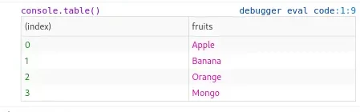

# Javascript Beginners Tips and Best Practices 2021

I'll discuss JavaScript tips, tactics, and best practises for beginners that I use and find valuable in this blog.

## Using Numeric Separator

When dealing with enormous numbers, this is one of the most commonly utilised operators.
When a separator (simply a \_) is used in a number, it looks nicer than when the number is not separated.

**For Example**:

Instead of this:

```javascript
let number = 12345678;
```

try this:

```javascript
let number = 12_345_678;
```

It also works with any other numeric base:

```javascript
const binary = 0b1010_0111;
const hex = 0x12_34_56_78;
```

## Delete and Splice

To remove an item from an array, use `splice` instead of `delete`.
The object attribute will be deleted, but the array will not be reindexed or its length updated. It appears to be undefined as a result of this.

### Delete

```javascript
> someArray = ["1", "2", "3", "4"];
[("1", "2", "3", "4"])]
> delete someArray[0];
true
> someArray[0];
undefined
```

It's worth noting that the property isn't set to undefined; rather, it's deleted from the array, making it appear undefined. When recording the array, the Chrome dev tools make this distinction evident by reporting empty.

### Splice

`Splice()` removes the element from the array, reindexes it, and modifies its length.

```javascript
> myArray = ["1", "2", "3", "4"]
["1", "2", "3", "4"]
> myArray.splice(0, 2)
["1", "2"]
> myArray
["3", "4"]
```

## Checking for many conditions

We can put all values in an array and use `indexOf()` or `includes()` to match multiple entries.

```javascript
if (value === 1 || value === "one" || value === 2 || value === "two") {
}
```

Instead use:

### indexOf()

```javascript
if ([1, "one", 2, "two"].indexOf(value) >= 0) {
}
```

### includes

```javascript
if ([1, "one", 2, "two"].includes(value)) {
}
```

## Bitwise operators ~~

Math.floor() can be replaced with the double NOT bitwise operator.

```javascript
const floor = Math.floor(12.8); //12
```

Instead use:

```javascript
const floor = ~~12.8; //12
```

## map and for loop

To cycle through an array's items, use the `map()` function method.

```javascript
var squares = [1, 2, 3, 4].map(function (item) {
  return item * item;
});

console.log(squares);
// Output => [1, 4, 9, 16]
```

Code that is less cluttered — When doing the same tasks, map almost always uses less code than for. It can occasionally be written effectively on one line, however for takes at least two or three lines, with braces included. Additionally, scope isolation, a reduction in the number of variables required, and reduced size all contribute to objectively clean code.

**Immutability** is a term used to describe the ability to change one's mind. The original array will not be changed in any way. This could be advantageous in situations where the original array is still required. Although for loops can be implemented without updating the old array, this involves additional code and requires us to update our new array as part of the loop operation. `map()`, on the other hand, keeps things cleaner because you only have to work in one scope to keep immutability.

## Rounding Numbers in javascript

The `toFixed()` method transforms a number to a specified amount of decimals after it has been rounded.

```javascript
var num = 12.345678;
num = num.toFixed(2);

console.log(num);
//Output => 12.34
```

## Inside a loop, try-catch should be avoided

Each time the catch clause is executed, the try-catch construct produces a new variable in the current scope, where the caught exception object is assigned to a variable.

```javascript
var items = ["foo", "bar"],
for (var i = 0, len = items.length; i < len; ++i) {
  try {
    // do something that throws an exception
  } catch (e) {
    // handle exception
  }
}

```

Instead Use:

```javascript
var items = ["foo", "bar"],
try {
  for (var i = 0, len = items.length; i < len; ++i){
    // do something that throws an exception
  }
} catch (e) {
  // handle exception
}
```

When an error occurs, the first one allows you to continue the loop, whereas the second leaves it.
**If an exception thrown by your code isn't severe enough to bring your programme to a halt, the first option is best.**

## console.table

To display javascript object in a tabular manner, use console.table:

```javascript
var items = [
  { fruits: "Apple" },
  { fruits: "Banana" },
  { fruits: "Orange" },
  { fruits: "Mango" },
];
console.table(items);
```



## Always use Semicolon

It is a good habit to use semi-colons to end lines.
You won't be notified if you forget it because the JavaScript parser will insert it in most circumstances, but depending on Automatic Semicolon Insertion (ASI) is not recommended.

[Google](https://google.github.io/styleguide/jsguide.html#formatting-semicolons-are-required), [Airbnb](https://github.com/airbnb/javascript#semicolons), and [jQuery](https://contribute.jquery.org/style-guide/js/#semicolons) all have Javascript style guides that incorporate this.

## Don't forget "var" in your code

Always double-check that you're not assigning a value to an undeclared variable when assigning a variable's value for the first time.

When an undeclared variable is assigned, a global variable is created automatically.
Attempt to avoid using global variables.

Other programmes can readily overwrite global variables.
For example, if two different components of an application establish global variables with the same name but different purposes, it can lead to unexpected problems, and debugging such a situation will be a nightmare.

In general, you should aim to scope your code so that it uses as little global scope as feasible. The more global variables you utilise in your script, the less likely you are to be able to use it in conjunction with other scripts.

Variables in a function should normally be local so that they disappear when the function is exited.
