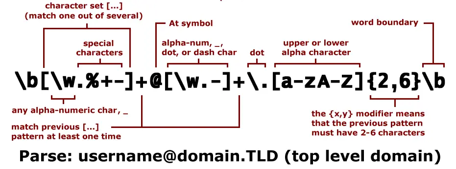

# Javascript Regex Cheatsheet

**A Regular Expression (RegEx) is a string of characters that defines a search pattern.** Regex can save you hundreds of lines of code and can be used with Javascript or any programming language (and even CLI tools)

## Basic of Regular Expression or Regex

In a RegEx, you always start and end the string with "/".
It is your responsibility to write the code in between the slashes."/apple/" RegEx is the easiest way to match the term "apple". Due to RegEx's case-sensitive nature, this will not match "aPpLe" or "Apple".



A search for apple using the "/apple/i" keyword will match the words "apple" and "aPpLe". Use "/apple|nut/" RegEx to match both "apple" and "nut."

Isn't it simple, eh?

## Regex in Javascript

In this lesson, we'll learn how to use RegEx in JS.

- `str.match(regex)`: Returns an array of matches. It turns out that there's a catch here. As an example, try saying `"apple apple".match(/apple/)` In the case of a match(/apple/), you would expect to get ["apple" and "apple"] but simple ['apple'] is returned. Add g flag to receive a full array with multiple matches.

* `regex.test(str)`: This method returns either `true` if the string is matched or `false` if not.

```javascript
let regex = /javascript|programming/i;
const str = "javascript is awesome programming language";
regex.test(str); // true

str.match(regex); // ["javascript", index: 0, input: "javascript is awesome programming language"]

regex = /javascript|programming/gi;

str.match(regex); // ["javascript", "programming"]
```

## Wildcard Period in Regex

Let's use the word 'hug' (`/hug/`) as an example of how we learned to statically match a word. But what if we want to match 'huh', 'hug,' and 'hum' all at once? It's the wildcard round! That is the correct response. `/hu./` This will match all three-letter long words that begin with the letter 'hu.'

## Matching string which starts or ends with particular character or word or line using Regex

### To find a character or word at the beginning of a string use `^`.

```javascript
let regex = /^123/;

regex.test("__123_123_"); // false - 123 is not exactly at the beginning!
regex.test("123___123___"); // true
```

### To search for a character or word at the end of string use `$` like so

```javascript
regex = /123$/;

regex.test("__123__123_"); // false - 123 has to be at the end

regex.test("__123"); // true
```

## Matching character which occur one or more than one time

We can use `+` operator to match the occurance of a string one or more the one time

```javascript
// With +
let regex = /1+/g;
"123".match(regex); //["1"]
"1123".match(regex); //["11"]
"11213".match(regex); //["11", "1"]
"234".match(regex); //null

//without +
regex = /a/g;
"abc".match(regex); //["1"]
"aabc".match(regex); //["1","1"]
"aabac".match(regex); //["1","1", "1"]
"bbc".match(regex); //null
```

## Matching character which occur zero or more

We can use `*` operator to match the occurance of a string zero or more .

```javascript
let str = "111";
str.match(/1*/g); // ["111", ""]

str.match(/1/g); // ["1", "1", "1"]
```

## Optional Character

The `?` operator makes a character or string optinal while mathcing regex pattern.

```javascript
let regex = /1234?5/; // makes 'u' capital

let american = "1235";
let british = "12345";

regex.test("1235"); // true
regex.test("12345678"); // true
regex.test("12365"); // false
```

## Matching character at certain limit in Regex

What if you wish to match a set of characters that repeats X times, such as a set of 5 letters that spells out "a"?
Let's get this party started, `a{5}`
This would only match 'aaaaa', not 'aa' or "aaaaaaaaaa".

```javascript
let str = "ama baalo maaaaamal aaaaaa";
console.log(str.match(/a{5}/g));
//prints ["aaaaa". "aaaaa"]

//to match 'm' letter followed by 5 x 'a'
console.log(str.match(/ma{5}/));
// prints ["maaaaa", indes: 10, ...]
//which means we have a match at index 10
```

You learned how to match a specific amount of repeating letters, such as `a{5}` matching "aaah."
But what if you want to match from one to three recurring characters rather than exactly five?
Here's `a{1,3}`: it matches "a," "aa," and "aaa," but not "aaaa."

## Posative and Negative Lookahead in Regex

This is one of the more esoteric aspects of regex. But let's try to understand:

- `x(?=y)` - This expression will match all the occurence of "x" that if followed by "y", without making "y" part of the match.

- `x(?!y)` - This expression will match all the occurence of "x" that is **NOT** followed by "y", without making "y" part of the match.

```javascript
let str = "worldheyworldhello";
str.match(/world(?=hello)/); //["world", index: 8, input: "worldheyworldhello"]

str.match(/world(?=hey)/); //["world", index: 0, input: "worldheyworldhello"]

str.match(/world(?!hey)/); //["world", index: 8, input: "worldheyworldhello"]
```

## Capture groups in Regex

We've all heard of the DRY (Don't Repeat Yourself) programming principle. Capture groups assist us in achieving this goal.The string to match is put between `/(string)/`

```javascript
/(123)\1\1/g;
//Here \1 will be evaluated as "123" so the regex expression will be:
// /123123123/g
```

You can alse use multiple capture group as:

```javascript
let regex = /(123+)(567+)\1\2/g;
//Will be same as /1233567712335677/g
```

## Comman shorthands

- For matching only alphbate you can use `/[a-z]/` or `/[A-Z]/`. Or you can also use `/D/`.

- For matching only numeric you can use `/[0-9]/`. Alternatively you can also use `/d/`.

- For matching a non-word character such as "!@#%^\*&" you can use `/\W/`.

- For matching alphanumeric character you can use `/\w/`.

## Flags in Regex

Along with `/regex/g` in Javascript we have six flags which are used as needed. They are:

- `/regex/i`: The match is now case-insensitive. There is no difference between the letters 'C' and 'c'.

- `/regex/s`: Allow wildcard period `.` to match with newline character `\n`.

- `/regex/u` : For Unicode Support.
- `/regex/y` : Enable full Unicode support.

- `/regex/m`: Multiline more; only affects the behavior of ^ and $
- `/regex/g`: Only the first match will be returned if this flag is not set.

### References

- https://dev.to/carter/regular-expressions-regex-in-javascript-4m9h

- http://www.vitoshacademy.com/vba-regex-in-excel/
