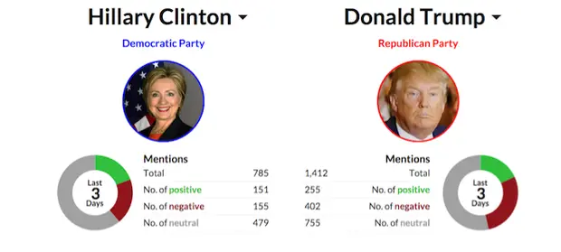

# Best Machine Learning Projects

As Artificial Intelligence (AI) continues to advance at a breakneck pace in 2021, mastering Machine Learning (ML) will become increasingly vital for all players in the field. This is because AI and machine learning are mutually beneficial. As a result, if you're a beginner, the best thing you can do is work on Machine Learning projects.

While textbooks and study resources will provide you with all of the information you want about Machine Learning, you will never truly understand the subject until you devote your time in real-world practical experiments — Machine Learning projects.

You will not only be able to test your skills and shortcomings while you work on machine learning project ideas, but you will also receive exposure that will help you further your career.

In this blog, you'll learn about 10 fun machine learning project ideas for novices and intermediate who want to gain some hands-on experience with the technology.

## 1. Cartoonify Image

Convert pictures into cartoons. Yes, CARTOONIFYING the pictures is the goal of this machine learning research.

As a result, you'll create a Python programme that uses machine learning tools to turn an image into a cartoon.

[Source Code](https://github.com/rohitkuk/Cartoonify)

## 2. Emojify - Creating you own emoji using Machine Learning

The goal of this machine learning research is to categorise and map human face emotions to emojis.

To identify face emotions, you'll use a convolutional neural network.

Then you'll associate those feelings with the appropriate emojis or avatars.

[Source Code](https://github.com/navyasuri/emojify)

## 3. Fake News Detection Project

This is one of the best machine learning project ideas for beginners, especially given how quickly bogus news is spreading. Fake news has an uncanny ability to spread like wildfire. And, with social media increasingly dominating our lives, it's more important than ever to tell the difference between false news and actual news events. Machine Learning can aid in this situation. Facebook already employs artificial intelligence to remove false and spammy content from consumers' news feeds.

This machine learning research seeks to use NLP (Natural Language Processing) techniques to identify false news and misleading articles that come from untrustworthy sources. You may also create a model that can distinguish between authentic and false news using the standard text classification technique. In the latter technique, you may collect datasets for both real and false news and use the Naive Bayes classifier to construct an ML model that can categorise a piece of news as fraudulent or legitimate based on the words and phrases it contains.

[Source Code](https://github.com/SushwanthReddy/Fake-News-Detection-using-Machine-Learning)

## 4. Music Genre Classification Project

The goal of this python machine learning project is to create a machine learning project that can automatically categorise various musical genres based on audio.

You must categorise these audio recordings based on their low-level frequency and temporal domain characteristics.

[Source Code](https://github.com/jsalbert/Music-Genre-Classification-with-Deep-Learning)

## 5. Bitcoin Price Prediction Project

The bitcoin price forecaster is a helpful tool.
The use of blockchain technology is growing, and there are a growing number of digital currencies.

This project will assist you in predicting the price of bitcoin based on historical data.

[Source Code](https://github.com/manthanthakker/BitcoinPrediction)

## 6. Sign Language Recognition Machine Learning Project

There has been a lot of study done to aid deaf and dumb individuals.

You construct a sign detector that detects sign language in this sign language recognition project.

This may be extremely useful in talking with others for the deaf and dumb.

[Source Code](https://github.com/harshbg/Sign-Language-Interpreter-using-Deep-Learning)

## 7. Facial Recognition Machine Learning Project to dectect mood and recommend songs

People listen to music based on their present mood and sentiments, which is a well-known truth. So, why not make an app that can identify a person's mood based on their facial expressions and then propose music to them? You'll utilise computer vision elements and techniques to do this.

The objective is to develop a model that can successfully use computer vision to assist computers interpret pictures and videos at a high level.

[Source Code](https://github.com/ashukumar12d/Music-Recommendation-using-Facial-Expressions)

## 8. Speech Emotion Recognition Machine Learning Project

This is one of the most impressive machine learning projects I've ever seen.
Audio data is used in the spoken emotion recognition system.

It takes a segment of speech as input and determines the speaker's emotional state.

You can recognise many emotions such as happiness, sadness, surprise, anger, and so on.
Identifying client emotions during a call to a call centre might be aided by this effort.

[Source Code](https://github.com/raulsteleac/Speech_Emotion_Recognition)

## 9. Sentiment analysis Machine Learning Project

This is an intriguing machine learning project concept.
Although most of us use social media platforms to broadcast our personal thoughts and ideas to the world, comprehending the "sentiments" underlying social media posts is one of the most difficult tasks.

This is also a fantastic concept for your next machine learning project!

User-generated material abounds on social media platforms.
It would be considerably easier for businesses to understand consumer behaviour if they could develop a machine learning system that could evaluate the emotion behind texts or posts.
As a result, they would be able to improve their client service, allowing for maximum customer happiness.

To get started with your sentiment analysis machine learning project, you may try mining data from Twitter or Reddit.
This might be one of the few deep learning projects that can benefit you in other ways as well.

[Source Code](https://github.com/ayushoriginal/Sentiment-Analysis-Twitter)

## 10. Object Detection Machine Learning Project

This is one of the more intriguing machine learning projects I've ever worked on. Deep Neural Networks (DNNs) should be your first option for picture categorization. While DNNs are currently utilised in a variety of real-world picture categorization applications, this machine learning research seeks to take it to the next level.

You will use DNNs to address the problem of object detection in this machine learning project. You'll need to create a model that can categorise items as well as properly locate objects of various types. Object detection will be approached as a regression issue using object bounding box masks. You'll also create a multi-scale inference process that can produce high-resolution item detections at a low cost.

[Source Code](https://github.com/Ankit152/Object-Detection)

## Conclusion

A complete collection of machine learning project ideas may be found here. Machine learning is still in its infancy throughout the world. There are many tasks to complete and many areas to enhance. Systems that assist business grow better, quicker, and more lucrative with clever minds and keen ideas. You must have hands-on experience with such machine learning projects if you want to thrive in Machine Learning.
