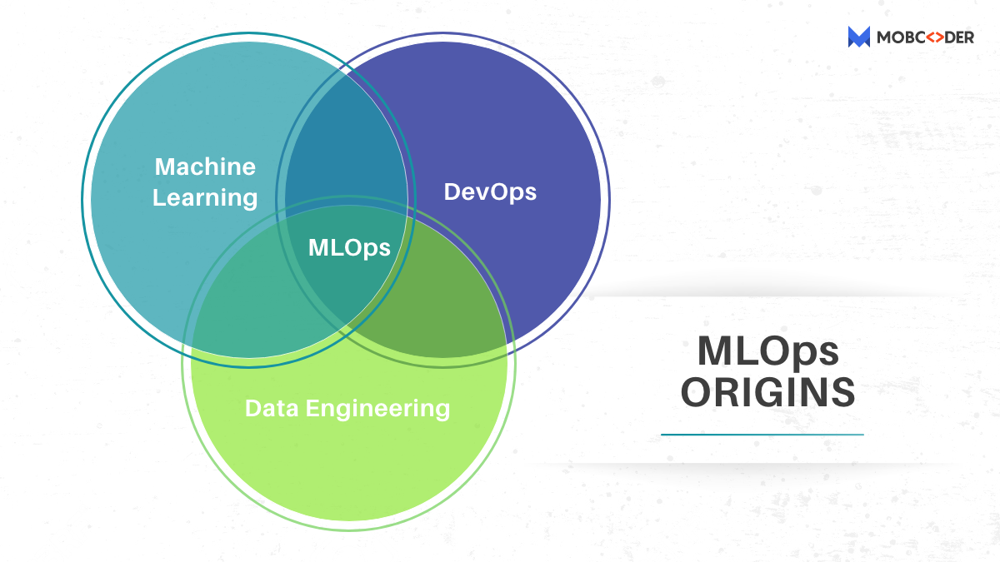
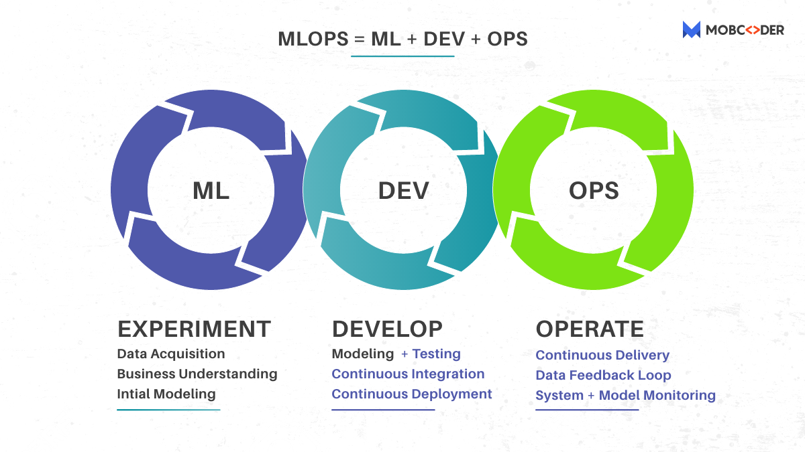
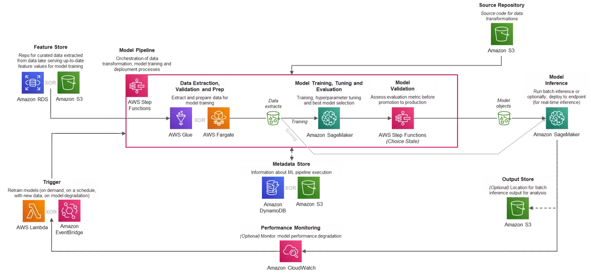

# MLOps: A Beginners Guid to MLOps

We were all studying about the software development lifecycle (SDLC) until recently, and how it goes from requirement elicitation to designing, programming, testing, deployment, and maintenance.
We studied (and continue to research) the waterfall, iterative, and agile software development models.

At this point, practically every other company is attempting to include AI/ML into their product.
This new need for developing ML systems adds/reforms some SDLC principles, resulting in MLOps, a new engineering profession.

MLOps – A new word has emerged, causing a stir and resulting in the creation of new job profiles.
MLOps stands for Machine Learning Operations, which is also known as ModelOps.

## What is MLOps ?

**The discipline of delivering machine learning (ML) models through repeatable and efficient workflows is known as machine learning operations (MLOps).**

MLOps facilitates the continuous delivery of high-performing ML applications into production at scale, much like DevOps did for the software development lifecycle ([SDLC](https://www.tutorialspoint.com/sdlc/sdlc_overview.htm)).
It considers ML's specific requirements to create a new lifecycle that sits alongside traditional SDLC and [CI/CD processes](https://www.synopsys.com/glossary/what-is-cicd.html), resulting in a more efficient workflow and more effective results for ML.

All of the skills that data science, product teams, and IT require to deploy, manage, regulate, and protect models in production are included in MLOps.
It consists of the following elements, which when combined, constitute an automated machine learning pipeline that maximises your ML performance and ROI:

* Serving and pipelining models

* Catalog(s) of model service for all models currently in production

* Version control for models

* Infrastructure administration

* Monitoring

* Security

* Governance

* All data sources are connected, and best-in-class tools for model training, development, infrastructure, and compliance are available.

## Why MLOps ?

We were dealing with reasonable amounts of data and a modest number of models on a small scale until recently.  Now that we're embedding decision automation in a wide range of applications, we're facing a slew of technical obstacles in developing and deploying machine learning-based systems.  To comprehend MLOps, we must first comprehend the lifespan of machine learning systems.  A data-driven organization's lifecycle involves multiple distinct teams.  The following teams contribute from top to bottom:

1. Defining business objectives with KPIs in the business development or product team

2. Data Engineering is the process of gathering and preparing data.

3. Architecting ML solutions and constructing models is what Data Science is all about.

4. Complete deployment setup and monitoring alongside scientists – this is what IT or DevOps is all about.

## How MLOps Works ?

MLOps facilitates the ML lifecycle by connecting the ML code to all of the other elements required for ML success.
This includes the following:

* Data on training

* Model education

* Validation of models

* Data on production

* Serving and pipelining models

* Catalogue of sample services (s)

* Version control for models

* Infrastructure administration

* Monitoring

* Security

* Governance

* Interpretability and explainability

MLOps includes all of the essential components, as well as the ability to integrate them all together—from data sources to compliance tools.

## What is ML Pipelines ?

The data pipeline is a fundamental notion in data engineering.  A data pipeline is a set of changes that we apply to data as it moves from one location to another.  They're commonly represented as a graph, with nodes representing transformations and edges representing dependencies or execution order.  Many specialised tools are available to assist in the creation, management, and operation of these pipelines.  ETL (extract, transform, and load) pipelines are another name for data pipelines.  

ML models almost always involve data transformation, which is typically accomplished through scripts or even cells in a notebook, making them difficult to manage and run consistently.  Switching to correct data pipelines has a number of benefits in terms of code reuse, runtime visibility, administration, and scalability.

Because ML training may also be thought of as a data transformation, it's only logical to incorporate the exact ML processes in the data pipeline itself, transforming it into an ML pipeline.  Most pipeline models will require two versions: one for training and one for serving.  This is because, in most cases, data formats—and the methods for accessing them—are extremely diverse from one moment to the next, particularly for models that we provide in real-time queries (as opposed to batch prediction runs).

The machine learning pipeline is a pure code construct that is unaffected by specific data instances.  This implies it's easy to track its versions in source control and deploy them using a typical CI/CD pipeline, which is a DevOps best practise.
This allows us to connect the code and data planes in a logical, automatic manner:

It's important to note that there are two separate machine learning pipelines: the training pipeline and the serving pipeline.
They all have one thing in common: the data transformations they execute must produce data in the same format, but their implementations can vary greatly.

It's critical, though, to keep these two pipelines consistent, therefore code and data should be reused whenever possible.

## What is Model and Data Versioning ?

Consistent version tracking is required to achieve reproducibility.  In a conventional software world, versioning code is sufficient because it defines all behaviour.  In machine learning, we must additionally keep track of model versions, as well as the data needed to train it and certain meta-data such as training hyperparameters.

A traditional version control system like Git can track models and metadata, but data is often too massive and mutable for this to be efficient and useful.  It's also crucial to avoid linking the model lifecycle to the code lifecycle, because model training is generally done on a distinct schedule.

Versioning data and tying each trained model to the specific versions of code, data, and hyperparameters utilised are also required.  A purpose-built tool would be ideal, but there is currently no market consensus, and practitioners employ a variety of techniques, most of which are based on file/object storage protocols and metadata databases.  

## MLOps tackles a number of major issues 

Managing such systems at scale is difficult, and several bottlenecks must be addressed.
The following are some of the significant problems that teams have proposed:

1. A scarcity of Data Scientists capable of creating and implementing scalable web applications exists.  In today's market, there is a new profile of ML Engineers that tries to meet this need.  It's a sweet place where Data Science and DevOps intersect.

2. Reflecting changing business objectives in the model — With data constantly changing, maintaining model performance requirements, and guaranteeing AI governance, there are many dependencies.  It's difficult to keep up with the constant model training and changing company goals.

3. The black-box nature of such ML/DL systems has sparked a lot of discussion.
Models frequently deviate from their original purpose.  Assessing the risk and expense of such failures is a crucial and time-consuming step.

For example, the cost of an incorrect YouTube video suggestion is far smaller than the cost of falsely accusing someone of fraud, blocking their account, and rejecting their loan applications. 

### References
* https://predera.com/
* https://mobcoder.com/
* https://mobcoder.com/
* https://medium.com/slalom-data-analytics/mlops-part-2-machine-learning-pipeline-automation-with-aws-1ca10348239e
