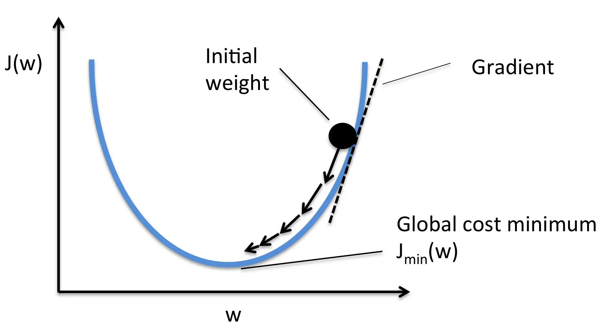
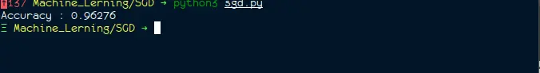

# Stochastic Gradient Descent (SGD) with Python

Stochastic gradient descent or SGD is very popular and powerful algorithm used in machine learning. Stochastic Gradient Descent (SGD) is an iterative algorithm which is used to compare various solution till the optimum solution is not found.They are widely used in trainning Neural Network.

Let's now understand what Stochastic Gradient Descent (SGD)  is, but before that first let's understand what Gradient Descent is?

## What is Gradient Descent

**Gradient** mean a slope either upward or downwords and **Descent** means stepping downword in a scale.Hence, **gradient descent** simply means stepping upwoard or downword of a slope to reach the lowest or highest point of that slope. In machine learning the objective of gradient descent is such that it find the minimum value of the objective function such that the final result is optimum or satisfactory.

Let's take an exmaple imagine you are blindfolded and want to climb to the top of the hill with fewest steps along the way as possible.Initially what you will do is first take big-big steps in steepest direction of the hill but as you come close to the top of the hill your steps will be smaller and smaller to avoid skipping it.Now instead of climbing up think of gradient descent as hiking down to the bottom valley.This is a better way to visualize this algorithm as it is a minimizing alogrithm.

Gradient descent initially will take bigger step then as it get's closer to the minimum slope of the objective function it's steps gets smaller and smaller.Gradient descent always tries to find minimum value of the slope which is close to zero but not zero because if it gets zero the model will stop learning.

1. Gradient descent start by picking random initial value for the parameter.(It is mostly partial derivative with respect to its input).

2. Then we update gradient descent function by giving this parameter values.
3. The output of gradient descent function is used in calculating step size:
   **step size = gradient x learning rate**

4. Here deciding the value "learning rate" is very important because if the value of "learning rate" is larger it may skip the optimum point and if it is smaller it will take more time in finding minimum point.

5. Now calculate new parameter by:

   **new params = old params - step size**

6. This process is repeated until the optimum value or satisfacotry value of the objective fucntion is not found.

The downside of gradient descent algorithum is the amount of computation it takes in each iteration.Suppose we have 50,000 data points and 50 features.Then we calculate derivative of the function with respect to it's feature,so total will be 50000 x 50 = 2500000 computaion per iteration. It is common to take atleast 1000 iteration so 2500000 x 1000 = 2500000000 computaion to complelte the alogrithm. Which conclude that gradient descent is very slow on huge data.

## What is Stochastic Gradient Descent (SGD)

'Stochastic' means involving random variable.Instead of selecting whole data and calculates it's derivative in each iteration, SGD selects few samples from the data points called 'batches' and compute it's derivatives.This step reduce the computaion steps enormusly.This samples or batches are randomly shuffle on each iteration of the alogrithum.



The path taken by Stochastic Gradient Descent (SGD) algorithm to find the optimum value is usually nosier than gradient descent as only one sample from the datasets is taken on each iteration. SGD usually taken heigher number of iteration to find optimum value than gradient descent but computation cost is much lesser than gradient descent since we are taking only samples instead of whole datastes.

Now let's look at example on how to implement Stochastic Gradient Descent in Python:

## Example of Stochastic Gradient Descent using Python

First let's import our necessary libraries:-

```python
import numpy as np
from sklearn.linear_model import SGDClassifier
from sklearn.model_selection import train_test_split
from sklearn.datasets import make_blobs
from sklearn import metrics
import matplotlib.pyplot as plt
```

Here we will be using `SGDClassifier` which is linear models but uses stochastic gradient descent (SGD) learning.

Now let's get our datasets.We have use here `make_blobs` to create our own datasets which contain 500000 data points with 2 features and 2 centers.

```python
def get_datasets():
    X,y = make_blobs(n_samples = 500000,n_features = 2,
            centers = 2,cluster_std = 2.5,random_state = 40)
    return X,y
```

Let us now implement `SGDClassifier` on the above datasets:

```python
if __name__ == '__main__':
    X,y = get_datasets()
    X_train,X_test,y_train,y_test = train_test_split(X,y,random_state = 40)
    model = SGDClassifier(loss = "log",max_iter = 1000, n_jobs = -1)
    model.fit(X_train,y_train)
    y_pred = model.predict(X_test)
    print(f"Accuracy : {metrics.accuracy_score(y_test,y_pred)}")

```

### Output:



### References

- <https://pantelis.github.io/cs634/docs/common/lectures/optimization/sgd/>

- <https://deepai.org/machine-learning-glossary-and-terms/stochastic-gradient-descent>
