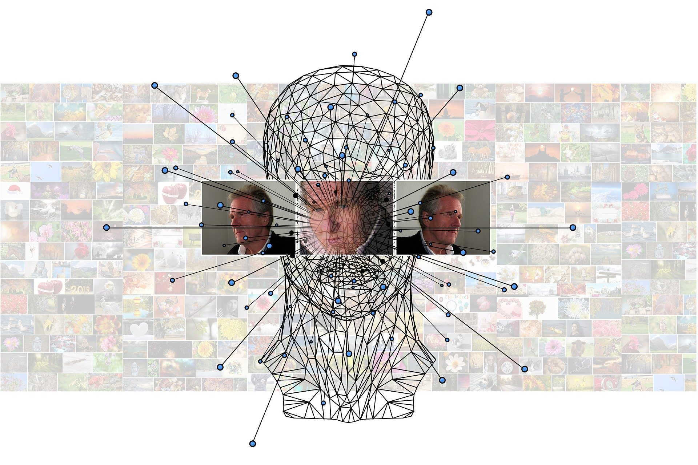

# What is Machine Learning ?

According to Wikipedia:

**_Machine learning is a scientific study of algorithm and statistical model of computer system._**

That is machine learning is used to perform certain tasks without using any human interaction. Machine learning has the ability to learn and recognize pattern to perform particular tasks. It can also improve it's own performance based on how well it learned to perform a that task.

It is nothing just a computer program which takes "data" as input, learn from that data, recognize underlying patterns between the data, and based on this it produced the output(which is usual case are just predictions).

_Note: The data here can be of any form such as video, images, files etc_

The way machine learning is implemented is by using **Machine Learning Algorithm**. This algorithm are based on sample data known as "training data" from which it build it's own **mathematical model** in order to make predictions or decisions without explicitly programmed to perform tasks. This **mathematical model** are just statistics which focuses on making prediction using computers.

Machine learning is seen as a subset of _Artificial Intelligence_ (AI). Here AI is ultimate intelligence demonstrated by machine to perform all the task which a human or animal could do, on the other hand **Machine Learning** are capable of learning one tasks well. They cannot be used to perform different tasks which it has not trained for.

Now a days **Machine Learning** is the most powerful tool which are being used in wide variety of applications. From email filtering which detect weather an email if spam or real, to medical diagnosis where they are being used to detect weather a person is having diseases such as cancer or it is being used to make new drugs to cure viruses.

## History of Machine Learning

Back than computer had very small amount of memory to run program. [_Arthur Samuel_](https://en.wikipedia.org/wiki/Arthur_Samuel) who was than working at IBM developed a game of checker. The way he developed the game was with something called as _alph-tunning_ which uses a scoring function based on the position of pieces in the board. This scoring function chooses the next step using _minimax_ strategy that is the program chooses it's next step in which it has the highest chance of winning. His algorithm also recorded each and every move he has taken so far and combined this with the reword function. **He was the first man who came up with the idea "Machine Learning" in 1952**.

Then in 1957 _Frank Rosenblatt_ designed the first neural network for computers, which simulate the thought processes of the human brain by combining model of brain cell by _Donald Hebb’s_ and _Arthur Samuel’s_ Machine Learning efforts.

Since then we are seeing new algorithm emerging out in the field of machine learning like _Nearest Neighbour algorithm_ in 1967, in 1970's scientist begin to create program to analyze large amount of data and draw a conclusion from it.

## Process Involved in Machine Learning

Machine Learning process involves number of step. Let's get to them one by one:

1. _Data Gathering_:

This is one of the most important set in Machine Learning. Here quantity and quality of data both are very important. Data could be of any form images,videos,audio,csv file or any text file. The reason quantity and quality both are important because this result machine learning model will directly depend of data you feed to them. If the data is large but is unclean or in other words it consists of unnecessary information then the outcome of machine learning model will show unnecessary result or if the data is clean but amount of data is less the model will not predict will enough. Therefore, **gathering large and clean amount of data is very important**.

2. **Choosing Model**:

In this phase we have to select a **Machine Learning Model**. This model consists of number of algorithm which use mathematics, statistics, and probability. Choosing a right machine learning usually required experience because this model will learn and recognize pattern in your data.

3. **Training**:

Here you train your model with the data you have gather. In training process usually 70-80% of your data is feed to your model. In this process model tries to learn your data.

4. **Evaluating or Validation**:

The remaining 20-30% of your data is used for validation that is it is used to check how well did the model perform.

5. **Tunning**:

After validating the model they are tunned. Tunning step usually consists of increasing number of training steps, adjusting learning rate, or change the values of default parameters.

6. **Prediction**:

After nicely tunning the model, the model is ready for making prediction on new datasets.

## Machine learning Approches

There are many ways from which machine learning can be implemented but this are grouped into 4 basic category:

- Supervised Learning
- Unsupervised Learning
- Reinforcement Learning
- Semi-Supervised Learning

Let's understand each of them one by one:

### Supervised Machine Learning Algorithm

Supervised Machine Learning Algorithm build a mapping function between the set of data and the desired output.

This algorithm learns the relation between the input and the output. For example let's say you have dataset which consists of images of apples and bananas and you want to classify them here model will learn mapping function as bananas are long, apples are curved and small, bananas are yellow apples are red etc. Once it have learned to recognize this pattern it will classify new data set given to them.

Supervised Learning are further classified into two type:

- Classification and
- Regression

#### Classification

Classification Machine Learning algorithm are used when you have to classify different group of data. This algorithm learn how to separate the data just like apple and bananas. This algorithm consists of categorical output.

#### Regression

This is another form of supervised learning. The output of regression are numerical rather than a class. This algorithm are used when you have to predict number for example the stock market price,temperature of a given day, or probability of an event occurring

### Unsupervised Machine Learning Algorithm

This algorithm are bit harder than _Supervised Learning Algorithm_. This algorithm only consists of input set and no output label for mapping it. This algorithm learn by itself and find pattern between the datasets.

This algorithm start from scratch and tries to find new or sometimes even better way to solve problem then _Supervised Learning Machine Learning Algorithm_. Therefore sometime they are also called **Knowledge Discovery** algorithms.

**Unsupervised Learning Algorithm** takes a set of input data and tries to find structure in the data by grouping or clustering. Instead of responding to the feedback like _Supervised Learning does_ it finds common pattern between the data and react between the presence and absence of this common pattern of each new pieces of data.

They are often used in clustering where same pieces of data are cluster together based on their commonalities.

### Reinforcement Machine Learning Algorithm

**Reinforcement Machine Learning Algorithm** are by far most complex and most accurate machine learning algorithm. Instead of labels these algorithms uses reward or feedback to learn patterns.

This algorithm are very much similar to how human learns. We perform some action based on that we receive some feedback. This feedback can either be positive of negative through this feedback we improve our actions.

Similar to this **Reinforcement Learning algorithm** take set of input from the environment. Then it do it's computation then it perform some action. This action is passed through an agent which will give a feedback to algorithm either positive or negative based on the feedback this algorithm will adjust itself.

Games are very good examples of Reinforcement Learning. They provide ideal data-rich environments. The scores in the game acts as as reword single to train the model. Reinforcement model tries to maximise it reward by playing game over and over again.

### Semi-Supervised Machine Learning Algorithm

This is by far my most favorite machine learning algorithm. This algorithms combines both the world: **Supervised Learning** and **Unsupervised Learning**.

It reduces the burden of having large amount of labelled data. It takes only small number of labelled data and large amount of unlabelled data.

A very good example of these learning is GAN(**Generative Adversial Network**). It uses two type of Neural Network _Generator_ and _Discriminator_. The Generator is trainned to produced new data. This data is feed to discriminator which decides weather the data is real or fake. Based on the output of discriminator the generator network is optimized. While on the other hand Discriminator is trainned to decide between real or fake using small set of labelled data.

By using the network both for generating input and another one to generate outputs there is no need for us to provide explicit labels every single time and so it can be classed as **Semi-Supervised Machine Learning Algorithm**
