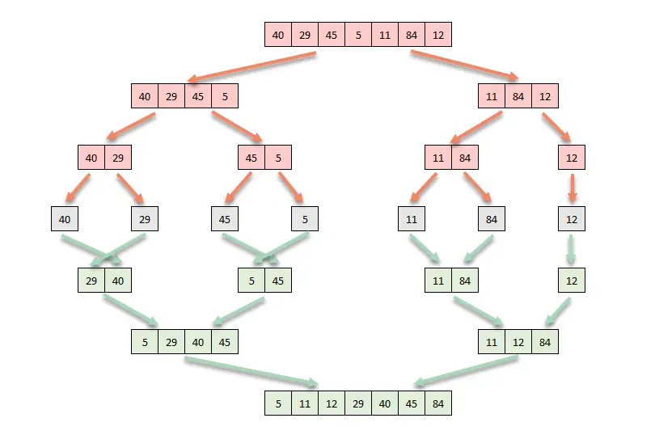

---

title: Understanding Merge sort algorithm
date: 2021-06-26
published: true
image: /images/merge-sort-implementation.png
author: Hatim
Tags: ["programming"]
description: "Merge sort is a sorting algorithm based on divide and conquer technology. It is one of the most efficient classification algorithms.Merge Sort
Iteratively decompose the array into two equal sub-arrays until each sub-array
contains one element."
keywords: python,C,C++,java,javascript,merge,sort,algorithm,exmaple,implimentationcomplexity,time,divide,conquer,data,structure
---

# Understanding Merge Sort Algorithm

Merge sort is a sorting algorithm based on "divide and conquer" technology. It is one of the most efficient classification algorithms.

In this blog, you will learn about the working principle of the merge sort algorithm, the merge sort algorithm, its time and space complexity, and its implementation in various
programming languages such as C++, Python, JavaScript and Java.

## How does the merge sort algorithm work?

The operating principle of merge management is divide and conquer. Merge Sort
Iteratively decompose the array into two equal sub-arrays until each sub-array
contains one element. In the end, all these sub-matrices were merged
times to order the resulting array.

With the help of Example, this concept can be explained more effectively. Consider an unsorted array with the following elements: {40,29, 45, 5, 11, 84, 12}.



Here, the merge sort algorithm splits the matrix into two halves, calls
for the two halves, and then merges the two ordered halves.

## Space and Time Complexity of the Merge Sort Algorithm

The Merge sort algorithm can be expressed in the form of the following
recurrence relation:

T(n) = 2T(n/2) + O(n)

After solving this recurrence relation using the [master's theorem](https://en.wikipedia.org/wiki/Master_theorem) or
recurrence tree method, you'll get the solution as O(n logn). Thus, the
time complexity of the merge sort algorithm is **O(n logn)**.

**The best-case time complexity of the merge sort:** O(n logn)

**The average-case time complexity of the merge sort:** O(n logn)

**The worst-case time complexity of the merge sort:** O(n logn)

**The auxiliary space complexity** of the merge sort algorithm is
**O(n)** as **n** auxiliary space is required in the merge sort
implementation.

## Merge Sorting Algorithm

Below is the Pseud code for merge sort:

```bash
    MergeSort(arr[], left, right)
    if left >= right
         return
    else
         Find the middle index that divides the array into two halves:
                 middle = left + (right-left)/2
         Call mergeSort() for the first half:
                 Call mergeSort(arr, left, middle)
         Call mergeSort() for the second half:
                 Call mergeSort(arr, middle+1, right)
         Merge the two halves sorted in step 2 and 3:
                 Call merge(arr, left, middle, right)
```

### C++ Implementation of merge sort

```cpp
#include <iostream>
#include <vector>
#include <algorithm>
#include <iterator>
#include <numeric>

//Function which merges the array
template<class T>
static void merge(T& items,auto first,auto mid,auto last) {
	//temp vector will hold sorted elements
	std::vector<typename T::value_type> temp;

	//reserving bytes of the memeory to avoid memory allocation
	temp.reserve(std::distance(first,last));

	auto left = first;
	auto right = std::next(mid);


	for(auto i = first; i <= last ; ++i) {
		//checks if the left part come to an end of not
		if(left > mid){
			temp.push_back(*right);
			right = std::next(right);
		}

		//check if the right part come to an end or not
		else if(right > last){
			temp.push_back(*left);
			left = std::next(left);
		}
		//Check which elements is smaller
		else if(*left < *right) {
			temp.push_back(*left);
			left = std::next(left);
		}
		else{
			temp.push_back(*right);
			right = std::next(right);
		}
	}

	//copies the sorted element back to the original array
	std::move(temp.begin(),temp.end(),first);

}

//Function for sorting
template<class T>
void mergeSort(T& items,auto first,auto last) {
	if(first < last) {
		auto mid = first;//mid iterator will point to mid element in the array
		std::advance(mid,std::distance(first,last)/2); //Finding the middle of array
		//firt half of array
		mergeSort(items,first,mid);
		//second half of array
		mergeSort(items,std::next(mid),last);

		merge(items,first,mid,last);

	}
}

//Function for printing the element
template<class T>
void printElement(const T& items, const std::string& heading) {
	std::cout << heading << std::endl;
	std::copy(items.begin(),items.end(),
		std::ostream_iterator<typename T::value_type>(std::cout," "));
	std::cout << std::endl;
}

//Main program
int main() {
	std::vector<int> elem({40,29, 45, 5, 11, 84, 12});
	printElement(elem,"Unsorted Array:");

	mergeSort(elem,elem.begin(),elem.end());

	printElement(elem,"Sorted Array:");


}
```

### Python Implementation of merge sort

```python

def merge_sort(elem):
    elem_length = len(elem)

    if elem_length == 1:
        return elem

    mid = elem_length // 2

    left  = merge_sort(list[:mid])
    right = merge_sort(list[mid:])

    return merge(left, right)


def merge(left, right):
    output = []
    i = j = 0

    while i < len(left) and j < len(right):
        if left[i] < right[j]:
            output.append(left[i])
            i += 1
        else:
            output.append(right[j])
            j += 1
    output.extend(left[i:])
    output.extend(right[j:])

    return output


def main():
    elem = [40,29, 45, 5, 11, 84, 12]
    print(elem)
    elem = merge_sort(elem)
    print(elem)

```

### JavaScript Implementation of merge sort

```javascript
<script>
   function merge_sort (elem) {
      if (elem.length === 1) {
      return elem
   }
   const middle = Math.floor(elem.length / 2)
   const left = elem.slice(0, middle)
   const right = elem.slice(middle)
   console.log(middle);
   return merge(
      merge_sort(left),
      merge_sort(right)
   )
   }

   function merge (left, right) {
      let output = []
      let left = 0
      let right = 0
      while (left < left.length && right < right.length) {
         if (left[left] < right[right]) {
         output.push(left[left])
         left++
         } else {
         output.push(right[right])
         right++
      }
   }
   return output.concat(left.slice(left)).concat(right.slice(right))
   }
   const elem = [40,29, 45, 5, 11, 84, 12]
   console.log(merge_sort(list));
   </script>

```

### Java Implementation of merge sort

```java
public class MergeSort {

	public static void main(String[] args) {

		int[] elem = {40,29, 45, 5, 11, 84, 12};

		int[] merged = mergeSort(elem, 0, elem.length - 1);

		for (int val : merged) {
			System.out.print(val + " ");
		}

	}

	public static int[] merge(int[] left, int[] right) {

		int[] sorted = new int[left.length + right.length];

		int i = 0;
		int j = 0;
		int k = 0;

		while (i < left.length && j < right.length) {

			if (left[i] < right[j]) {
				sorted[k] = left[i];
				k++;
				i++;
			} else {
				sorted[k] = right[j];
				k++;
				j++;
			}
		}

		if (i == left.length) {

			while (j < right.length) {
				sorted[k] = right[j];
				k++;
				j++;
			}
		}

		if (j == right.length) {

			while (i < left.length) {
				sorted[k] = left[i];
				k++;
				i++;
			}
		}

		return sorted;

	}

	public static int[] mergeSort(int[] elem, int left, int right) {

		if (left == right) {
			int[] br = new int[1];
			br[0] = elem[left];

			return br;
		}

		int middle = (left + right) / 2;

		int[] fh = mergeSort(elem, left, middle);
		int[] sh = mergeSort(elem, mid + 1, right);

		int[] output = merge(fh, sh);

		return output;
	}

}

```
