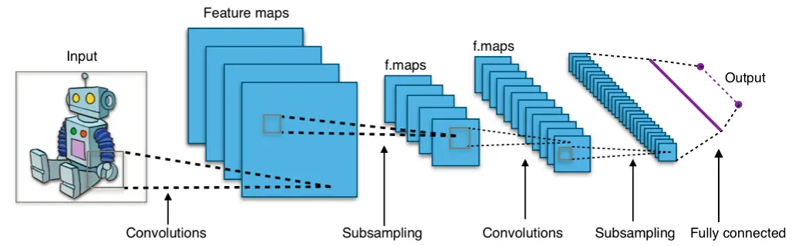
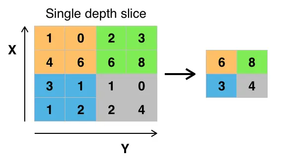

# What is Convolutional Neural Network (CNN)

In our [previous](https://anothertechs.com/programming/neural-network/cnn/) article we have discussed how a simple neural network works.The problem with fully conntected neural network is that they are computationally expensive. Also, by adding lots of layer we come across some problem:

1. We run into problem of [vanashing gradient problem](https://en.wikipedia.org/wiki/Vanishing_gradient_problem).
2. Another issue is that number of trainable parameter grows rapidly. Because of this trainning slows down or became practically impossible.
3. Fully connected neural network can be easily exposed to overfitting

Convolutional Neural Network (or CNN) can solve this problem by finding correlations between adjacent input between dataset (eg. image or time series). This means that not every node in the network is connected to every other node in the next layer and this cut down number of weight parameter required to be trained in the model.

## How Convolutional Neural Network (CNN) works

According to wikipedia a **convolution** is a operation between to function the produce third function expression how the shape of one modified by the other. In convolutional neural network this means that we move a window or filter across the image being studied. We can imagine this as a 2x2(or 3x3) filter sliding accross all the available nodes/ pixels in the input image.



Now let's look at some of the important term used in convolutional nerual network (CNN)

## Components of Convolutional Neural Network (CNN)

### Feature mapping (or activation map)

Whenever we use a filter matrix(or slidding window) accross the image to compute the convolution operation the resultant matrix is called **Feature Map**.Because of this mapping our network learn to recognize common geometrical object such as edge,line etc.

Convolution layers need multiple filters(For example an image consists of 3 channel Red,Green and Blue).This multiple filters will produce their own 2D output, then this outputs is then combined to produced a single output (Feature map or activation map). Each channel will be trained to detect certain key feature.The ouptut dimenssion of the feature map will be 1 more than the input channel.

### Polling



Polling is a type of sliding window technique, but instead of applying weights, we apply some statistical function of some type over content window. The most common type of polling is **max polling**. And the output of max polling is the maximum value in that content window.

### Strides

Strides is the number of pixels which shits over the input image.For example if strides is 1 then we move the window 1 pixels at a time, when it is 2 we move the windows 2 pixels at a time and so on.

_In polling if strides is greater than 1 then the ouput size will reduce. For example if the input image is of size 5x5 and if we apply strides of 2 than our output will be of 3x3 this process is called **down sampling** and it reduce the number of trainning parmeter_

### Padding

Sometimes our sliding window doest not fit perfactly with the input image. So we have two options:

- Pad the image with zero(also called zero-padding).
- Drop or clip the part of the image where our filter window did not fit. This is also known as valid padding which keeps only valid part of the image.

## Implementing Convolutional Nerual Network

Firt let's import our necessary libraries:

```python

import torch
import torch.nn as nn
from torch.autograd import Variable
import torch.nn.functional as F
import torch.optim as optim
from torchvision import datasets,transforms
from tqdm import tqdm


device = torch.device("cuda:0" if torch.cuda.is_available() else "cpu")

def get_data(batch_size = 200,train = True):
    data = torch.utils.data.DataLoader(
        datasets.MNIST('../data', train=train, download=True,
                       transform=transforms.Compose([
                           transforms.ToTensor(),
                           transforms.Normalize((0.1307,), (0.3081,))
                       ])),
        batch_size=batch_size, shuffle=True)
    return data


```

Now let's create our model class

```python
class Model(nn.Module):
    def __init__(self):
        super(Model,self).__init__()
        self.l1 = nn.Sequential(
                nn.Conv2d(1,32,kernel_size = 5,stride = 1,padding = 2),
                nn.ReLU(),
                nn.MaxPool2d(kernel_size = 2, stride = 2)
                )
        self.l2 = nn.Sequential(
                nn.Conv2d(32,64,kernel_size = 5,stride = 1,padding = 2),
                nn.ReLU(),
                nn.MaxPool2d(kernel_size = 2, stride = 2)
                )
        self.drop_out = nn.Dropout()
        self.fc1 = nn.Linear(7*7*64,1000)
        self.fc2 = nn.Linear(1000,10)
```

As we have discussed in our [last section](https://anothertechs.com/programming/neural-network/cnn/) to create a nerual network all you need is to inherit the `nn.Module` class in your model.

Next we create sequential object. The `nn.Sequential()` method allow us to create sequential ordered layer in our network. As in our case we have create convolution->ReLU->polling.sequence.

The `nn.Conv2d()` method is used the create set of convolution filters and we have passed to parameters first is our input channel which is 1 for gray scale image and the next is number of output channel.The `kernel_size` argument is the size of our sliding window of our image and the last two argument are strides and padding.

To know the dimenssion of our output image we have formula:

Wout = ((Win - F + 2P)/S) + 1 (Same formula is calculated for Height)

Wout = Width of ouput
F = Filter size(or window size)
P = Padding
S = Stride

If we wish to keep our input and output dimenssion same we have to take `kernel_size` = 5 and `stride` = 1. If we put all the value in above formula we get `padding` = 2.

`nn.ReLU()` is our activation function.
The last element on our sequential object of `self.l1` is `nn.MaxPool2d`. First argument given to this method is polling size which we have given as 2x2. Next we want to down sample our date by giving the stride 2. So our 28x28 pixel image will now be 14x14 pixel(You can also put the value in above formula, you will get Wout = 14 if you put padding = 0).

Similaryly, we have define our second layer i.e `self.l2`.After this operation our ouput will be of dimensssion 7x7 pixels.

Next we use `nn.Dropout` to avoid overfitting.Finally we create two fully connected layer `self.fc1` and `self.fc2` by using `nn.Linear()`.The input size of first layer will be 7x7x64 which is dimenssion of image and number of channel from previous `Sequential` layer and this is connected to 1000 nodes.Finally this 1000 node is than connected to 10 nodes.

Now let's write our `froward()` method to tell our network how our data should flow.

```python
        def forward(self,x):
            x = self.l1(x)
            x = self.l2(x)
            x = x.reshape(x.size(0),-1)
            x = self.drop_out(x)
            x = self.fc1(x)
            x = self.fc2(x)
            x = x.reshape(x.size(0),-1)

	    return x
```

The first two line of `forward` is straight forward. After line `self.l2(x)` we apply `reshape` method which flatten our data of dimession 7x7x64 to 3136x1. Next dropout is applied followed by two fully connected layer,with finaly output being returned.

Now we create our main function:

```python
if __name__  == '__main__':
    cnn = Model()
    if torch.cuda.is_available():
        cnn.cuda()

    criterion = nn.CrossEntropyLoss()
    optimizer = torch.optim.Adam(cnn.parameters(),lr = 0.01)
```

First of all we create instance of our Model class called `cnn`. Next we define our loss function which in our case is `nn.CrossEntropyLoss()`. Then we define our optimize,here I have used `Adam` optimizer, which takes model parameter as it's firt input and we have given _learning rate_ to be 0.01.

Now let's train our model:

```python

    train = get_data()
    for epoch in tqdm(range(10)):
        for i,(images,target) in enumerate(train):
            images = images.to(device)
            target = target.to(device)

            out = cnn(images)
            loss = criterion(out,target)

            # Back-propogation
            optimizer.zero_grad()
            loss.backward(https://miro.medium.com/max/3944/1*YejW73f36BGhNGhrtbz67g.png)
            optimizer.step()

            _,pred = torch.max(out.data,1)
            correct = (pred == target).sum().item()

            if i % 100 == 0:
                print(f" epoch: {epoch}\tloss: {loss.data}\tAccuracy: {(correct/target.size(0)) * 100}%")
```

In trainning I have used 10 epochs. Next we iterate to our _DataLoader_ object(i.e `train`).Then we pass our datasets(i.e `images`) to our model.Using `criterion` we calculate our loss. Next step is to perform back propogation, first we make gradient to be zero which is done by using `optimizer.zero_grad()`. Next we call `backword()` on our loss variable to perfrom back-propogation. After the gradient has been calculated we optimize our model by using `optimizer.step()` method.

Now to test model:

```python

    # Testing
    test = get_data(train = False)

    with torch.no_grad():
        correct = 0
        total = 0
        for i,(images,target) in tqdm(enumerate(train)):
            images = images.to(device)
            target = target.to(device)

            out = cnn(images)
            _,pred = torch.max(out.data,1)
            total += target.size(0)
            correct += (pred == target).sum().item()
        print(f"Accuracy: {(correct/total) * 100}")
```

Testing model is pretty much similar to trainning model except, in testing model we don't want to update weights of our model. For this we use `torch.no_grad()` which tell pytorch not to update weight.

### OUTPUT

```bash
epoch: 6	loss: 0.35762882232666016	Accuracy: 86.0%
epoch: 6	loss: 0.345419317483902	Accuracy: 88.5%
epoch: 6	loss: 0.3479294180870056	Accuracy: 90.0%
70%|█████████████████████████████████████████████████████████████████▊                            | 7/10 [08:18<03:34, 71.46s/it] epoch: 7	loss: 0.5705909729003906	Accuracy: 85.0%
epoch: 7	loss: 0.36838656663894653	Accuracy: 89.5%
epoch: 7	loss: 0.2633790671825409	Accuracy: 91.5%
80%|███████████████████████████████████████████████████████████████████████████▏                  | 8/10 [09:30<02:23, 71.59s/it] epoch: 8	loss: 0.31612157821655273	Accuracy: 89.0%
epoch: 8	loss: 0.2783728539943695	Accuracy: 91.0%
epoch: 8	loss: 0.38499078154563904	Accuracy: 90.5%
90%|████████████████████████████████████████████████████████████████████████████████████▌         | 9/10 [10:42<01:11, 71.68s/it] epoch: 9	loss: 0.2609010934829712	Accuracy: 91.5%
epoch: 9	loss: 0.32276371121406555	Accuracy: 88.5%
epoch: 9	loss: 0.4422188997268677	Accuracy: 87.0%
100%|█████████████████████████████████████████████████████████████████████████████████████████████| 10/10 [11:54<00:00, 71.45s/it]
300it [00:30,  9.96it/s]
Accuracy: 89.43333333333334
```

### References

- [CNN](https://en.wikipedia.org/wiki/Convolutional_neural_network)
- https://medium.com/swlh/convolutional-neural-networks-mathematics-1beb3e6447c0
- [Feature Mapping](https://www.geeksforgeeks.org/feature-mapping/)
- [PyTorch torch.nn](https://pytorch.org/docs/stable/nn.html)
- [PyTorch Convolution Layer](https://pytorch.org/docs/stable/nn.html#convolution-layers)
- [PyTorch Normalization Layer](https://pytorch.org/docs/stable/nn.html#normalization-layers)
