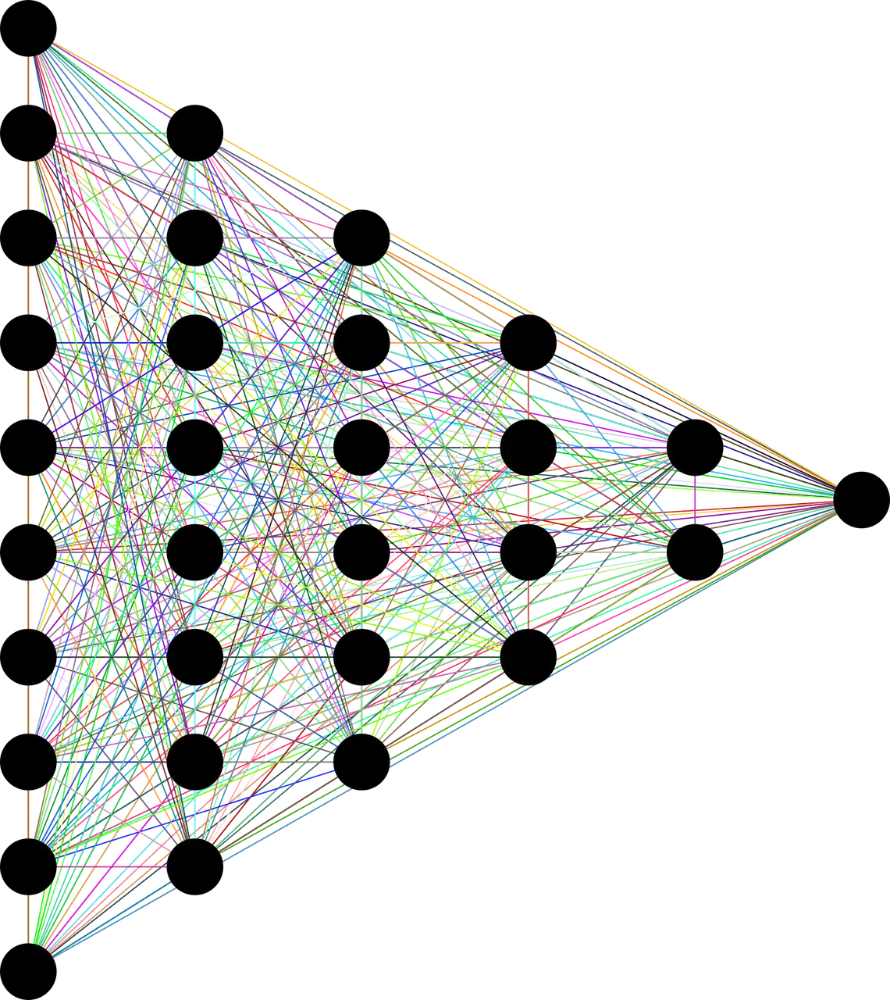

# Implementing Convolutional Neural Network (CNN) in Pytorch

In this turorial, we’ll go through the basic ideas of PyTorch starting at tensors and computational graphs and finishing at the Variable class and the PyTorch autograd functionality.

## Tensor

Tensor are just multi-dimessional array.Tesnors play a vital role in deep learning libraries for efficient computation.Graphical Processing Unit(GPUs) work effectivly at computing operations between different tensor.In Pytourch there are number of way we can declare tensors:

```python
import torch
a = torch.Tensor(2,3) #create tensor of size(2,3)(or 2x3 matrix) filled with zero
b = torch.ones(4,5) #create tensor of size(4,5)(or 2x3 matrix) filled with ones
c = torch.rand(5,5) #create tensor of size(5,5)(or 2x3 matrix) filled with random values
```

## Autograd

In neural network we calculate errors between predicted ouput and the actual ouput and based on this two we calculate error gradient and do a back-propogation through our computational graph. This mechanisum in PyTorch is called **autograd**. Autograd allows automatic gradient computation on the tensor when the `.backword()`method is called.

Variable class is the main component autograd system.This class wraps around tensor. The object of this class contains the value of tensor, the gradient of tensor and also contains reference to whatever function created.In PyTorch variable is declared as:

```python
x = Variable(torch.onses(2,3)+5,requires_grad = True)
```

## Creating Neural Network



Here we are going to create a neural network of 4 layer which will consists of 1 input layer,1 ouput layer, and 2 hidden layer. The input consits of 28x28(784) gray scale pixels which are MNIST hand written data set.This input data is passed through 2 hidden layers with ReLU activation function. Finally ouput layer is of 10 nodes corresponding to 10 possibledigit(i.e 0 to 9).At the ouput layer we will be using softmax activation function.

First let import our necessay libraries

```python
import torch
import torch.nn as nn
from torch.autograd import Variable
import torch.nn.functional as F
import torch.optim as optim
from torchvision import datasets,transforms
from tqdm import tqdm

```

When creating neural network we have to include `nn.Module` class from PyTorch. The `nn.Module` is the base class of all neural network. Inheriting this class allows us to use the functionality of `nn.Module` base class but have the capabilites of overwritting of the base class for model construction/forword pass through our network.

```python
class Model(nn.Module):
    def __init__(self):
        super(Model,self).__init__()
        self.input_layer = nn.Linear(28*28,200)
        self.hidde_layer1 = nn.Linear(200,200)
        self.hidde_layer2 = nn.Linear(200,10)
```

In our `__init__()` method we also define our neural net architecture which will contain input layer of nodes 28x28(784), two hidden layer of node 200, and one ouput layer of 10 nodes.

Next lets define how our data will flow in our network. For this we will be using `forword()` in our class. This method will overwrite a dummy method in the base class.and this is needed for definning each network.

```python
    def forword(self,x):
        x = F.relu(self.input_layer(x))
        x = F.relu(self.hidde_layer1(x))
        x = self.hidde_layer1(x)
        return F.log_softmax(x)
```

Now let's write our main function

```python

def get_data(batch_size = 200,train = True):
    data = torch.utils.data.DataLoader(
        datasets.MNIST('../data', train=train, download=True,
                       transform=transforms.Compose([
                           transforms.ToTensor(),
                           transforms.Normalize((0.1307,), (0.3081,))
                       ])),
        batch_size=batch_size, shuffle=True)
    return data

if __name__ == '__main__':
    net = Model()
    net.to(device)
    optimizer = optim.SGD(net.parameters(),lr = 0.01,momentum = 0.9)
    criterion = nn.NLLLoss()

    ## Trainning Model
    train = get_data()
    for epoch in tqdm(range(10)):
        for idx,(x_train,target) in enumerate(train):
            x_train,target = Variable(x_train).to(device),Variable(target).to(device)

            x_train = x_train.view(-1,28*28) optimizer.zero_grad()
            net_out = net(x_train)
            loss = criterion(net_out,target)
            loss.backward()
            optimizer.step()
            if idx % 10 == 0:
                print(f"Train Loss {loss.data}")

    ## Testing our model
    test = get_data(train = False)
    test_loss = 0
    correct = 0
    with torch.no_grad():
        for epoch in tqdm(range(10)):
            for idx,(x_test,target) in enumerate(test):
                x_test,target = Variable(x_test).to(device),Variable(target).to(device)

                x_test = x_test.view(-1,28*28)
                optimizer.zero_grad()
                net_out = net(x_test)
                test_loss += criterion(net_out,target).data
                pred = net_out.data.max(1)[1]
                correct += pred.eq(target.data).sum()

    test_loss /= len(test.dataset)
    print(f"Average loss: {test_loss}\n correct:{correct}\n Accuracy: {(correct/len(test.dataset)) * 100}%")

```

In the main fucntion first we create instance of our model class. Then we define our loss function, here I have used [SGD](https://anothertechs.com/programming/machine-learning/sgd/) loss function. Next we set our log criterion which is negative log likelihood.

Next in trainnig part i have extracted data from `train` object which is included in PyTourch utility module.This object supplies batched of input. In the outer loop is the number of epochs while the inner loop runs through entire trainning set. The `view` function operates on PyTorch variable to reshape them.`optimizer.zero_grad()` reset all the gradient in this model. `loss.backward()` runs back-propogation operation from loss Variable and `optimizer.step()` method execute gradient descent step based on gradient calculated during the `.backward()` operation.

Similarly we do this operation on test data but now we dont need to update gradient on our network for this we use `torch.no_grad()` to tell PyTorch not to update weight while back-propgating.

After running for 10 epochs I got the following ouput:

```bash
Average loss: 0.0033838008530437946
correct:97720
Accuracy: 98%
```

## References

- [CNN](https://en.wikipedia.org/wiki/Convolutional_neural_network)
- https://medium.com/swlh/convolutional-neural-networks-mathematics-1beb3e6447c0
- [Feature Mapping](https://www.geeksforgeeks.org/feature-mapping/)
- [PyTorch torch.nn](https://pytorch.org/docs/stable/nn.html)
- [PyTorch Convolution Layer](https://pytorch.org/docs/stable/nn.html#convolution-layers)
- [PyTorch Normalization Layer](https://pytorch.org/docs/stable/nn.html#normalization-layers)
