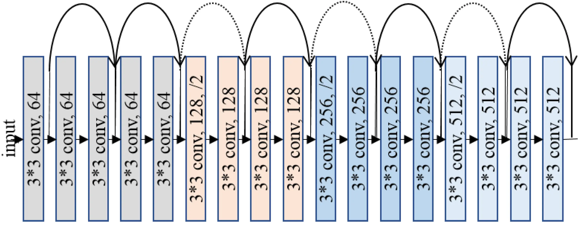

# ResNet: Understanding the Revolutionary Neural Network Architecture for Deep Learning


ResNet (Residual Network) is a powerful convolutional neural network architecture that has revolutionized the field of deep learning. It was introduced in a research paper by Microsoft Research Asia in 2015 and has since become one of the most popular deep learning models due to its high accuracy and efficiency.

ResNet addresses the problem of vanishing gradients that often occur in very deep neural networks. When a neural network has many layers, the gradients can become very small, which makes it difficult for the network to learn. ResNet solves this problem by introducing shortcut connections, also known as skip connections, that allow the network to skip over certain layers and directly propagate the input to deeper layers. This helps to preserve the gradient and make it easier for the network to learn.

## Deep Convolutional Neural Network

In our [last article](https://anothertechs.com/programming/neural-network/cn/) we have seen how a simple Convolutional neural network works.A **Deep Convolution Neural Network** are the network which consists of many hidden layer for examples _AlexNet_ which consist of 8 layer where first 5 were convlutional layer and last 3 were full connected layer or _VGGNet_ which consists of 16 Convolutional layer.

The problem with these deep neural network were as you increase the layer we start seeing degradation problem. Or to put it in another word as we increase depth of the network the accuracy gets saturated and starts degrading rapidly. In a deep neural network as we perform back-propogation, repeated mulitplication for finding optimal solution makes gradient very small which result in degradation. This problem is often called vanishing gradient/exploding gradient.

## ResNet(or Residual Network)

ResNet solve this degradation problem, is by skipping connection or layer. Skipping connection means, consider input x and this input is passed through stack of neural network layers and produce f(x) and this f(x) is then added to original input x.So our ouput will be:

H(x) = f(x) + x


So, instead of mapping direct function of x -> y with a function f(x), here we define a residual function using f(x) = H(x) - x. Which can be reframed to H(x) = f(x) + x, where f(x) represent stack of non-linear layers and x represent identity function. From this if the identity mapping is optimal we can easily put f(x) = 0 simply by putting value of weight to 0. So the f(x) is what authors call residual function.

This mapping ensure that higher layer will perfrom at least as good as lower layer, and not worse.

The ResNet architecture consists of several blocks, each of which contains multiple convolutional layers, batch normalization layers, and ReLU activation functions. The shortcut connections are added between these blocks, allowing the network to learn more complex features and improve its accuracy.

One of the major benefits of ResNet is its ability to train very deep neural networks with high accuracy. It has been used in a variety of applications, including image classification, object detection, and segmentation. In fact, ResNet is the backbone architecture for many state-of-the-art computer vision models, such as Faster R-CNN and Mask R-CNN.

## Implimenting ResNet

Now let's impliment ResNet model. Here I will be using ResNet18 model which consists of 18 layers. The dataset I will be using is _dog-vs-cat_ which i have downloaded form kaggle websites. Our model will classify images of dogs and cats.

### Architecture



In the above diagram first we take input image which consists 3 channel(RGB) passed it to Convolutional layer of _kernel_size_ = 3 and get 64 channel ouput.
The Convolutional block between the curved arrow represent a _Residual Block_ which will consists of:
Convolutional layer -> Batch Normalization -> ReLU activation -> Convolutional layer.

Ouput of these rediual block is than added to the initial input(i.e x) of residual block.After adding the ouput is than passed to ReLU activation function for next layer.

The dotted arrow represent that the output dimenssion of residual has changed so we also have to change the dimenssion of the input which is passed to that rediual block(i.e x) for adding it because adding is only possbile if the dimenssion are same.

The last layer of this architecture is a _Linear Layer_ which will take the input and gives us ouput i.e wheater it is dog or cat.

### Code

Let's first our import necessay libraries:

```python
from PIL import Image
import torch.optim as optim
from tqdm import tqdm
from torchvision import transforms
import torch.nn.functional as F
import torch.nn as nn
import torchvision.datasets as dt
import torch
import os

device = torch.device("cuda:0" if torch.cuda.is_available() else "cpu")

PREPROCESS = transforms.Compose([transforms.Resize(256),
                        transforms.CenterCrop(224),
                        transforms.ToTensor(),
                        transforms.Normalize(mean = [0.485,0.456,0.406],std = [0.229,0.224,0.225])])

```

PyTorch provides very good class `transforms` which are use for modifying and transfoming image.`transforms.Compose` is use to combine or chained different transformation of image. This is used to build transformation pipeline.

Now let's get out dataset:

```python
def get_dataset(train = True):
    if train:
        trainset = dt.ImageFolder(root = "./train/",transform = PREPROCESS)
        train_loader = torch.utils.data.DataLoader(trainset,batch_size = 8,shuffle=True)
        return train_loader
    else:
        testset = dt.ImageFolder(root = "./test/",transform = PREPROCESS)
        test_loader = torch.utils.data.DataLoader(trainset,batch_size = 8,shuffle=True)
        return test_loader
```

Next let's write our _Residual Block_:

```python
class ResidualBlock(nn.Module):
    expansion = 1
    def __init__(self, inchannel, outchannel, stride=1):
        super(ResidualBlock, self).__init__()
        self.conv1 = nn.Sequential(
                        nn.Conv2d(inchannel, outchannel, kernel_size=3, stride=stride, padding=1, bias=False),
                        nn.BatchNorm2d(outchannel),
                        )
        self.conv2  = nn.Sequential(
                        nn.Conv2d(outchannel, outchannel, kernel_size=3, stride=1, padding=1, bias=False),
                        nn.BatchNorm2d(outchannel)
                    )
        self.skip = nn.Sequential()
        if stride != 1 or inchannel != self.expansion * outchannel:
            self.skip = nn.Sequential(
                nn.Conv2d(inchannel, self.expansion * outchannel, kernel_size=1, stride=stride, bias=False),
                nn.BatchNorm2d(self.expansion * outchannel)
            )

    def forward(self, X):
        out = F.relu(self.conv1(X))
        out = self.conv2(out)
        out += self.skip(X)
        out = F.relu(out)
        return out
```

In the [last](https://anothertechs.com/programming/neural-network/cnn/) article I have explain why we use `nn.Module` in our class so, I am going to skip that part.
We have created two Convolutional layer `self.conv1` and `self.conv2` just like in diagram.
The `self.skip` is our shortcut layer which will be added to the output of `self.conv2`.
The "if" part in `__init__()` method checks weather the dimenssion of `self.conv2` will change or not. If it changes than we have to change the ouput dimenssion of input by passing it to `nn.Conv2d` layer.
In `forward()` method it is straight forward that how our data will flow.

Now let's write our Model class or ResNet class:

```python
class Model(nn.Module):
    def __init__(self, ResidualBlock, num_classes):
        super(Model, self).__init__()
        self.inchannel = 64
        self.conv1 = nn.Sequential(
            nn.Conv2d(3, 64, kernel_size=3, stride=1, padding=1, bias=False),
            nn.BatchNorm2d(64),
        )
        self.layer1 = self.make_layer(ResidualBlock, 64,  2, stride=1)
        self.layer2 = self.make_layer(ResidualBlock, 128, 2, stride=2)
        self.layer3 = self.make_layer(ResidualBlock, 256, 2, stride=2)
        self.layer4 = self.make_layer(ResidualBlock, 512, 2, stride=2)
        self.fc = nn.Linear(512*ResidualBlock.expansion, num_classes)

    def make_layer(self, block, channels, num_blocks, stride):
        strides = [stride] + [1] * (num_blocks - 1)
        layers = []
        for stride in strides:
            layers.append(block(self.inchannel, channels, stride))
            self.inchannel = channels * block.expansion
        return nn.Sequential(*layers)

    def forward(self, x):
        out = F.relu(self.conv1(x))
        out = self.layer1(out)
        out = self.layer2(out)
        out = self.layer3(out)
        out = self.layer4(out)
        out = F.avg_pool2d(out, out.size()[3])
        out = torch.flatten(out,1 )
        out = self.fc(out)
        return out
```

In `__init__()` method `self.conv1` is the layer where we will take our input image of channel 3 (RGB) and will produce 64 output channel.Then we create 4 layer using `make_layer` method and each layer consists of 2 `ResidualBlock`.
And the last layer(`self.fc`) is our `Linear` layer which will give us ouput weather it is _dog or cat_.

In `forward` method before passing it to `self.fc` layer we firt `flatten` or reshape our matrics to 1D.

Now let's define our loss function and optimizer:

```python
if __name__ == '__main__':
    resnet = Model(ResidualBlock,num_classes = 2)
    if torch.cuda.is_available():
        resnet.cuda()
    print(resnet)

    criterion = nn.CrossEntropyLoss()
    optimizer = torch.optim.SGD(resnet.parameters(),lr = 0.01)

```

I have used here `CrossEntropyLoss() and `SGD``` optimizer.

### Trainning

Let's train our model:

```python
    train = get_dataset(train = True)

    for epoch in tqdm(range(10)):
        for i,(images,target) in enumerate(train):
            images = images.to(device)
            target = target.to(device)

            out = resnet(images)
            loss = criterion(out,target)
            print(loss)

            # Back-propogation
            optimizer.zero_grad()
            loss.backward()
            optimizer.step()

            _,pred = torch.max(out.data,1)
            correct = (pred == target).sum().item()

            if i % 100 == 0:
                torch.save(resnet.state_dict(),"model")
                print(f" epoch: {epoch}\tloss: {loss.data}\tAccuracy: {(correct/target.size(0)) * 100}%")
```

I have used 10 epochs to train the model. `optimizer.zero_grad()` method is used to make gradient to 0. Next we call `backword()` on our loss variable to perfrom back-propogation. After the gradient has been calculated we optimize our model by using `optimizer.step()` method.

### Testing
```python
    test = get_data(train = False)

    with torch.no_grad():
        correct = 0
        total = 0
        for i,(images,target) in tqdm(enumerate(test)):
            images = images.to(device)
            target = target.to(device)

            out = resnet(images)
            _,pred = torch.max(out.data,1)
            total += target.size(0)
            correct += (pred == target).sum().item()
        print(f"Accuracy: {(correct/total) * 100}")
```

Since we don't need to calculate weight during back-propogation while testing our model we use `torch.no_grad` method. Rest part is same as training.

After 10 epochs I got accuracy of 93.23%.

## Conclusion

In conclusion, ResNet is a powerful deep learning architecture that has become an essential tool for computer vision applications. By understanding its working, benefits, and potential applications, you can leverage ResNet to improve the accuracy and efficiency of your neural network models.


## References

- [ResNet](https://en.wikipedia.org/wiki/Residual_neural_network)
- [Overview of Resnet](https://towardsdatascience.com/an-overview-of-resnet-and-its-variants-5281e2f56035)
- [PyTorch Docs](https://pytorch.org/hub/pytorch_vision_resnet/)
- [Deep Learning](https://amzn.to/3qe3BwT)
- [ResNet Architecture](https://www.analyticsvidhya.com/blog/2021/06/build-resnet-from-scratch-with-python/)
