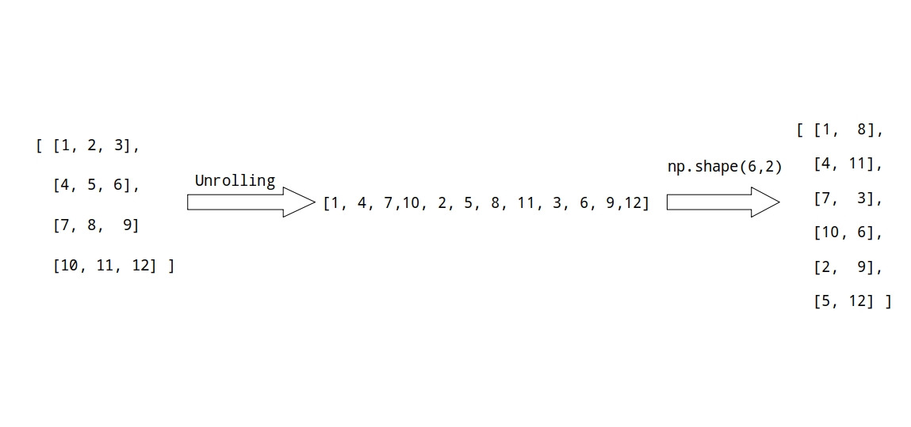

# Reshaping Numpy Arrays: A Comprehensive Guide to Numpy Array ReshapeNumpy Reshape

You might frequently want to reshape an existing array into an array with a different number of dimensions while working with Numpy arrays. This might be very helpful if you transform data in stages.

The NumPy array reshape() function in Python is used to change the shape of an array without changing its data.We can add or remove dimensions from an array by reshaping it. Change the amount of elements in each dimension as well. 

In this article, I'll show you how to use the `numpy.reshape()` function to reshape a Python NumPy array using examples.

But Before Diving into numpy reshape let us first discuss about array shape

## What is a Numpy Array?

A Numpy array is a collection of elements of the same data type. It can be created using the Numpy library in Python. Numpy arrays are more efficient than Python lists for numerical computations. They can be one-dimensional or multidimensional.


## Array Shape in Numpy

### One dimensional array

As we all know in numpy arrays have a particular shape. Whenever we create an array using `numpy.array()` numpy automatically deduce the shape of the array. For example let us create an 1D array:

```python
import numpy as np

arr = np.array([1,2,3,4,5])

print(arr.shape) # Output:  (5,)

```
Since it is an 1D array here the shape of the array will be (5).

### Two dimensional array

Now let's us create two dimensional numpy array:

```python
import numpy as np

arr = np.array([[1,2,3,4],
                [5,6,7,9],
                [9,10,11,12]])

print(arr.shape) # Output: (3,4)

```

In 2D the shape of the array will be (Row,Column) or in this case (3,4). Suppose we want to access element "2" we would do something like `arr[0,1]`. **Here the "0" indicates the outer index of the array and "1" indicated the inner index wrapped inside the brackets.**


### More dimensional arrays

We may apply the same approach to higher-dimensional arrays.  The first index is the one with the most brackets, and the last index is the one with the fewest.

## What is meant by reshaping numpy array or `np.reshape()`

You may want to start with a 1-dimensional array of numbers when working with NumPy arrays.  After that, reshape it into an array of the 2-dimension.

This is especially useful when the dimensions of the new array are unknown at the start or are inferred during execution.  It's also feasible that a given data processing step requires the input to be of a certain shape.

This is where reshaping comes in.**NumPy's reshape function lets you change the shape of an array without altering its data.**


## Syntax of Numpy reshape()

Here is the syntax of numpy reshape function:

```python

numpy.reshape(arr,newshape,order = 'C'|'F'|'A' )

```

`numpy.reshape` function take 3 arguments:

- `arr` : Numpy array which you want to reshape.
- `newshape` : the shape you want (1D,2D,3D etc) that will be return by `reshape` function.
- `order`: refers to the order in which you’d like to read in the elements of the array to be reshaped.

Before learning how to use this NumPy method, let's first discuss a little bit more about the order parameter and how this order is carried out behind the scene.

### Order C

```python
import numpy as np

np.reshape(arr,newshape,order = 'C')

```

Here the `order = 'C'` actually stands for programming language 'C'. This is the default order of `np.reshape` i.e if we don't specify order by default it will use `order = C`.

**If the value is C, the reshape method will be instructed to read and write the elements using an index order similar to C, with the final axis index changing the fastest.**

For 1-dimensional array we both unroll and roll back up, with the last index moving quickly and the first index changing gradually.

For 2-dimensional array first we convert array to 1-dimensional, we first unroll the array with the last index or row changing fastest which gives us 1D array. We than roll back up with last index moving fast(which in 1D array is just a single row).


Similarly for 3-dimensional array we unroll the array with the last(inner most) index changing fast, which will again gives us 1D array, then we roll back up with last index moving fast.

Once you have a grasp of how it operates, you can also bypass the unrolling and go straight from the input array to the output array. Additionally, we have the ability to transform any two-dimensional array into a three-dimensional array, as well as into any other combination of dimensions. 

### Order F

```python
import numpy as np

np.reshape(arr,newshape,order = 'F')

```
Here `order = F` stands for programming language "Fortan". With an index order similar to Fortran, **the reshape function is instructed to read and write the items with the first index changing the fastest and the last index changing the slowest when given the value F.**

The first index is changed first and most quickly, followed by the second index and then the final index.

The first index changes the most quickly in a two-dimensional array, and the second index changes the least quickly as shown below:



Similarly for 3-dimensional array, the first index changes the quickest, whereas the third index changes the slowest.


### Order A

```python
import numpy as np

np.reshape(arr,newshape,order = 'A')

```

Last but not least, a value of "A" instructs the `reshape` function to read and write the elements in accordance with the following rules:

- If the memory for the NumPy array is Fortran contiguous, read and write the elements in Fortran-like index order.

- Otherwise, read and write the elements in C-like order.

Now that we have that out of the way, let's look at some `np.reshape` function examples

## Example of `np.reshape`

### Convert Numpy array from 1D to 2D

```python
import numpy as np

arr = np.arange(12)
print(arr)

# Output: array([ 0,  1,  2,  3,  4,  5,  6,  7,  8,  9, 10, 11])

print(np.reshape(arr,(4,3)))

#Output:
'''
 [[ 0  1  2]
  [ 3  4  5]
  [ 6  7  8]
  [ 9 10 11]]
'''
 
```
### Convert Numpy array from 1D to 2D

```python
import numpy as np

arr = np.arange(12)
print(arr)

# Output: array([ 0,  1,  2,  3,  4,  5,  6,  7,  8,  9, 10, 11])

print(np.reshape(arr,(1,4,3)))

#Output:
'''
 [[[ 0  1  2]
   [ 3  4  5]
   [ 6  7  8]
   [ 9 10 11]]]
'''
```


### Using numpy reshape() to flatten an array

Flattening an array means reducing a multidimensional array to a single dimension. To obtain 1D array from any multidimensional array we use `np.reshape(-1)`:

#### -1 in `np.reshape`

In `np.reshape`, we can use -1 in a shape. -1 is a placeholder that takes the appropriate value so that the input and output shapes match. This is especially useful when writing a function and not knowing the exact dimensions of the input array, but knowing that the output should have two columns, for example. However, only one value can be replaced by -1 at a time.

```python
import numpy as np

arr = np.array([[1,2,3,4],[5,6,7,8]])
print(arr)

#Output:
'''
[[1 2 3 4]
 [5 6 7 8]]
'''

print(np.reshape(-1))

#Output: [1 2 3 4 5 6 7 8]

```

## Using numpy.resize()


The resize() function is used to change the shape and size of an array. If the new size is larger than the original size, the original array will be repeated to fill the new size. The syntax of the resize() function is as follows:

```python
numpy.resize(a, new_shape)
```

## Using transpose()

The transpose() function is used to reverse or permute the axes of an array. It returns a view of the original array with the axes rearranged. The syntax of the transpose() function is as follows:

```python
numpy.transpose(a, axes=None)

```

Here, a is the array to be transposed, and axes is the new order of the axes.

Let's see an example:

```python
import numpy as np
a = np.array([[1, 2], [3, 4], [5, 6]])
b = np.transpose(a)
print(b)

## Output

[[1 3 5]
 [2 4 6]]

```

## using ravel()

The ravel() function is similar to the flatten() function. It returns a flattened view of the original array. The syntax of the ravel() function is as follows:

```python

numpy.ravel(a, order='C')
```
Here, a is the array to be flattened, and order is the order in which the elements are read.

Let's see an example:

```python

import numpy as np
a = np.array([[1, 2], [3, 4], [5, 6]])
b = a.ravel()
print(b)

#Output:

[1 2 3 4 5 6]
```


## Conclusion

In this article, we covered all you need to know about Numpy array reshape, including examples and best practices. We started with an introduction to Numpy arrays and then covered different ways of reshaping arrays, including the reshape(), resize(), transpose(), flatten(), and ravel() functions.

Numpy array reshape is a powerful feature that allows you to manipulate arrays easily. By mastering these functions, you can handle complex data processing tasks efficiently.

## References

- [Numpy Docs](https://numpy.org/doc/stable/reference/generated/numpy.reshape.html)
- [C vs Fortan Memory Order](https://www.visitusers.org/index.php?title=C_vs_Fortran_memory_order)
- [N-dimensional](https://numpy.org/doc/stable/reference/arrays.ndarray.html)  
- [Learning Numpy Array](https://amzn.to/3Q1Ob9o)
- [Numpy for beginners](https://amzn.to/3TnKnSW)

