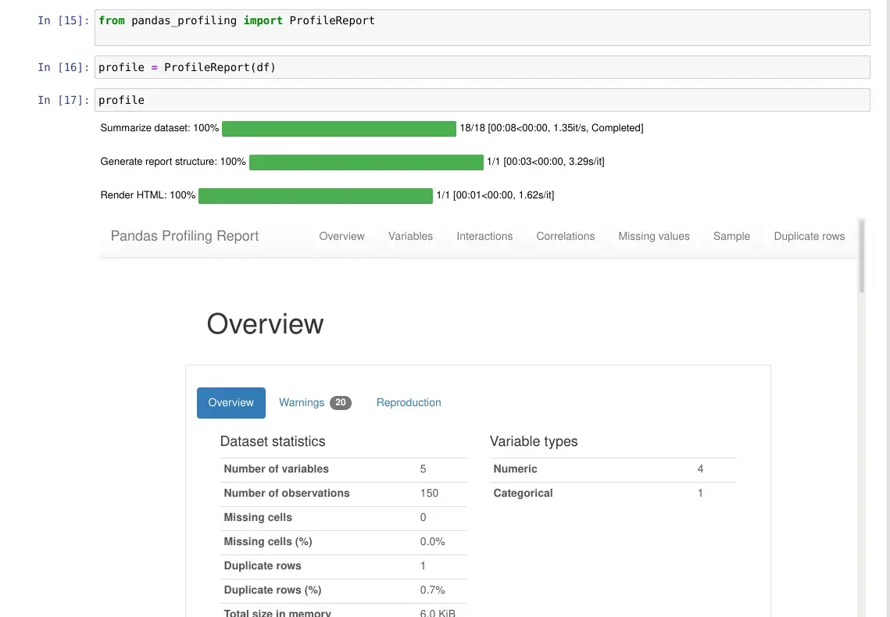

# What is Pandas Data Profiling ?

The Pandas library has a large number of functions. It aids in data manipulation and offers a diverse set of features for practically any activity. The pandas `describe()` function is a popular Pandas function. It provides a descriptive statistical overview of all the dataset's features to the user. Even though it is useful for understanding data, it lacks numerous capabilities.

**Pandas profiling** is the answer to this problem. It let's you create reports for your dataset that include a range of features and adjustments. In this post, we'll examine at the functionality of this library, as well as some of the more advanced use cases and connectors that may help you create stunning data frame reports!

## Installing Pandas Data Profiling in Jupyter notebook

Pandas profiling, like all other python packages, is quickly installed using the pip or conda package manager:

**pip:**

```bash
pip install pandas-profiling
```

**conda:**

```bash
 conda install -c conda-forge pandas-profiling
```

## Setting up Pandas Data Profiling in jupyter notebook

Now we'll look at how to use the pandas profiling library and create a report from the data frames. Let's start by importing a dataset for which we'll be generating reports. In our example we will be using iris dataset from sklearn.

```python
from sklearn.datasets import load_iris
import pandas as pd
import numpy as np

data = load_iris()
df = pd.DataFrame(np.column_stack((data.data, data.target)), columns = data.feature_names+['target'])

df.describe()
```


Now let's start with pandas profiling library:

```python
from pandas_profiling import ProfileReport
```

To begin profiling a dataframe, you can use one of two methods:

- You can use the `.profile_report()` method on a pandas dataframe. This function is not part of the pandas API, but it is automatically added to dataframe objects after the profiling library is loaded.

- Or by giving the dataframe object to the profiling function and then executing the function object created.

You will get the same outcome report regardless of the method you use. To build the report for the iris dataset imported, I'm using the second technique.

```python
profile = ProfileReport(df)

profile
```



## Profiling Report

Now let's explore each section of profiling one by one:

### 1. Overview

**Overview**, **Warnings**, and **Reproduction** are the three tabs in this section.

Overall statistics are shown in the **Overview**. This contains the number of variables (dataframe features or columns), the number of observations (dataframe rows), the number of missing cells, the percentage of missing cells, the number of duplicate rows, and the total size in memory.


The **warnings** tab offers a variety of warnings, including those about cardinality, correlation with other variables, missing values, zeroes, skewness of the variables, and more.


The reproduction tab simply displays information related to the report generation. It shows the start and ends the time of the analysis, the time taken to generate the report, the software version of pandas profiling, and a configuration download option.

The **reproduction** tab just displays details on the report creation process. It shows the start and end times of the analysis, the time it took to construct the report, the version of the pandas profiling software, and a configuration download option.


### 2. Variable


This section of the report examines all of the dataset's variables, columns, and characteristics in detail. Depending on the data type of variable, the information given differs. Let's have a look at it in more detail.

#### Numeric Variables

The unique values, missing values, min-max, mean, and negative values count are all included in the numeric data type features. In the form of a Histogram, you can also receive small representation values.

When the toggle button is hit, the Statistics, Histogram, Common values, and Extreme values tab expands.

The following information can be found on the statistics tab:

- Quantile statistics include min-max, percentiles, median, range, and IQR (Inter Quartile range)

- Descriptive statistics include standard deviation, coefficient of variance, kurtosis, mean, skewness, variance, and monotonicity.

The histogram tab displays the frequency of variables or the distribution of numeric data. On the common values page, the variable value_counts are displayed as both counts and percent frequency.

#### String Variables

String type variables provide distinct (unique) values, distinct percentages, missing, missing percentages, memory size, and a horizontal bar presentation of all the unique values with count presentation.

When the toggle button is hit, the Overview, Categories, Words, and Characters tabs are expanded.

The Overview tab displays the maximum and minimum median mean lengths for string type values, as well as total characters, different characters, separate categories, unique, and a sample from the collection.

The categories tab shows a histogram and, on occasion, a pie chart of the feature's value counts. The value, count, and % frequency are all listed in the table.

In terms of how the data is presented in tabular and histogram format, the words and characters tab is similar to the categories tab, but it may go much further into the lower case, higher case, punctuation, and special characters categories.

### 3. Correlations

The term "correlation" refers to the degree to which two variables move in lockstep with one another. Pearson's r, Spearman's ρ, Kendall's τ, Phik (φk), and Cramér's V (φc) are the five forms of correlation coefficients available in the pandas profiling report.


### 3. Missing values

The visualisations for the missing variables in the dataset are also included in the report. There are three sorts of plots available: count, matrix, and dendrogram. The count plot is a simple bar graph with column names on the x-axis and the length of the bar representing the number of values present (without null values). The matrix and the dendrogram are similar.


### 5. Sample

Display's first and last 10 rows of the dataset


## Saving Pandas Profiling Report

You've shown how to create dataframe reports using just one line of code or function, as well as all of the report's capabilities. You might want to save this analysis as an external file so that you can combine it with other programmes or publish it online.

This report can be saved in –

1. JSON format or
2. HTML format

For any of the formats, the save function remains the same; simply change the file extension when saving. To save the report, use the profile object's ".to file()" function:

```python
profile.to_file("iris_profile_report.html")
profile.to_file("iris_profile_report.json")
```

## Widget in Jupyter Notebooko

The HTML will only be rendered in the code cell when you run panda profiling in your Jupyter notebooks. This causes the user's experience to be disrupted. You may make it act as a simple widget that presents information in a condensed style. To do so, simply call `.to_widgets()` on your profile object:
