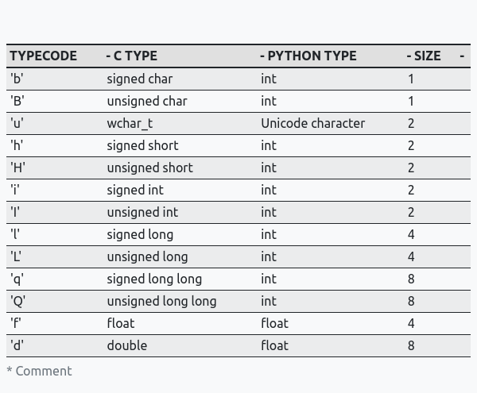

# Python Array 

This article will teach you how to use Python arrays.  You'll learn how to define them as well as the various methods for performing operations on them.

_The article discusses arrays created by importing the `array module` in python._


## What are arrays 

An array is a collection of items that are stored in adjacent memory locations.  It is a container that can hold a set number of items, all of which must be of the same type.  Most programming languages, including C/C++, JavaScript, and others, use arrays.


An array is a concept that stores multiple items of the same type together and makes calculating the position of each element easier by simply adding an offset to the base value.  Combining the arrays could save a significant amount of time by reducing the overall size of the code.  It is used to keep several values in a single variable.


## What are python arrays 

Arrays are a fundamental data structure that is used in almost all programming languages.
They are containers in Python that can hold more than one item at a time.

They are an ordered collection of elements, with each value of the same data type. **The most important thing to remember about Python arrays is that they can only contain a sequence of multiple items of the same type.**

## What is the difference between python array and python list

Lists are a common data structure in Python and an essential part of the language.  Arrays and lists behave similarly.  Lists, like arrays, are composed of an ordered sequence of elements.  They are also mutable and not fixed in size, so they can grow and shrink throughout the program's lifespan.  Items can be added and removed, making them extremely adaptable.

However, lists and arrays are not synonymous.

Lists contain items of various data types.  This means that a list can contain integers, floating point numbers, strings, or any other Python data type.  This is not true of arrays.

As stated in the preceding section, arrays only store items of the same single data type.
There are arrays that only contain integers, arrays that only contain floating point numbers, and arrays that only contain any other Python data type you want to use.

## When to use python array 

Arrays are not included in the Python programming language, but lists are.

Because arrays are not a built-in data structure, they must be imported with the `array module` before being used.

Arrays in the `array module` are a thin wrapper around C arrays and are useful when working with homogeneous data.

They are also more compact than lists and take up less memory and space, making them more space efficient.

Because python array use less mermoy than python list they are much faster than list.

Python arrays are used when you need to use a large number of variables of the same type.  It can also be used to store data collections.  Arrays are especially useful when you need to process data in a dynamic manner.

## How to use python array

### Importing python array module

In order to create python array you first need to import the `array module` which has all the necassay fucntions:

```python
import array as arr

```
### Defining python array

After importing `python array` now let's define python array. This can be done using syntax:

```python

array_name = arr.array(typecode,[initializer])

```

- `array_name` as the name suggest it will be the variable name of our python array

- The `typecode` specifies the types of elements that will be stored in the array.
Whether it's an array of integers, an array of floats, or any other Python data type.

_Keep in mind that all elements must be of the same data type._

- You mention the element that would be stored in the array inside square brackets, with each element separated by a comma.  You can also make an empty array by simply writing:

```python
array_name = arr.array(typecode) 
```

**Typecode table**




### Creating python array

```python
import array as arr

num = arr.array("i",[1,2,3,5,6])

print(num) # Output: array('i', [1, 2, 3, 4, 5, 6])

float_num = arr.array('f',[1.2,2.3,4.5,6.7])

print(float_num) # Output: array('f',[1.2,2.3,4.5,6.7])

```

### Accessing element from python array

You can use the index operator [] to reach a specific item in an array. The index must be an integer.

**Time Complexity:** 0(1)
**Space:** 0(1)

```python
import array as arr


num_arr   = arr.array("i",[1,2,3,4])
alpha_arr = arr.array("c",['a','b','c'])

print(num_arr[2])   #Output: 3
print(alpha_arr[0]) #Output: a

```

### Adding elements to python array

The built-in [`insert()`](https://docs.python.org/3/library/array.html#array.array.insert) function can be used to add elements to the Array.  `insert()` is a function that is used to insert one or more data elements into an array.A new element can be added at the beginning, end, or any given index of the array depending on the requirement. [`append()`](https://docs.python.org/3/library/array.html#array.array.append) can also be used to append the value specified in its arguments to the end of an array.

**Time Complexity:**
- O(n) : for inserting at particular position in the array
- O(1) : for inserting at the end of an array

**Space:** O(1)

```python
import array as arr


num_arr   = arr.array("i",[1,2,3,4])
alpha_arr = arr.array("c",['a','b','c'])
float_arr = arr.array("f",[1.2,2.4])

num_arr.insert(1,5) # Inserting at certain position
print(num_arr) # Output: array('i', [1, 5, 2, 3, 4])


alpha_arr.append('d') # Inserting at the end of an array
print(alpha_arr) #Output: array(['a', 'b', 'c', 'd'])

float_arr.extend([3.5,6.6,8.9]) # Insering more the one element
print(float_arr) # Output: array('f', [1.2,2.4,3.5,6.6,8.9])

```

### Deleting elements from python array

Elements can be removed using the array's built-in [`remove()`](https://docs.python.org/3/library/array.html#array.array.remove) function, however if the element doesn't already exist in the set, an error is raised.Because the `remove()` method only removes one element at a time, iterators are used to remove a selection of elements.

_Note: `remove()` method in python array will only remove first occurrence of the searched element from array_

The [`pop()`](https://docs.python.org/3/library/array.html#array.array.pop) function, however, just delete the final element in the array by default.  The `pop()` function accepts the element's index as an input to delete the element from a specific location in the array.

**Time Complexity:**

- O(1) - for removing element at the end of the array
- O(n) - for removing element at the beginning and to the full array.

**Space:** O(1)


```python

import array as arr


num_arr   = arr.array("i",[1,2,3,4])
alpha_arr = arr.array("c",['a','b','c'])

num_arr.remove(1)
print(num_arr) #Output: array('i',[2,3,4])

alpha_arr.pop(2)
print(alpha_arr) #Output: array('c',['a','b'])

```

### Slicing python array

Use the slicing operator, which is represented by the colon ":", to access a specific range of values inside the array.

By default, the counting starts at 0 when you use the slicing operator and only include one item. The first item is obtained, followed by items up to but excluding the index number you specify.

```python

import array as arr


num_arr   = arr.array("i",[1,2,3,4,5,6])

print(num_arr[:4]) #Output: array('i',[1,2,3,4])

```

When you pass two numbers as parameters, you give a range of numbers.In this case, counting goes from the first number in the range to the second, but not beyond it:

```python

import array as arr


num_arr   = arr.array("i",[1,2,3,4,5,6])

print(num_arr[2:4]) #Output: array('i',[3,4])

```

### Updating the value of an item in python array

By specifying an element's position and giving it a new value, you can change its value.

**Time Complexity:** O(n)
**Space:** O(1)

```python

import array as arr

num_arr   = arr.array("i",[1,2,3,4,5,6])
alpha_arr = arr.array("c",['a','b','c'])

num_arr[0] = 53
alpha_arr[2] = 'z'

print(num_arr)     # Output: array('i',[53,2,3,4,5,6])
print(alpha_arr)   # Output: array('c',['a','b','z'])

```


### Searching elements in python array

We use the [`index()`](https://docs.python.org/3/library/array.html#array.array.index) method that is built into Python to search for a specific element in the array. The index of the first time a value mentioned in parameters appears is returned by this method.

**Time Complexity:** O(n)
**Space :** O(1)


```python

import array as arr

num_arr   = arr.array("i",[1,2,3,4,5,6])
alpha_arr = arr.array("c",['a','b','c'])

print(num_arr.index(4))     # Output: 3
print(alpha_arr.index('c')) # Output: 2

```

## Conclusion

Compared to arrays, lists are far more flexible.  They can keep strings and other items of various data kinds.  Additionally, you are far better off using something like [NumPy](https://numpy.org/) if you need to perform mathematical computation on arrays and matrices.

What applications are there for arrays produced by the Python array module?

`array.array` module offers space-efficient storage of fundamental C-style data types, is really a thin shell on C arrays.  Arrays can be faster and use less memory than lists if you need to allocate an array that won't change. 
